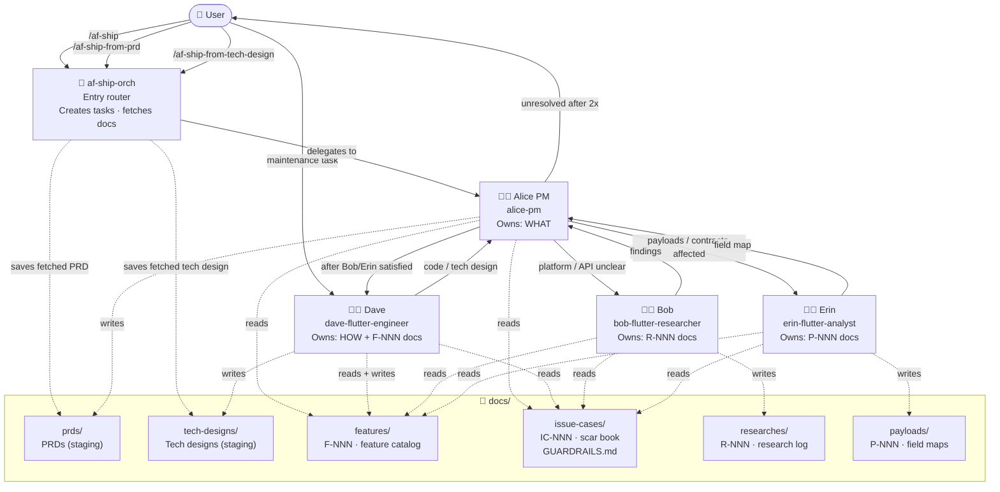

# AppsFlyer Flutter Plugin — AI Skill Workflow

> Last updated: auto-generated

Describes how the Claude Code skills communicate and which `docs/` directories each one reads or writes.

---

## Skill Communication & Docs Access



**Solid arrows** = skill invocation (who calls whom).
**Dotted arrows** = docs read/write access.

---

## Docs Layer — Who Owns What

| Directory | Nickname | Owner | Consumers |
|-----------|----------|-------|-----------|
| `docs/prds/` | PRDs (staging) | Alice (writes); af-ship-orch (saves external) | User review; may move to Notion |
| `docs/tech-designs/` | Tech designs (staging) | Dave (writes); af-ship-orch (saves external) | User review; may move to Notion |
| `docs/features/` | Feature catalog | Dave (writes F-NNN) | Alice, Bob, Erin (read) |
| `docs/issue-cases/` | Scar book | Human / eng team | Alice, Dave, Bob, Erin (read) |
| `docs/researches/` | Research log | Bob (writes R-NNN) | Alice (via challenge loop) |
| `docs/payloads/` | Payload map | Erin (writes P-NNN, FIELD_MAP) | Alice, Dave (via challenge loop) |

---

## Invocation Rules

| Entry point | When |
|-------------|------|
| `/af-ship <description>` | Starting a new feature from scratch |
| `/af-ship --prd <url-or-path>` | Starting from an existing PRD (Notion URL or local .md) |
| `/af-ship --tech-design <url-or-path>` | Starting from an existing tech design (Notion URL or local .md) |
| `/af-ship-from-prd <url-or-path>` | Same as `--prd` flag; dedicated command alternative |
| `/af-ship-from-tech-design <url-or-path>` | Same as `--tech-design` flag; dedicated command alternative |
| Dave (direct) | Maintenance only: logs, renames, dead-code removal, comment cleanup, test additions, minor refactors with no public API change |
| Bob (direct) | Ad-hoc platform/API research not tied to a feature |
| Erin (direct) | Ad-hoc payload or schema analysis not tied to a feature |
| Bob | Invoked by Alice when platform API / version / external behavior is unclear |
| Erin | Invoked by Alice when payloads, request fields, or server-visible schema is affected |

If unsure whether a task is maintenance or a feature → use `/af-ship`.

---

## Loop Mechanics

**New feature from scratch:**
```
/af-ship <description>
  → af-ship-orch creates task wizard → calls alice-pm
  → Alice writes PRD → saves to docs/prds/<slug>.md → asks user to review
  → User approves PRD
  → Alice invokes Bob and/or Erin if needed
  → Bob/Erin produce findings → Alice challenges (max 2 iterations)
  → Alice updates PRD if scope changed → Alice invokes Dave
  → [Phase 1 / 2 / 3 below]
```

**From existing PRD:**
```
/af-ship-from-prd <url-or-path>  (or /af-ship --prd <url-or-path>)
  → af-ship-orch fetches / reads PRD → saves to docs/prds/<slug>.md → calls alice-pm
  → Alice challenges PRD for completeness → resolves gaps with user
  → Alice delegates to Bob/Erin/Dave (no second review pause)
  → [Phase 1 / 2 / 3 below]
```

**From existing tech design:**
```
/af-ship-from-tech-design <url-or-path>  (or /af-ship --tech-design <url-or-path>)
  → af-ship-orch fetches / reads tech design → saves to docs/tech-designs/<slug>.md → calls alice-pm
  → Alice runs full challenge agenda → Dave addresses issues (max 2 iterations)
  → Alice: "Satisfied — Dave, this is ready."
  → [Phase 2 / 3 below — Phase 1 skipped, PRD gate bypassed]
```

**Phase 1 — Tech design**
```
  → Dave writes tech design → saves to docs/tech-designs/<slug>.md
  → Alice challenges tech design (max 2 iterations)
  → Alice: "Satisfied — Dave, this is ready."
  → Dave asks user to review tech design
  → User approves tech design
```

**Phase 2 — Implementation**
```
  → Dave implements + writes unit tests
  → Alice challenges implementation (max 2 iterations)
  → Alice: "Satisfied — Dave, this is ready."
```

**Phase 3 — Feature doc**
```
  → Dave runs impact scan → updates any affected existing F-NNN docs
  → Dave writes new F-NNN feature doc → saves to docs/features/
  → Alice challenges feature doc (max 2 iterations)
  → Alice: "Satisfied — Dave, this is ready."
```

Escalation: if any item is unresolved after 2 full challenge loops → Alice escalates to User.

---

## Authority Map

| Question | Owner |
|----------|-------|
| WHY — strategy, business goal | User (escalated by Alice) |
| WHAT — requirements, scope, acceptance criteria | Alice |
| HOW — architecture, implementation, tech tradeoffs | Dave |
