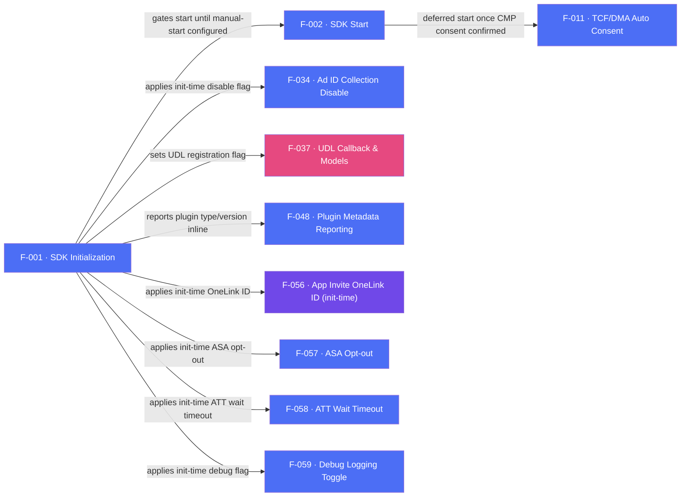

# AppsFlyer Flutter Plugin — Feature Diagrams

## Section 1 — Runtime Flow

Only features with at least one inbound or outbound cross-feature edge are shown. `eventsAndRevenue` and `platformIntegration` have no cross-feature edges in this codebase — every feature in those two categories is a standalone 1:1 native setter, so neither appears below.

```mermaid
flowchart TD
    subgraph sdkCore ["sdkCore"]
        F001["F-001<br/>SDK Initialization"]:::sdkCore
        F002["F-002<br/>SDK Start"]:::sdkCore
        F011["F-011<br/>TCF/DMA Auto Consent"]:::sdkCore
        F015["F-015<br/>Customer User ID"]:::sdkCore
        F021["F-021<br/>Delayed Session Start"]:::sdkCore
        F034["F-034<br/>Ad ID Collection Disable"]:::sdkCore
        F048["F-048<br/>Plugin Metadata Reporting"]:::sdkCore
        F057["F-057<br/>ASA Opt-out"]:::sdkCore
        F058["F-058<br/>ATT Wait Timeout"]:::sdkCore
        F059["F-059<br/>Debug Logging Toggle"]:::sdkCore
    end

    subgraph purchaseValidation ["purchaseValidation"]
        F023["F-023<br/>IAP Validation V1"]:::purchaseValidation
        F024["F-024<br/>IAP Validation V2"]:::purchaseValidation
        F025["F-025<br/>Receipt Sandbox Toggle"]:::purchaseValidation
        F038["F-038<br/>Legacy Validation Callback"]:::purchaseValidation
        F049["F-049<br/>Purchase Connector Config"]:::purchaseValidation
        F050["F-050<br/>StoreKit Version Selection"]:::purchaseValidation
        F051["F-051<br/>Android Validation Listeners"]:::purchaseValidation
        F052["F-052<br/>iOS Combined Validation Callback"]:::purchaseValidation
        F053["F-053<br/>Google Play Data Models"]:::purchaseValidation
        F054["F-054<br/>Build-Time Opt-in"]:::purchaseValidation
        F055["F-055<br/>Missing-Config Guard"]:::purchaseValidation
    end

    subgraph deepLinking ["deepLinking"]
        F014["F-014<br/>Manual Deep-Link Re-trigger"]:::deepLinking
        F022["F-022<br/>Push Deep-Link Path Config"]:::deepLinking
        F031["F-031<br/>Push Notification Data Handling"]:::deepLinking
        F035["F-035<br/>Conversion Data Callback"]:::deepLinking
        F036["F-036<br/>App-Open Attribution Callback"]:::deepLinking
        F037["F-037<br/>UDL Callback & Models"]:::deepLinking
        F039["F-039<br/>Native iOS Deep-Link Entry Points"]:::deepLinking
        F040["F-040<br/>Android New-Intent Forwarding"]:::deepLinking
    end

    subgraph oneLinkAndGrowth ["oneLinkAndGrowth"]
        F027["F-027<br/>Invite Link Generation"]:::oneLinkAndGrowth
        F028["F-028<br/>App Invite OneLink ID"]:::oneLinkAndGrowth
        F029["F-029<br/>Cross-Promotion Tracking"]:::oneLinkAndGrowth
        F056["F-056<br/>App Invite OneLink ID (init-time)"]:::oneLinkAndGrowth
    end

    F002 --> F001
    F011 --> F001
    F011 --> F002
    F021 --> F015
    F035 --> F001
    F036 --> F001
    F037 --> F001
    F048 --> F001
    F057 --> F001
    F058 --> F001
    F059 --> F001

    F023 --> F025
    F023 --> F038
    F024 --> F025
    F049 --> F051
    F049 --> F052
    F049 --> F054
    F050 --> F049
    F051 --> F049
    F052 --> F049
    F053 --> F049
    F053 --> F051
    F055 --> F049

    F014 --> F037
    F022 --> F037
    F031 --> F022
    F037 --> F039
    F037 --> F040

    F027 --> F028
    F027 --> F056
    F028 --> F056
    F029 --> F027
    F056 --> F028

    classDef sdkCore fill:#4C6EF5,color:#fff
    classDef purchaseValidation fill:#F59F00,color:#fff
    classDef deepLinking fill:#E64980,color:#fff
    classDef oneLinkAndGrowth fill:#7048E8,color:#fff
```

---

## Section 2 — Initialization Flow

Features that configure, register, gate, or boot other features at startup time. `F-001` (SDK Initialization) is the sole boot entry point — every init-time option and startup-gated registration hangs off it directly.

---

## Section 3 — Dependency Table

| Feature | Depends On | Note |
|---------|-----------|------|
| F-002 | F-001 | SDK session start only makes sense after init/options have been validated and passed to native |
| F-011 | F-001 | TCF auto-consent collection requires manual-start init configuration |
| F-011 | F-002 | TCF auto-consent defers the actual `startSDK()` call until CMP consent is confirmed |
| F-014 | F-037 | Manual deep-link re-trigger forces the native SDK to re-run the same UDL resolution path |
| F-021 | F-015 | iOS routes `setCustomerIdAndLogSession` to the identical native handler as plain `setCustomerUserId` |
| F-022 | F-037 | Push-notification deep-link path config only matters once a payload reaches UDL resolution |
| F-023 | F-025 | iOS validates against the sandbox/production endpoint set by the receipt-validation toggle |
| F-023 | F-038 | V1 validation delivers its async result through the legacy purchase-validation callback |
| F-024 | F-025 | iOS validates against the sandbox/production endpoint set by the receipt-validation toggle |
| F-027 | F-028 | Invite-link generation needs a base OneLink ID configured at runtime |
| F-027 | F-056 | Invite-link generation needs a base OneLink ID configured at init time (whichever wrote last wins) |
| F-028 | F-056 | Both setters write the same native OneLink-ID property — last write wins |
| F-029 | F-027 | iOS cross-promotion reuses the same invite-URL generator helper as invite-link generation |
| F-031 | F-022 | Push notification data handling resolves deep links using the registered JSON key-path |
| F-035 | F-001 | Conversion data delivery is gated by SDK init/start having registered the listener |
| F-036 | F-001 | App-open attribution delivery is gated by SDK init/start having registered the listener |
| F-037 | F-001 | UDL listener/delegate registration is gated by the UDL flag set during init |
| F-037 | F-039 | UDL resolution on iOS is fed by the native URL-scheme/Universal-Link/Scene entry points |
| F-037 | F-040 | UDL resolution on Android is fed by the new-intent forwarding entry point |
| F-048 | F-001 | Plugin metadata is reported inline as part of the native `initSdk` call |
| F-049 | F-051 | Android `configure()` requires the validation-result listener object as a constructor param |
| F-049 | F-052 | iOS `configure()` assigns the purchase-revenue delegate that the combined callback depends on |
| F-049 | F-054 | Purchase Connector only compiles/registers when the build-time opt-in is enabled |
| F-050 | F-049 | StoreKit version is packed into the shared `configure()` payload owned by F-049 |
| F-051 | F-049 | Android validation listeners only receive events once `configure()`/observation has started |
| F-052 | F-049 | iOS combined validation callback relies on the delegate wired during `configure()` |
| F-053 | F-049 | Data models are payload shapes exchanged only through the configured connector |
| F-053 | F-051 | Data models are referenced exclusively from the Android validation-result listener models |
| F-055 | F-049 | Guard exists specifically to catch use of Purchase Connector APIs before `configure()` runs |
| F-056 | F-028 | Both setters write the same native OneLink-ID property — last write wins |
| F-057 | F-001 | ASA opt-out is an init-time option validated/applied inside `initSdk` |
| F-058 | F-001 | ATT wait timeout is an init-time option validated/applied inside `initSdk` |
| F-059 | F-001 | Debug logging is an init-time option validated/applied inside `initSdk` |
