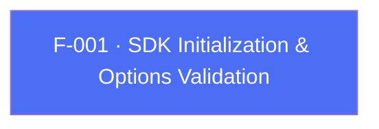

## Business Purpose
This is the entry point that wires the Flutter app's dev key, app ID and startup flags into the native AppsFlyer SDK. Without it, no other AppsFlyer API works: no attribution, no events, no deep linking. The Dart-side validation (`_validateAFOptions` / `_validateMapOptions`) catches misconfiguration early (missing dev key, malformed iOS numeric App Store ID) via `assert`s, and decides whether the SDK auto-starts or waits for an explicit `startSDK()` call (F-002). It also stamps the plugin's identity (`Plugin.FLUTTER` / `AFSDKPluginFlutter`) onto the native SDK so AppsFlyer's backend can attribute traffic to the Flutter wrapper.

> TODO: enrich from product specs — provide a Notion database URL and re-run Phase 4 to fill this automatically.

---

## Trigger
Called once by the host app immediately after constructing `AppsflyerSdk(options)`, typically in `main()` before `runApp()`. Runs whenever `initSdk()` is invoked, regardless of whether `AppsFlyerOptions` (typed) or a raw `Map` was passed to the factory constructor.

---

## Call Chain
```
AppsflyerSdk(options) factory                                          [lib/src/appsflyer_sdk.dart]
  → AppsflyerSdk.private(...)                                          [lib/src/appsflyer_sdk.dart]
AppsflyerSdk.initSdk({registerConversionDataCallback, registerOnAppOpenAttributionCallback, registerOnDeepLinkingCallback})
  → _validateAFOptions(AppsFlyerOptions) | _validateMapOptions(Map)     [lib/src/appsflyer_sdk.dart]
    → _methodChannel.invokeMethod("initSdk", validatedOptions)
      → Android: AppsflyerSdkPlugin.onMethodCall("initSdk") → initSdk(call, result)   [android/.../AppsflyerSdkPlugin.java]
        → AppsFlyerLib.getInstance().init(afDevKey, gcdListener, mContext)
        → instance.start(activity)  [only if isManualStartMode == false]
      → iOS: AppsflyerSdkPlugin.handleMethodCall("initSdk") → initSdkWithCall:result:   [ios/Classes/AppsflyerSdkPlugin.m]
        → [AppsFlyerLib shared].appsFlyerDevKey / .appleAppID / .isDebug = ...
        → [[AppsFlyerLib shared] start]  [only if manualStart == NO]
```

---

## Files
| File | Role |
|------|------|
| `lib/src/appsflyer_sdk.dart` | `initSdk`, `_validateAFOptions`, `_validateMapOptions` — validation + MethodChannel dispatch |
| `lib/src/appsflyer_options.dart` | `AppsFlyerOptions` typed config model (devKey, appId, ATT wait time, manualStart, etc.) |
| `lib/src/appsflyer_constants.dart` | String keys shared across Dart/native (`AF_DEV_KEY`, `AF_APP_Id`, `AF_MANUAL_START`, `AF_GCD`, `AF_UDL`, `PLUGIN_VERSION`) |
| `android/src/main/java/com/appsflyer/appsflyersdk/AppsflyerSdkPlugin.java` | `initSdk(call, result)` — native Android init, conditional auto-start |
| `android/src/main/java/com/appsflyer/appsflyersdk/AppsFlyerConstants.java` | Native Android mirror of the Dart string keys |
| `ios/Classes/AppsflyerSdkPlugin.m` | `initSdkWithCall:result:` — native iOS init, conditional auto-start |
| `ios/Classes/AppsflyerSdkPlugin.h` | `#define` string keys (`afDevKey`, `afAppId`, `afManualStart`, …) and `kAppsFlyerPluginVersion` |

---

## Input / Output
| | |
|--|--|
| **Input** | `afDevKey` (String, required), `appId` (String, required on iOS — validated against `^\d{8,11}$`), `showDebug` (bool), `manualStart` (bool), `timeToWaitForATTUserAuthorization` (double, iOS only), `disableAdvertisingIdentifier` (bool), `disableCollectASA` (bool, iOS only), `appInviteOneLink` (String?), plus derived flags `GCD`/`UDL` computed from the `registerConversionDataCallback` / `registerOnAppOpenAttributionCallback` / `registerOnDeepLinkingCallback` parameters |
| **Output** | Native SDK instance initialized and, unless `manualStart: true`, started; Android returns `"success"` string to Dart, iOS returns `{"status": "OK"}`. Neither is currently exposed to the caller since `initSdk()`'s returned `Future` is rarely awaited for its value. |

---

## Tests
`test/appsflyer_sdk_test.dart` — `check initSdk call` (line 93) constructs `AppsflyerSdk.private(...)` with `mapOptions` and asserts the mocked channel receives `initSdk`. This exercises `_validateMapOptions` end-to-end but does not assert on the resulting validated map's contents, and does not cover `_validateAFOptions` (the typed `AppsFlyerOptions` path) or the iOS App ID regex / ATT-wait-time assertions at all — those run only under `Platform.isIOS`, which the Dart test environment does not satisfy.

---

## Known Limitations
- Validation uses Dart `assert()`, which is stripped in release/profile builds — a missing `afDevKey` or malformed iOS `appId` will silently pass validation in release mode and only fail (or silently misbehave) once it reaches native code.
- The plugin version string is duplicated in three places and has drifted: Dart `AppsflyerConstants.PLUGIN_VERSION = "6.17.9"` (`lib/src/appsflyer_constants.dart`) vs. Android `AppsFlyerConstants.PLUGIN_VERSION = "6.18.0"` and iOS `kAppsFlyerPluginVersion = "6.18.0"` (matching `pubspec.yaml`'s `6.18.0`). The value reported to AppsFlyer's backend via `PluginInfo`/`setPluginInfoWith:` therefore differs from what `getVersionNumber()` (F-003) returns to the app.
- `disableCollectASA` and `timeToWaitForATTUserAuthorization` are only read/applied on iOS; on Android these options are silently ignored (no assertion or warning).
- Android's `initSdk` calls `result.success("success")` unconditionally at the end, even though `setDisableAdvertisingIdentifiers`, `subscribeForDeepLink`, etc. earlier in the method have no error handling — a native exception before that line surfaces to Flutter only as a generic platform exception, not one of the plugin's own error codes.

---

## Dependencies

