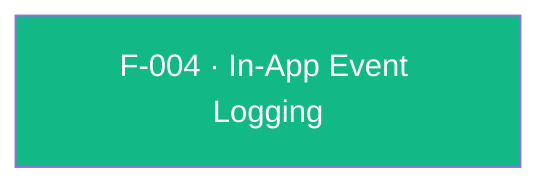

## Business Purpose
AppsFlyer's attribution model can only compute ROI (Return on Investment) and LTV (Lifetime Value) for media sources if the app reports what users actually *do* after install — purchases, tutorial completions, level-ups, subscriptions, etc. `logEvent` is the single funnel through which every custom in-app event (a name plus an arbitrary value map) reaches AppsFlyer's backend and is joined to the installing campaign/media-source. Without it, install attribution would exist in isolation with no downstream engagement or monetization signal, making campaign performance comparison and LTV/ROI reporting impossible.

> TODO: enrich from product specs — provide a Notion database URL and re-run Phase 4 to fill this automatically.

---

## Trigger
Called by the host app at any point after the SDK is initialized, whenever a business-significant in-app action occurs (e.g. purchase, level completion, tutorial finish, subscription).

---

## Call Chain
```
AppsflyerSdk.logEvent(eventName, eventValues)                                        [lib/src/appsflyer_sdk.dart]
  → _methodChannel.invokeMethod("logEvent", {'eventName': ..., 'eventValues': ...})
    → Android: AppsflyerSdkPlugin.onMethodCall("logEvent") → logEvent(call, result)   [android/.../AppsflyerSdkPlugin.java]
      → AppsFlyerLib.getInstance().logEvent(mContext, eventName, eventValues)
      → result.success(true)
    → iOS: AppsflyerSdkPlugin.handleMethodCall("logEvent") → logEventWithCall:result: [ios/appsflyer_sdk/Sources/appsflyer_sdk/AppsflyerSdkPlugin.m]
      → [[AppsFlyerLib shared] logEvent:eventName withValues:eventValues]
      → result(@YES)
```

---

## Files
| File | Role |
|------|------|
| `lib/src/appsflyer_sdk.dart` | `logEvent(String eventName, Map? eventValues)` — Dart public API, returns `Future<bool?>` |
| `android/src/main/java/com/appsflyer/appsflyersdk/AppsflyerSdkPlugin.java` | `logEvent(MethodCall, Result)` — reads `AF_EVENT_NAME`/`AF_EVENT_VALUES` args, forwards to `AppsFlyerLib.getInstance().logEvent(mContext, eventName, eventValues)`, always returns `result.success(true)` |
| `ios/appsflyer_sdk/Sources/appsflyer_sdk/AppsflyerSdkPlugin.m` | `logEventWithCall:result:` — reads `eventName`/`eventValues` (normalizes `NSNull` to `nil`), forwards to `[[AppsFlyerLib shared] logEvent:withValues:]`, always returns `result(@YES)`; comment `//TODO: Add callback handler` marks that no completion callback is wired |
| `doc/InAppEvents.md` | Public integration guide with usage example |

---

## Input / Output
| | |
|--|--|
| **Input** | `eventName` (String, required — AppsFlyer docs recommend ≤45 chars or the event is dropped from the dashboard but still visible in raw data); `eventValues` (Map, nullable — arbitrary event parameters, e.g. `af_revenue`, `af_content_id`) |
| **Output** | `Future<bool?>` — on both platforms this resolves to `true` unconditionally once the native SDK call is *dispatched*; it does not reflect whether the event was actually delivered to/accepted by AppsFlyer's backend (no listener/callback is wired on either platform) |

---

## Tests
`test/appsflyer_sdk_test.dart` — `check logEvent call` (line 115) awaits `logEvent("eventName", {"key": "val"})` against a mocked channel and asserts the channel receives the `logEvent` invocation; it only exercises the Dart-to-channel dispatch, not native behavior or the actual return value semantics.

---

## Known Limitations
- **No delivery confirmation on either platform**: both native handlers call the fire-and-forget overload of the AppsFlyer SDK's `logEvent` (no `AppsFlyerRequestListener`/completion block) and immediately return `true`/`@YES`. A caller awaiting `logEvent()` gets no signal about whether the event actually reached AppsFlyer — the returned boolean only reflects "the method call was processed," not "the event was sent successfully."
- iOS explicitly documents this gap in-code: `//TODO: Add callback handler` in `logEventWithCall:result:`.
- No client-side validation of the 45-character event-name limit; events with longer names still get accepted by the plugin and are silently excluded from the AppsFlyer dashboard (only visible via raw data/Pull/Push APIs), per `doc/InAppEvents.md`.
- `eventValues` accepts an untyped `Map`, so type mismatches (e.g. non-JSON-serializable values) are only caught when the native SDK attempts to serialize the payload, not at the Dart call site.

---

## Dependencies

