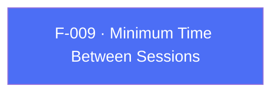

## Business Purpose
By default AppsFlyer starts a new session whenever the app returns to the foreground after being backgrounded, using the SDK's built-in threshold. Apps with unusual foreground/background patterns (e.g. quick task-switching flows, widget-driven relaunches) can get inflated session counts that distort engagement metrics. `setMinTimeBetweenSessions` lets the app widen (or narrow) that threshold so relaunches within the configured window are folded into the current session instead of counted as a new one, keeping session-based KPIs meaningful.

> TODO: enrich from product specs — provide a Notion database URL and re-run Phase 4 to fill this automatically.

---

## Trigger
Called by the host app during startup configuration, before or shortly after SDK init, whenever the default session-splitting threshold needs to be overridden.

---

## Call Chain
```
AppsflyerSdk.setMinTimeBetweenSessions(seconds)                          [lib/src/appsflyer_sdk.dart]
  → assert(seconds >= 0)
  → _methodChannel.invokeMethod("setMinTimeBetweenSessions", {'seconds': seconds})
    → Android: AppsflyerSdkPlugin.onMethodCall("setMinTimeBetweenSessions") → setMinTimeBetweenSessions(call, result)   [android/.../AppsflyerSdkPlugin.java]
      → AppsFlyerLib.getInstance().setMinTimeBetweenSessions(seconds)
    → iOS: AppsflyerSdkPlugin.handleMethodCall("setMinTimeBetweenSessions") → setMinTimeBetweenSessions:result:         [ios/appsflyer_sdk/Sources/appsflyer_sdk/AppsflyerSdkPlugin.m]
      → [AppsFlyerLib shared].minTimeBetweenSessions = seconds
```

---

## Files
| File | Role |
|------|------|
| `lib/src/appsflyer_sdk.dart` | `setMinTimeBetweenSessions(int)` — asserts non-negative seconds, dispatches to channel |
| `android/src/main/java/com/appsflyer/appsflyersdk/AppsflyerSdkPlugin.java` | `setMinTimeBetweenSessions` native handler |
| `ios/appsflyer_sdk/Sources/appsflyer_sdk/AppsflyerSdkPlugin.m` | `setMinTimeBetweenSessions:result:` native handler (direct property assignment) |

---

## Input / Output
| | |
|--|--|
| **Input** | `seconds` (int, must be `>= 0` per Dart `assert`) |
| **Output** | `void` — fire-and-forget; no confirmation returned to Dart. |

---

## Tests
`test/appsflyer_sdk_test.dart` — `check setMinTimeBetweenSessions call` (line 214) asserts the mocked channel receives `setMinTimeBetweenSessions`. The negative-seconds `assert` guard is not covered by any test.

---

## Known Limitations
- The `seconds >= 0` guard is a Dart `assert()`, which is stripped in release/profile builds — a negative value passed in a release build reaches native code unchecked, where behavior is whatever the native SDK does with a negative threshold (undocumented in this repo).
- No upper-bound validation — an unreasonably large value (e.g. `Duration` misused as seconds) is not caught client-side.

---

## Dependencies

