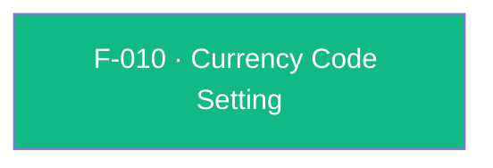

## Business Purpose
AppsFlyer's revenue analytics (ROI/LTV dashboards) need a consistent currency to normalize monetary values reported through in-app purchase/revenue events. Apps that sell in a currency other than the SDK's USD default must declare that currency once via `setCurrencyCode`, so every subsequent in-app event's monetary value is interpreted (and converted for reporting) correctly. Without it, revenue figures for non-USD apps would be misreported or misinterpreted at AppsFlyer's default currency assumption, corrupting revenue-based attribution and LTV comparisons across campaigns.

> TODO: enrich from product specs — provide a Notion database URL and re-run Phase 4 to fill this automatically.

---

## Trigger
Called by the host app once, typically at startup (before or after logging revenue-bearing events), whenever the app's transactions are denominated in a non-default (non-USD) currency.

---

## Call Chain
```
AppsflyerSdk.setCurrencyCode(currencyCode)                                                  [lib/src/appsflyer_sdk.dart]
  → _methodChannel.invokeMethod("setCurrencyCode", {'currencyCode': currencyCode})
    → Android: AppsflyerSdkPlugin.onMethodCall("setCurrencyCode") → setCurrencyCode(call, result)  [android/.../AppsflyerSdkPlugin.java]
      → AppsFlyerLib.getInstance().setCurrencyCode(currencyCode)
      → result.success(null)
    → iOS: AppsflyerSdkPlugin.handleMethodCall("setCurrencyCode") → setCurrencyCode:result:        [ios/appsflyer_sdk/Sources/appsflyer_sdk/AppsflyerSdkPlugin.m]
      → [[AppsFlyerLib shared] setCurrencyCode:currencyCode]
      → result(nil)
```

---

## Files
| File | Role |
|------|------|
| `lib/src/appsflyer_sdk.dart` | `setCurrencyCode(String currencyCode)` — platform-agnostic Dart API, `void` |
| `android/src/main/java/com/appsflyer/appsflyersdk/AppsflyerSdkPlugin.java` | `setCurrencyCode(MethodCall, Result)` — forwards to `AppsFlyerLib.getInstance().setCurrencyCode(currencyCode)` |
| `ios/appsflyer_sdk/Sources/appsflyer_sdk/AppsflyerSdkPlugin.m` | `setCurrencyCode:result:` — forwards to `[[AppsFlyerLib shared] setCurrencyCode:]` |
| `doc/API.md` | Public documentation for `setCurrencyCode` |

---

## Input / Output
| | |
|--|--|
| **Input** | `currencyCode` (String) — expected to be a 3-character ISO 4217 code (default is `"USD"` per the Dart doc comment) |
| **Output** | `void` on the Dart side; both native handlers call `result(nil)`/`result.success(null)` unconditionally — there is no validation or error signal if an invalid/malformed currency code is passed |

---

## Tests
`test/appsflyer_sdk_test.dart` — `check setCurrencyCode call` (line 129) calls `setCurrencyCode("USD")` and asserts the mocked channel receives `setCurrencyCode` with `currencyCode: 'USD'`; exercises only the Dart-to-channel dispatch, not native validation (since none exists) or actual downstream effect on event currency conversion.

---

## Known Limitations
- **No format validation anywhere in the plugin**: neither the Dart API, nor the Android handler, nor the iOS handler check that `currencyCode` is a valid 3-letter ISO 4217 code. Any string (empty, too long, lowercase, non-existent code) is passed straight through to the native SDK; whether the native SDK itself validates or silently ignores an invalid code is outside this plugin's code and undocumented here.
- No API to read back the currently configured currency code — the plugin is write-only for this setting (unlike, e.g., `getHostName`/`getHostPrefix` for `setHost`).
- No enforced ordering relative to `initSdk()`/`startSDK()` or relative to `logEvent`/`logAdRevenue` calls; if called after revenue events have already been logged, prior events may retain the previous (default `"USD"`) currency depending on native SDK behavior, which is not something this plugin layer controls or documents.

---

## Dependencies

