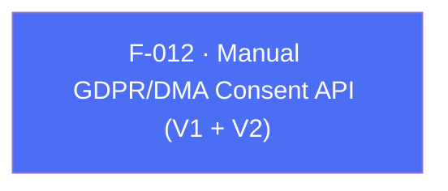

## Business Purpose
Apps that don't rely on a TCF-compatible CMP (F-011) still need a way to legally record and forward the user's GDPR/DMA consent decisions before AppsFlyer collects or uses their data. `setConsentData`/`setConsentDataV2` are the manual counterpart: the app itself determines whether GDPR applies and what the user consented to, then hands that decision to the SDK explicitly. `setConsentDataV2` is the current, more granular API (adds `hasConsentForAdStorage`, supports nullable "not yet decided" states); `setConsentData` is the deprecated V1 shape kept for backward compatibility. Getting this right is a legal-compliance requirement, not just a UX nicety — incorrect or missing consent forwarding can put the integrating company in violation of GDPR/DMA.

> TODO: enrich from product specs — provide a Notion database URL and re-run Phase 4 to fill this automatically.

---

## Trigger
Called by the host app once consent has been captured from the user (via its own consent UI), and per `doc/DMA.md`, ideally called *before* `initSdk()` (or at least before `startSDK()` when using manual-start mode) so the very first SDK network request already carries the correct consent state.

---

## Call Chain
```
AppsflyerSdk.setConsentData(AppsFlyerConsent consentData)   [DEPRECATED]              [lib/src/appsflyer_sdk.dart]
  → _methodChannel.invokeMethod('setConsentData', {'consentData': consentData.toMap()})
    → Android: AppsflyerSdkPlugin.onMethodCall("setConsentData") → setConsentData(call, result)   [android/.../AppsflyerSdkPlugin.java]
      → new AppsFlyerConsent.forGDPRUser(...) | AppsFlyerConsent.forNonGDPRUser()
      → AppsFlyerLib.getInstance().setConsentData(consentData)
    → iOS: AppsflyerSdkPlugin.handleMethodCall("setConsentData") → setConsentData:result:          [ios/Classes/AppsflyerSdkPlugin.m]
      → [[AppsFlyerConsent alloc] initForGDPRUserWith...] | initWithNonGDPRUser
      → [[AppsFlyerLib shared] setConsentData:consentData]

AppsflyerSdk.setConsentDataV2({isUserSubjectToGDPR, consentForDataUsage, consentForAdsPersonalization, hasConsentForAdStorage})   [lib/src/appsflyer_sdk.dart]
  → _methodChannel.invokeMethod('setConsentDataV2', {...})
    → Android: AppsflyerSdkPlugin.onMethodCall("setConsentDataV2") → setConsentDataV2(call, result) → getAppsFlyerConsentFromCall(call)   [android/.../AppsflyerSdkPlugin.java]
      → new AppsFlyerConsent(isUserSubjectToGDPR, consentForDataUsage, consentForAdsPersonalization, hasConsentForAdStorage)
      → AppsFlyerLib.getInstance().setConsentData(consent)
    → iOS: AppsflyerSdkPlugin.handleMethodCall("setConsentDataV2") → setConsentDataV2:result:       [ios/Classes/AppsflyerSdkPlugin.m]
      → [[AppsFlyerConsent alloc] initWithIsUserSubjectToGDPR:...hasConsentForAdStorage:...]
      → [[AppsFlyerLib shared] setConsentData:consentData]
```

---

## Files
| File | Role |
|------|------|
| `lib/src/appsflyer_consent.dart` | `AppsFlyerConsent` model — `forGDPRUser`/`nonGDPRUser` factories, `toMap()` (used by deprecated V1 API only) |
| `lib/src/appsflyer_sdk.dart` | `setConsentData` (`@Deprecated`), `setConsentDataV2` |
| `android/src/main/java/com/appsflyer/appsflyersdk/AppsflyerSdkPlugin.java` | `setConsentData` (deprecated), `setConsentDataV2`, `getAppsFlyerConsentFromCall` |
| `ios/Classes/AppsflyerSdkPlugin.m` | `setConsentData:result:` (deprecated), `setConsentDataV2:result:` |
| `doc/DMA.md` | Full integration guide for both the CMP-automatic (F-011) and manual (this feature) consent paths |

---

## Input / Output
| | |
|--|--|
| **Input** | V1 (`setConsentData`): `AppsFlyerConsent` object — `isUserSubjectToGDPR` (bool), `hasConsentForDataUsage` (bool), `hasConsentForAdsPersonalization` (bool). V2 (`setConsentDataV2`): four independently-nullable named bools — `isUserSubjectToGDPR`, `consentForDataUsage`, `consentForAdsPersonalization`, `hasConsentForAdStorage` — `null` explicitly means "not yet decided," distinct from `false`. |
| **Output** | `void` for both — fire-and-forget on the Dart side. Android's `setConsentDataV2` wraps the native call in try/catch and returns a `CONSENT_ERROR` platform error to Dart on failure; iOS's V2 handler similarly catches `NSException` and returns a `CONSENT_ERROR` `FlutterError`. The deprecated V1 handlers on both platforms have no error handling. |

---

## Tests
`test/appsflyer_sdk_test.dart` mocks `'setConsentData'` in its channel handler switch (line 56) but has **no test** that actually calls `instance.setConsentData(...)` or asserts on it — the mock case exists without a corresponding `test(...)` block. There is **no test at all**, mocked or otherwise, for `setConsentDataV2`, despite it being the currently recommended API per `doc/DMA.md`.

---

## Known Limitations
- `setConsentData` (V1) is `@Deprecated('Use setConsentDataV2 instead')` in Dart, and `doc/DMA.md` explicitly flags it as deprecated, yet it remains fully wired end-to-end on both platforms with no runtime warning or removal timeline.
- V1's `AppsFlyerConsent` model (`lib/src/appsflyer_consent.dart`) forces `hasConsentForDataUsage`/`hasConsentForAdsPersonalization` to non-null booleans, which cannot represent an explicit "user has not yet decided" state — this is precisely the gap V2's nullable parameters were introduced to close.
- `setConsentDataV2` has zero test coverage despite being the actively recommended, DMA-critical API — a regression in its argument marshaling (e.g. a renamed key on one platform) would not be caught by the existing test suite.
- Both consent APIs are order-sensitive relative to `initSdk()`/`startSDK()` (must be called first to affect the initial request), but neither the Dart API nor either native handler enforces or warns about this ordering.

---

## Dependencies

