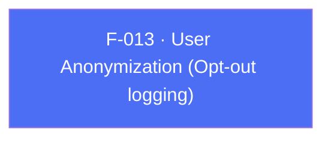

## Business Purpose
When a specific user opts out of tracking (e.g. via an in-app privacy setting, or in response to a "do not track" regulatory requirement), the app needs a way to tell AppsFlyer to stop logging identifiable data for that user without tearing down the whole SDK. `anonymizeUser` flips this per-user opt-out flag on the native SDK. Without it, the only way to honor such a request would be the much blunter `stop()` API, which disables the SDK entirely rather than scoping the opt-out to one user.

> TODO: enrich from product specs — provide a Notion database URL and re-run Phase 4 to fill this automatically.

---

## Trigger
Called by the host app whenever the current user's tracking-opt-out preference changes (e.g. a settings toggle, or an automated privacy-compliance check at login).

---

## Call Chain
```
AppsflyerSdk.anonymizeUser(shouldAnonymize)                              [lib/src/appsflyer_sdk.dart]
  → _methodChannel.invokeMethod("anonymizeUser", {'shouldAnonymize': shouldAnonymize})
    → Android: AppsflyerSdkPlugin.onMethodCall("anonymizeUser") → anonymizeUser(call, result)   [android/.../AppsflyerSdkPlugin.java]
      → AppsFlyerLib.getInstance().anonymizeUser(shouldAnonymize)
    → iOS: AppsflyerSdkPlugin.handleMethodCall("anonymizeUser") → anonymizeUser:result:          [ios/Classes/AppsflyerSdkPlugin.m]
      → [AppsFlyerLib shared].anonymizeUser = shouldAnonymize
```

---

## Files
| File | Role |
|------|------|
| `lib/src/appsflyer_sdk.dart` | `anonymizeUser(bool)` |
| `android/src/main/java/com/appsflyer/appsflyersdk/AppsflyerSdkPlugin.java` | `anonymizeUser` native handler |
| `ios/Classes/AppsflyerSdkPlugin.m` | `anonymizeUser:result:` native handler (direct property assignment) |

---

## Input / Output
| | |
|--|--|
| **Input** | `shouldAnonymize` (bool) — `true` enables anonymized logging for the current user, `false` restores normal logging. |
| **Output** | `void` — fire-and-forget; no confirmation returned to Dart. |

---

## Tests
No dedicated test found. `test/appsflyer_sdk_test.dart` does not mock or call `anonymizeUser` anywhere, despite it being fully wired on both platforms.

---

## Known Limitations
- No test coverage at all, unlike most other setters in this file — a regression in argument key naming (`shouldAnonymize`) on either platform would go undetected by CI.
- The flag is process/instance-scoped (it toggles a property on the shared `AppsFlyerLib`/native singleton), not tied to a specific customer user ID — if the app switches logged-in users without also resetting this flag, the anonymization state can leak across user sessions.
- No way to read back the current anonymization state from Dart (no `getAnonymizeUser()` counterpart) — the app must track the last value it set itself.

---

## Dependencies

