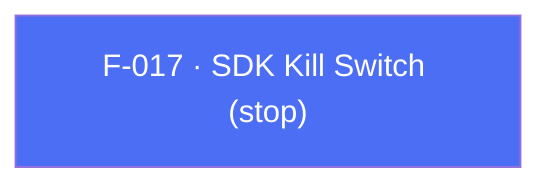

## Business Purpose
Some legal, privacy, or contractual situations (e.g. a user invokes a "right to be forgotten," a regulator order, or a licensing dispute) require the app to fully halt all AppsFlyer network activity immediately, not just for one user but for the whole SDK instance. `stop(true)` is the bluntest tool in the plugin: it tells the native SDK to stop communicating with AppsFlyer's servers entirely. Without it, the only way to achieve the same effect would be to prevent the SDK from ever calling `initSdk()`/`startSDK()`, which is not possible once the app is already running with the SDK live. This is documented as an "extreme case" API for legal/privacy compliance, distinct from the narrower per-user `anonymizeUser` (F-013).

> TODO: enrich from product specs — provide a Notion database URL and re-run Phase 4 to fill this automatically.

---

## Trigger
Called by the host app at any point during the app's lifetime — typically in response to a privacy/legal requirement (e.g. a "kill switch" remote config flag, a consent withdrawal flow, or during automated compliance testing) — to start or stop all SDK network communication.

---

## Call Chain
```
AppsflyerSdk.stop(isStopped)                                           [lib/src/appsflyer_sdk.dart]
  → _methodChannel.invokeMethod("stop", {'isStopped': isStopped})
    → Android: AppsflyerSdkPlugin.onMethodCall("stop") → stop(call, result)   [android/.../AppsflyerSdkPlugin.java]
      → AppsFlyerLib.getInstance().stop(isStopped, mContext)
    → iOS: AppsflyerSdkPlugin.handleMethodCall("stop") → stop:result:         [ios/Classes/AppsflyerSdkPlugin.m]
      → [AppsFlyerLib shared].isStopped = stop
```

---

## Files
| File | Role |
|------|------|
| `lib/src/appsflyer_sdk.dart` | `stop(bool)` — Dart API surface |
| `android/src/main/java/com/appsflyer/appsflyersdk/AppsflyerSdkPlugin.java` | `stop(call, result)` native handler, line 1033 |
| `ios/Classes/AppsflyerSdkPlugin.m` | `stop:result:` native handler (direct property assignment), line 734 |

---

## Input / Output
| | |
|--|--|
| **Input** | `isStopped` (bool) — `true` halts all SDK network communication/activity; `false` re-enables it. |
| **Output** | `void` — fire-and-forget; no confirmation returned to Dart. |

---

## Tests
`test/appsflyer_sdk_test.dart` — `check stop call` (line 143) asserts the mocked channel receives method `'stop'` with `capturedArguments['isStopped'] == true`. Native Android/iOS behavior is not exercised by any Dart test.

---

## Known Limitations
- No way to read back the current stopped state from Dart — the host app must track the last value it set itself.
- Calling `stop(true)` does not clear or reset any previously buffered/queued native SDK state; resuming with `stop(false)` re-enables communication but the plugin doc explicitly frames this as an "extreme" API not meant for routine toggling.
- No test coverage of the native Android/iOS code paths, only the Dart-to-channel argument shape.
- Distinct from `anonymizeUser` (F-013): `stop` disables the entire SDK instance for all users/sessions, while `anonymizeUser` scopes an opt-out to the current user only. Using `stop` where `anonymizeUser` was intended would be a significant over-reach in production.

---

## Dependencies

