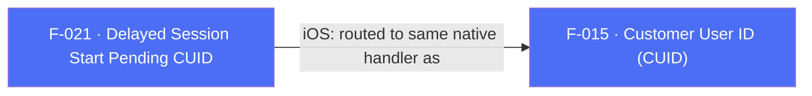

## Business Purpose
Some apps only know the user's own customer ID (CUID) after login, but want every session — including the very first one — attributed with that ID rather than logging an "anonymous" session first. `waitForCustomerUserId(true)` tells the SDK to hold off logging the launch/session event until `setCustomerIdAndLogSession()` explicitly supplies the CUID and unblocks it. Without this pair of APIs, an app that authenticates after launch would either lose the CUID association on the first session or have to accept an anonymous first session in its AppsFlyer reporting.

> TODO: enrich from product specs — provide a Notion database URL and re-run Phase 4 to fill this automatically.

---

## Trigger
`waitForCustomerUserId(true)` is called during startup configuration (typically before or instead of relying on auto-start) to arm the delay. `setCustomerIdAndLogSession(id)` is called later, once the app has resolved the user's customer ID (e.g. after login), to supply the ID and release the held session.

---

## Call Chain
```
AppsflyerSdk.waitForCustomerUserId(wait)                               [lib/src/appsflyer_sdk.dart]
  → _methodChannel.invokeMethod("waitForCustomerUserId", {'wait': wait})
    → Android: AppsflyerSdkPlugin.onMethodCall("waitForCustomerUserId") → waitForCustomerUserId(call, result)   [android/.../AppsflyerSdkPlugin.java]
      → AppsFlyerLib.getInstance().waitForCustomerUserId(wait)
    → iOS: AppsflyerSdkPlugin.handleMethodCall("waitForCustomerUserId") → waitForCustomerId:result:              [ios/Classes/AppsflyerSdkPlugin.m]
      → NO-OP — the method body only calls result(nil); no native AppsFlyerLib API is invoked

AppsflyerSdk.setCustomerIdAndLogSession(id)                            [lib/src/appsflyer_sdk.dart]
  → _methodChannel.invokeMethod("setCustomerIdAndLogSession", {'id': id})
    → Android: AppsflyerSdkPlugin.onMethodCall("setCustomerIdAndLogSession") → setCustomerIdAndLogSession(call, result)   [android/.../AppsflyerSdkPlugin.java]
      → AppsFlyerLib.getInstance().setCustomerIdAndLogSession(id, mContext)
    → iOS: AppsflyerSdkPlugin.handleMethodCall("setCustomerIdAndLogSession") → setCustomerUserId:result:                  [ios/Classes/AppsflyerSdkPlugin.m]
      → routed to the same handler as plain setCustomerUserId — [AppsFlyerLib shared] setCustomerUserID:id]; no "log session" semantics
```

---

## Files
| File | Role |
|------|------|
| `lib/src/appsflyer_sdk.dart` | `waitForCustomerIdAndLogSession` split into `waitForCustomerUserId(bool)` and `setCustomerIdAndLogSession(String)` — no `Platform.isAndroid` guard on either |
| `android/src/main/java/com/appsflyer/appsflyersdk/AppsflyerSdkPlugin.java` | `waitForCustomerUserId(call, result)` (line 971), `setCustomerIdAndLogSession(call, result)` (line 1009) — both proxy real native APIs |
| `ios/Classes/AppsflyerSdkPlugin.m` | `waitForCustomerId:result:` (line 757, no-op stub), `setCustomerIdAndLogSession` dispatch aliased to `setCustomerUserId:result:` (line 107/722) |
| `doc/API.md` | Explicitly documents both APIs as **"Android only!"** (lines 440, 449) |

---

## Input / Output
| | |
|--|--|
| **Input** | `waitForCustomerUserId`: `wait` (bool) — `true` delays session logging until a CUID is set. `setCustomerIdAndLogSession`: `id` (String) — the customer user ID to attach and the trigger to release the held session. |
| **Output** | `void` for both — fire-and-forget; no confirmation returned to Dart. |

---

## Tests
`test/appsflyer_sdk_test.dart` — `check waitForCustomerUserId call` (line 260) asserts the mocked channel receives `'waitForCustomerUserId'`. No test exists for `setCustomerIdAndLogSession` — it is absent from the mock handler's recognized-method switch (line 24-66) entirely, so calling it in a test would not even register as a captured method.

---

## Known Limitations
- **Effectively Android-only, despite no platform guard in Dart.** On iOS, `waitForCustomerId:` is a hollow stub (`result(nil)` only) — calling `waitForCustomerUserId(true)` on iOS has zero effect on session logging. `setCustomerIdAndLogSession` on iOS is silently routed to the same code as plain `setCustomerUserId` (just sets the customer ID property) with no "wait/release" behavior at all. This means an app that relies on this feature to guarantee CUID-attributed first sessions gets that guarantee only on Android; on iOS the first session logs immediately, unattributed, regardless of `waitForCustomerUserId(true)`.
- The official docs (`doc/API.md`) do flag both APIs "Android only," but the Dart API surface itself has no runtime warning, assertion, or `Platform.isAndroid` check — an integrator who skips the docs and only reads code/dartdoc could easily assume cross-platform parity.
- No test coverage at all for `setCustomerIdAndLogSession`, and no test verifies the delay/release semantics (mocks only assert the method name was invoked, not any ordering or blocking behavior).

---

## Dependencies

