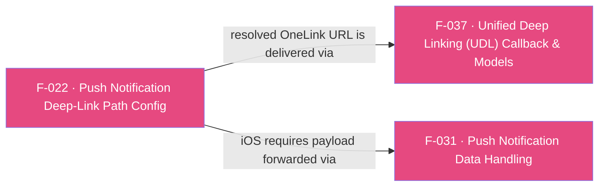

## Business Purpose
Push-notification re-engagement campaigns often embed a OneLink URL somewhere inside a custom, nested JSON payload rather than in a fixed top-level field — the exact location varies per app. `addPushNotificationDeepLinkPath` tells the native AppsFlyer SDK the JSON key-path where that OneLink URL lives, so the SDK can extract and resolve it as a deep link when the push payload is later handed to it. Without configuring this path, the SDK has no way to find the OneLink URL inside an arbitrarily-shaped push payload, and push-driven deep links silently fail to route users to the right in-app destination.

> TODO: enrich from product specs — provide a Notion database URL and re-run Phase 4 to fill this automatically.

---

## Trigger
Called once by the host app during startup configuration, **before** `initSdk()`/`startSDK()` is invoked — per `doc/API.md`, calling it after SDK start is unsupported. This registers the path so it's in place before any push payload is later delivered (see F-031).

---

## Call Chain
```
AppsflyerSdk.addPushNotificationDeepLinkPath(List<String> deeplinkPath)              [lib/src/appsflyer_sdk.dart]
  → _methodChannel.invokeMethod("addPushNotificationDeepLinkPath", deeplinkPath)
    → Android: AppsflyerSdkPlugin.onMethodCall("addPushNotificationDeepLinkPath") → addPushNotificationDeepLinkPath(call, result)   [android/.../AppsflyerSdkPlugin.java]
      → AppsFlyerLib.getInstance().addPushNotificationDeepLinkPath(String[] path)
    → iOS: AppsflyerSdkPlugin.handleMethodCall("addPushNotificationDeepLinkPath") → addPushNotificationDeepLinkPath:result:   [ios/appsflyer_sdk/Sources/appsflyer_sdk/AppsflyerSdkPlugin.m]
      → [[AppsFlyerLib shared] addPushNotificationDeepLinkPath:deeplinkPath]
```
The configured path is later consulted when a push payload reaches the native SDK (Android: automatically, from the launch/new intent extras; iOS: when `sendPushNotificationData`/`handlePushNotification` is called — see F-031), and any OneLink URL found at that path is resolved and delivered through the UDL `onDeepLinking` callback (F-037).

---

## Files
| File | Role |
|------|------|
| `lib/src/appsflyer_sdk.dart` | `addPushNotificationDeepLinkPath(List<String>)` — passes the path array directly as method-channel arguments (no wrapping map) |
| `android/src/main/java/com/appsflyer/appsflyersdk/AppsflyerSdkPlugin.java` | `addPushNotificationDeepLinkPath(call, result)` — casts arguments to `ArrayList<String>`, converts to `String[]`, forwards to `AppsFlyerLib.getInstance().addPushNotificationDeepLinkPath` |
| `ios/appsflyer_sdk/Sources/appsflyer_sdk/AppsflyerSdkPlugin.m` | `addPushNotificationDeepLinkPath:result:` — forwards the `NSArray` directly to `[AppsFlyerLib shared]` if non-nil |

---

## Input / Output
| | |
|--|--|
| **Input** | `deeplinkPath` (`List<String>`) — ordered JSON keys describing where in the push payload the OneLink URL is nested (e.g. `["deeply", "nested", "deep_link"]`) |
| **Output** | `void` — fire-and-forget; both native handlers call `result.success(null)`/`result(nil)` unconditionally (Android does so even if `call.arguments` is null, since the `if` guard just skips the native call but still succeeds). |

---

## Tests
No dedicated test found. `test/appsflyer_sdk_test.dart` does not exercise `addPushNotificationDeepLinkPath`.

---

## Known Limitations
- Must be called before SDK init/start per documentation; neither native handler nor the Dart method enforces or warns about ordering — calling it late is a silent no-op for that launch.
- On Android this path config is sufficient on its own (the SDK auto-extracts from intent extras); on iOS it configures the path but does nothing until the payload is separately forwarded to the SDK via F-031's `sendPushNotificationData`/`handlePushNotification` — an integrator who configures the path on iOS but skips that step will see push deep links silently fail to resolve.
- No validation of the path array shape (e.g. empty list, non-string elements) on either platform before forwarding to native code.

---

## Dependencies

