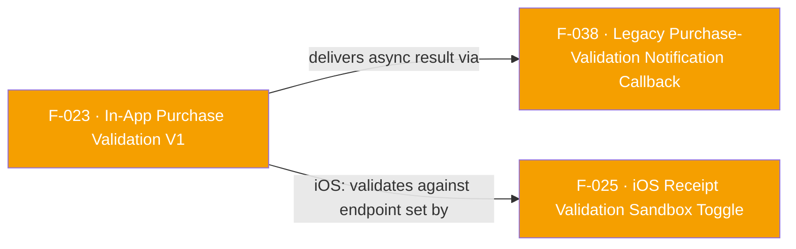

## Business Purpose
Before the cross-platform V2 API existed, apps needed a way to send a purchase receipt directly to AppsFlyer's validation servers so that in-app-purchase revenue could be confirmed against the store (Google Play / App Store) rather than trusted at face value from the client. This is what lets AppsFlyer distinguish real, store-verified revenue from spoofed or refunded purchases in attribution and revenue reporting. `validateAndLogInAppAndroidPurchase` submits the Google Play `purchaseData`/`signature`/`publicKey` triple; `validateAndLogInAppIosPurchase` submits the App Store `productIdentifier`/`transactionId`. Both are now `@Deprecated` in favor of `validateAndLogInAppPurchaseV2` (F-024), but any app still calling them relies on this exact code path — removing it would break revenue validation for apps that have not migrated, with no automatic fallback.

> TODO: enrich from product specs — provide a Notion database URL and re-run Phase 4 to fill this automatically.

---

## Trigger
Called by the host app immediately after it detects a completed purchase from the platform store (Google Play Billing on Android, StoreKit on iOS) and wants that purchase validated and logged to AppsFlyer.

---

## Call Chain
```
Android:
AppsflyerSdk.validateAndLogInAppAndroidPurchase(publicKey, signature, purchaseData, price, currency, additionalParameters)   [lib/src/appsflyer_sdk.dart]
  → _methodChannel.invokeMethod("validateAndLogInAppAndroidPurchase", {publicKey, signature, purchaseData, price, currency, additionalParameters})
    → AppsflyerSdkPlugin.onMethodCall case "validateAndLogInAppAndroidPurchase" → validateAndLogInAppPurchase(call, result)   [android/.../AppsflyerSdkPlugin.java]
      → registerValidatorListener()  // registers AppsFlyerInAppPurchaseValidatorListener (feeds F-038)
      → AppsFlyerLib.getInstance().validateAndLogInAppPurchase(mContext, publicKey, signature, purchaseData, price, currency, additionalParameters)
      → result.success(null)   // Future resolves immediately; real result arrives later via the "validatePurchase" callback (F-038)

iOS:
AppsflyerSdk.validateAndLogInAppIosPurchase(productIdentifier, price, currency, transactionId, additionalParameters)   [lib/src/appsflyer_sdk.dart]
  → _methodChannel.invokeMethod("validateAndLogInAppIosPurchase", {productIdentifier, price, currency, transactionId, additionalParameters})
    → AppsflyerSdkPlugin.handleMethodCall case "validateAndLogInAppIosPurchase" → validateAndLogInAppPurchase:result:   [ios/appsflyer_sdk/Sources/appsflyer_sdk/AppsflyerSdkPlugin.m]
      → [AppsFlyerLib shared] validateAndLogInAppPurchase:productIdentifier price:currency:transactionId:additionalParameters:success:failure:
        → success block → onValidateSuccess: → [_streamHandler sendResponseToFlutter:@"validatePurchase" status:@"success" data:response]   [ios/appsflyer_sdk/Sources/appsflyer_sdk/AppsFlyerStreamHandler.m]
        → failure block → onValidateFail: → [_streamHandler sendResponseToFlutter:@"validatePurchase" status:@"failure" data:errorObject]
      → result(nil)   // Future resolves immediately, same fire-and-forget pattern as Android
```

---

## Files
| File | Role |
|------|------|
| `lib/src/appsflyer_sdk.dart` | `validateAndLogInAppAndroidPurchase(...)` and `validateAndLogInAppIosPurchase(...)`, both annotated `@Deprecated` |
| `android/src/main/java/com/appsflyer/appsflyersdk/AppsflyerSdkPlugin.java` | `validateAndLogInAppPurchase(MethodCall, Result)` native handler; calls `registerValidatorListener()` and `AppsFlyerLib.getInstance().validateAndLogInAppPurchase(...)` |
| `ios/appsflyer_sdk/Sources/appsflyer_sdk/AppsflyerSdkPlugin.m` | `validateAndLogInAppPurchase:result:` native handler; calls `[AppsFlyerLib shared] validateAndLogInAppPurchase:...]` with success/failure blocks routed through `onValidateSuccess:`/`onValidateFail:` |
| `ios/appsflyer_sdk/Sources/appsflyer_sdk/AppsFlyerStreamHandler.m` | `sendResponseToFlutter:status:data:` — forwards the async iOS validation result to Dart over the callback `MethodChannel` (`callbacks`) using `invokeMethod("callListener", ...)`, despite the class name suggesting an `EventChannel` |

---

## Input / Output
| | |
|--|--|
| **Input** | Android: `publicKey` (String), `signature` (String), `purchaseData` (String), `price` (String), `currency` (String), `additionalParameters` (Map<String,String>?). iOS: `productIdentifier` (String), `price` (String), `currency` (String), `transactionId` (String), `additionalParameters` (Map<String,String>). |
| **Output** | The Dart `Future` returned by both methods resolves to `null` immediately (fire-and-forget) — it does **not** carry the validation result. The actual validation outcome (success/failure + response payload) is delivered asynchronously, out-of-band, through the `onPurchaseValidation` callback listener (F-038), keyed by callback id `"validatePurchase"`. |

---

## Tests
`test/appsflyer_sdk_test.dart` — covers `validateAndLogInAppAndroidPurchase` only (asserts the method name string `"validateAndLogInAppAndroidPurchase"` and that `publicKey`/`price`/`currency` are forwarded correctly in the arguments map). No test exists for `validateAndLogInAppIosPurchase`.

---

## Known Limitations
- Both APIs are `@Deprecated` with a doc comment pointing to `validateAndLogInAppPurchaseV2` (F-024), and are marked for removal in a future version — new integrations should not use them.
- The Dart `Future` resolves to `null` on both platforms as soon as the native call is dispatched, not when validation actually completes — callers cannot `await` a result from these methods; they must separately register `onPurchaseValidation` (F-038) to observe the outcome. This asynchronous split is easy to miss and is not documented in the dartdoc for either method.
- iOS delivers its result via `AppsFlyerStreamHandler.sendResponseToFlutter`, which despite its name and the class being wired to a `FlutterEventChannel`, actually pushes data through the callback `MethodChannel` (`callListener`) instead of an `EventSink` — the Dart-side `EventChannel` (`af-events`) instantiated in `appsflyer_sdk.dart` is never `.listen()`-ed to anywhere in `lib/`.
- No test coverage at all for the iOS path (`validateAndLogInAppIosPurchase`), only the Android path is asserted in `test/appsflyer_sdk_test.dart`.
- On Android, the validated result is only forwarded to Dart if `onPurchaseValidation` was registered *before* the validation completes (gated by the `validatePurchaseCallback` boolean flag); on iOS, `sendResponseToFlutter` has no such gate and always attempts to forward, which is an asymmetry between the two native implementations of the same nominal feature.

---

## Dependencies

