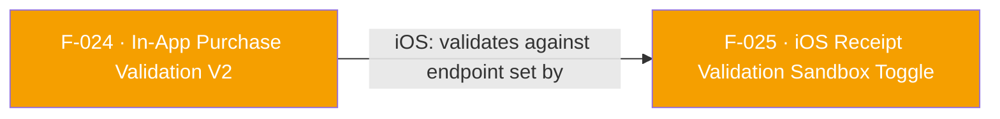

## Business Purpose
`validateAndLogInAppPurchaseV2` replaces the deprecated, platform-specific V1 APIs (F-023) with a single cross-platform entry point built around the `AFPurchaseDetails` model, so app developers write one call site instead of branching on `Platform.isAndroid`/`Platform.isIOS`. It lets AppsFlyer verify purchase/subscription revenue against the store (Google Play or App Store) and, unlike V1, returns the actual validation result (or a structured error) directly on the `Future`, so the app can react to a failed validation (e.g. refuse to unlock content) at the call site instead of wiring a separate global listener. Without this feature, apps would have to fall back to the deprecated, harder-to-use, fire-and-forget V1 APIs to get server-side purchase validation at all.

> TODO: enrich from product specs — provide a Notion database URL and re-run Phase 4 to fill this automatically.

---

## Trigger
Called by the host app after it detects a completed purchase or subscription renewal from the platform store, whenever it wants a synchronous (awaited) validation result back from AppsFlyer.

---

## Call Chain
```
AppsflyerSdk.validateAndLogInAppPurchaseV2(purchaseDetails, {additionalParameters})        [lib/src/appsflyer_sdk.dart]
  → _methodChannel.invokeMethod("validateAndLogInAppPurchaseV2", {
        'purchaseDetails': purchaseDetails.toMap(),      // {purchaseType, purchaseToken, productId}  [lib/src/af_purchase_details.dart]
        'additionalParameters': additionalParameters,
    })
    → Android: AppsflyerSdkPlugin.onMethodCall case "validateAndLogInAppPurchaseV2" → validateAndLogInAppPurchaseV2(call, result)   [android/.../AppsflyerSdkPlugin.java]
      → mapPurchaseType(purchaseTypeString)  // "subscription" → AFPurchaseType.SUBSCRIPTION, "one_time_purchase" → AFPurchaseType.ONE_TIME_PURCHASE
      → new AFPurchaseDetails(purchaseType, purchaseToken, productId)
      → AppsFlyerLib.getInstance().validateAndLogInAppPurchase(purchaseDetails, additionalParameters, AppsFlyerInAppPurchaseValidationCallback)
        → onInAppPurchaseValidationFinished(...) → result.success(flutterResult)
        → onInAppPurchaseValidationError(...)    → result.error("VALIDATION_ERROR", errorMessage, flutterErrorResult)
    → iOS: AppsflyerSdkPlugin.handleMethodCall case "validateAndLogInAppPurchaseV2" → validateAndLogInAppPurchaseV2:result:   [ios/Classes/AppsflyerSdkPlugin.m]
      → maps purchaseType string to AFSDKPurchaseType, purchaseToken → transactionId
      → new AFSDKPurchaseDetails(productId, transactionId, purchaseType)
      → [AppsFlyerLib shared] validateAndLogInAppPurchase:purchaseAdditionalDetails:completion:
        → completion(response, nil)   → result(response)
        → completion(nil, error)      → result([FlutterError code:"VALIDATION_ERROR" ...])
```

---

## Files
| File | Role |
|------|------|
| `lib/src/appsflyer_sdk.dart` | `validateAndLogInAppPurchaseV2(AFPurchaseDetails, {additionalParameters})` |
| `lib/src/af_purchase_details.dart` | `AFPurchaseDetails` model (`purchaseType`, `purchaseToken`, `productId`) and `AFPurchaseType` enum (`oneTimePurchase`, `subscription`); `toMap()` serializes `purchaseType` to `"one_time_purchase"` / `"subscription"` strings for the channel |
| `android/src/main/java/com/appsflyer/appsflyersdk/AppsflyerSdkPlugin.java` | `validateAndLogInAppPurchaseV2(MethodCall, Result)` handler; `mapPurchaseType(String)` translates the Dart string enum to the native `AFPurchaseType` |
| `ios/Classes/AppsflyerSdkPlugin.m` | `validateAndLogInAppPurchaseV2:result:` handler; inline string comparison maps to `AFSDKPurchaseType` (note: `purchaseToken` from Dart is passed as iOS `transactionId`) |

---

## Input / Output
| | |
|--|--|
| **Input** | `purchaseDetails` (`AFPurchaseDetails` → map with `purchaseType` string, `purchaseToken`, `productId`), `additionalParameters` (`Map<String, String>?`, optional). |
| **Output** | `Future<Map<String, dynamic>>` — resolves with the native SDK's validation-finished result map on success; on failure the platform channel throws (Android: `PlatformException` with code `"VALIDATION_ERROR"` or `"INVALID_ARGUMENTS"`/`"INVALID_PURCHASE_TYPE"`; iOS: `PlatformException` with code `"VALIDATION_ERROR"` or `"INVALID_ARGUMENTS"`, details include `error_code`/`error_domain`). Unlike V1 (F-023), the result is delivered synchronously on the same `Future` — no separate listener is needed. |

---

## Tests
No dedicated test found. `test/appsflyer_sdk_test.dart` does not register a mock handler for `"validateAndLogInAppPurchaseV2"` or call `validateAndLogInAppPurchaseV2` anywhere; the only purchase-validation test present covers the deprecated `validateAndLogInAppAndroidPurchase` (F-023). The `example/` app does exercise this method (`example/lib/main_page.dart`, `validatePurchase()` helper), but that is a manual/demo path, not an automated test.

---

## Known Limitations
- No automated test coverage — a regression in the `purchaseType` string values (`"one_time_purchase"` / `"subscription"`), which must match exactly across `af_purchase_details.dart`, `AppsflyerSdkPlugin.java`'s `mapPurchaseType`, and the iOS string comparison, would not be caught by CI.
- The field name is inconsistent across platforms: Dart/Android call it `purchaseToken`, but the iOS handler maps that same value onto `transactionId` (`NSString* transactionId = purchaseDetailsMap[@"purchaseToken"];`) — functionally correct today, but a naming trap for anyone reading only one side of the bridge.
- Invalid `purchaseType` strings are handled inconsistently in shape: Android returns a distinct `"INVALID_PURCHASE_TYPE"` error code, while iOS silently defaults any non-`"subscription"` string to `AFSDKPurchaseTypeOneTimePurchase` instead of validating and erroring — a typo'd purchase type on iOS would silently validate as the wrong purchase type rather than fail loudly.

---

## Dependencies

