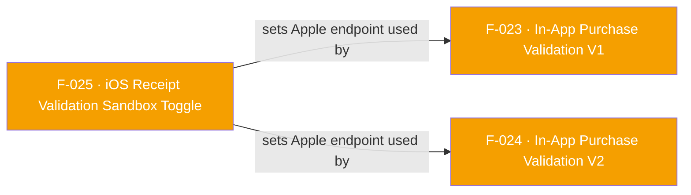

## Business Purpose
Apple's StoreKit sandbox (TestFlight / Xcode debug builds) issues receipts that Apple's production receipt-validation endpoint rejects, and vice versa. `useReceiptValidationSandbox` lets a host app tell AppsFlyer's native iOS SDK which Apple endpoint to call when it later validates an in-app purchase (F-023 V1 iOS path, or F-024 V2), so QA/TestFlight builds can validate sandbox receipts without those calls failing against the production endpoint. Without this toggle, developers testing purchase validation on non-production builds would see every validation call fail against Apple's servers, even though the purchase itself is legitimate in the sandbox.

> TODO: enrich from product specs — provide a Notion database URL and re-run Phase 4 to fill this automatically.

---

## Trigger
Called by the host app during setup/configuration (typically before or alongside SDK init), whenever it needs to toggle whether subsequent iOS purchase-validation calls (F-023, F-024) hit Apple's sandbox or production receipt-validation environment.

---

## Call Chain
```
AppsflyerSdk.useReceiptValidationSandbox(bool isSandboxEnabled)          [lib/src/appsflyer_sdk.dart]
  → _methodChannel.invokeMethod("useReceiptValidationSandbox", isSandboxEnabled)
    → AppsflyerSdkPlugin.handleMethodCall case "useReceiptValidationSandbox"
        → useReceiptValidationSandbox:result:                            [ios/appsflyer_sdk/Sources/appsflyer_sdk/AppsflyerSdkPlugin.m]
            → _isSandboxEnabled = isSandboxEnabled.boolValue
            → [AppsFlyerLib shared].useReceiptValidationSandbox = _isSandboxEnabled
            → result(nil)
```
There is no Android implementation: the method channel argument is only handled on the iOS side.

---

## Files
| File | Role |
|------|------|
| `lib/src/appsflyer_sdk.dart` | `useReceiptValidationSandbox(bool isSandboxEnabled)` — sends the raw bool as the method-call argument (not wrapped in a map) |
| `ios/appsflyer_sdk/Sources/appsflyer_sdk/AppsflyerSdkPlugin.m` | `useReceiptValidationSandbox:result:` (line ~410) — guards with `isKindOfClass:[NSNumber class]`, stores into static `_isSandboxEnabled`, and forwards to `[AppsFlyerLib shared].useReceiptValidationSandbox` |

---

## Input / Output
| | |
|--|--|
| **Input** | `isSandboxEnabled` (`bool`) — sent as the bare method-call argument, not nested in a map. |
| **Output** | None — `void` method; native side calls `result(nil)` and the call is fire-and-forget. The effect is purely a stateful flag on `AppsFlyerLib` that changes the behavior of subsequent `validateAndLogInAppPurchase`/`validateAndLogInAppPurchaseV2` calls (F-023, F-024). |

---

## Tests
No dedicated test found. `grep` of `test/` and `example/` for `useReceiptValidationSandbox`/`isSandboxEnabled` returns no matches — neither an automated test nor the example app exercises this API.

---

## Known Limitations
- iOS-only: there is no Android method-channel handler or native equivalent for `useReceiptValidationSandbox`. Calling it on Android is a silent no-op from the Dart side (the platform channel simply has nothing registered to receive it on the Android plugin, since Android doesn't implement this case), which is undocumented in the dartdoc (`/// set sandbox for iOS purchase validation` is the only hint).
- No automated or example-app coverage — a regression that stops forwarding the flag to `[AppsFlyerLib shared].useReceiptValidationSandbox` would not be caught by CI.
- The static `_isSandboxEnabled` variable is process-global (`static BOOL`), matching the plugin's existing pattern for other boolean toggles (e.g. `disableSKAdNetwork`), but means the flag persists across plugin instances within the same process.

---

## Dependencies

