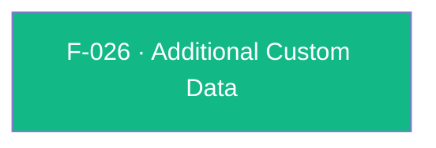

## Business Purpose
Some integrations need to enrich every outbound AppsFlyer SDK request with custom key/value context that doesn't fit any dedicated setter (e.g. app-specific segmentation flags, experiment identifiers, or partner-required metadata) — data that then flows into raw data/Pull-Push API exports alongside attribution and event data for downstream analysis. `setAdditionalData` gives the host app a generic escape hatch to attach arbitrary custom data to the SDK's requests. Without it, any custom context not covered by a named AppsFlyer API (customer user ID, currency, etc.) would have no way to travel with the SDK's payload at all.

> TODO: enrich from product specs — provide a Notion database URL and re-run Phase 4 to fill this automatically.

---

## Trigger
Called by the host app whenever it needs to attach custom key/value context to subsequent AppsFlyer SDK requests — typically once at startup, but callable at any point.

---

## Call Chain
```
AppsflyerSdk.setAdditionalData(customData)                                                     [lib/src/appsflyer_sdk.dart]
  → _methodChannel.invokeMethod("setAdditionalData", {'customData': customData})
    → Android: AppsflyerSdkPlugin.onMethodCall("setAdditionalData") → setAdditionalData(call, result)  [android/.../AppsflyerSdkPlugin.java]
      → AppsFlyerLib.getInstance().setAdditionalData((HashMap<String, Object>) customData)
      → result.success(null)
    → iOS: AppsflyerSdkPlugin.handleMethodCall("setAdditionalData") → setAdditionalData:result:        [ios/Classes/AppsflyerSdkPlugin.m]
      → [[AppsFlyerLib shared] setAdditionalData:data]
      → result(nil)
```

---

## Files
| File | Role |
|------|------|
| `lib/src/appsflyer_sdk.dart` | `setAdditionalData(Map<String, dynamic>? customData)` — platform-agnostic Dart API, `void` |
| `android/src/main/java/com/appsflyer/appsflyersdk/AppsflyerSdkPlugin.java` | `setAdditionalData(MethodCall, Result)` — casts the `customData` argument directly to `HashMap<String, Object>` and forwards to `AppsFlyerLib.getInstance().setAdditionalData(...)` |
| `ios/Classes/AppsflyerSdkPlugin.m` | `setAdditionalData:result:` — reads `customData` as an `NSDictionary` and forwards to `[[AppsFlyerLib shared] setAdditionalData:]` |
| `doc/API.md` | Public documentation for `setAdditionalData` |

---

## Input / Output
| | |
|--|--|
| **Input** | `customData` (`Map<String, dynamic>?`, nullable) — arbitrary key/value pairs |
| **Output** | `void` on the Dart side; both native handlers unconditionally call `result(nil)`/`result.success(null)` regardless of whether `customData` was null, empty, or well-formed |

---

## Tests
`test/appsflyer_sdk_test.dart` — `check setAdditionalData call` (line 254) calls `setAdditionalData(null)` and asserts the mocked channel receives the `setAdditionalData` invocation; it only verifies the null-safe dispatch path and does not exercise a populated map, nor either native handler's cast/forward logic.

---

## Known Limitations
- **Unsafe native cast on Android**: `AppsflyerSdkPlugin.java` casts the incoming argument directly to `(HashMap<String, Object>) call.argument("customData")` with no type check — if Dart ever sends a `Map` that isn't backed by a `HashMap` (e.g. a different `LinkedHashMap`/immutable map from platform-channel deserialization changes) this would throw a `ClassCastException` uncaught by any try/catch in that method, unlike `logAdRevenue`'s more defensive argument handling in the same file.
- No test coverage for the non-null path (a populated `customData` map) on either the Dart dispatch or native handlers — only the `null` case is exercised.
- No documented or enforced key/value shape — arbitrary nested values are passed straight through to the native SDK with no serialization validation in this plugin layer; malformed values would only surface as a native SDK-level failure outside this code.
- No API to read back or clear previously set additional data; each call presumably replaces (rather than merges into) the native SDK's stored additional data, but that merge-vs-replace behavior lives entirely in the native `AppsFlyerLib.setAdditionalData` implementation, outside this plugin's code.

---

## Dependencies

