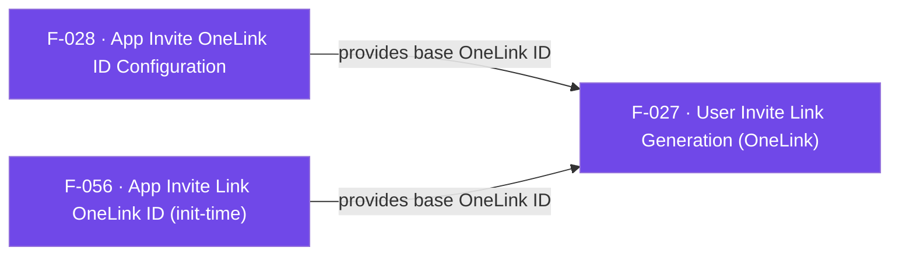

## Business Purpose
Referral/invite growth loops (e.g. "invite a friend and get X") need a personalized, attributable deep link that carries the referrer's identity, campaign, and channel so that when the invited user installs the app, AppsFlyer can attribute the install back to the referrer. `generateInviteLink` wraps the native AppsFlyer User-Invite-API (`ShareInviteHelper` / `AppsFlyerShareInviteHelper`) so the Flutter app can build such a OneLink without any native code. Without this feature, apps would have to drop to native platform channels themselves to construct invite links, losing the plugin's cross-platform convenience and the built-in referrer/customParams mapping.

> TODO: enrich from product specs — provide a Notion database URL and re-run Phase 4 to fill this automatically.

---

## Trigger
Called by the host app whenever it needs to hand a user a shareable invite/referral link (e.g. tapping an "Invite Friends" button). Requires a base OneLink ID to already be configured, either at init time (`appInviteOneLink` option, F-056) or at runtime via `setAppInviteOneLinkID` (F-028).

---

## Call Chain
```
AppsflyerSdk.generateInviteLink(params, success, error)                                  [lib/src/appsflyer_sdk.dart]
  → _translateInviteLinkParamsToMap(params)                                               [lib/src/appsflyer_sdk.dart]
  → startListening(success, "generateInviteLinkSuccess")                                  [lib/src/callbacks.dart]
  → startListening(error, "generateInviteLinkFailure")                                    [lib/src/callbacks.dart]
  → _methodChannel.invokeMethod("generateInviteLink", paramsMap)
    → Android: AppsflyerSdkPlugin.onMethodCall("generateInviteLink") → generateInviteLink(call, result)   [android/.../AppsflyerSdkPlugin.java]
      → ShareInviteHelper.generateInviteUrl(mContext) → LinkGenerator.generateLink(mContext, listener)     (native AppsFlyer Android SDK)
        → listener.onResponse(url) / onResponseError(error) → runOnUIThread(...) → mCallbackChannel.invokeMethod("callListener", ...)
    → iOS: AppsflyerSdkPlugin.handleMethodCall("generateInviteLink") → generateInviteLink:result:           [ios/Classes/AppsflyerSdkPlugin.m]
      → AppsFlyerShareInviteHelper generateInviteUrlWithLinkGenerator:completionHandler:                    (native AppsFlyer iOS SDK)
        → _streamHandler sendResponseToFlutter:responseID:status:data:                                     [ios/Classes/AppsFlyerStreamHandler.m]
  → Dart: callbacks.dart _methodCallHandler("callListener") → _callbacksById["generateInviteLinkSuccess"/"generateInviteLinkFailure"](data)   [lib/src/callbacks.dart]
```

---

## Files
| File | Role |
|------|------|
| `lib/src/appsflyer_invite_link_params.dart` | `AppsFlyerInviteLinkParams` — Dart model for channel, campaign, referrerName, referrerImageUrl, customerID, baseDeepLink, brandDomain, customParams |
| `lib/src/appsflyer_sdk.dart` | `generateInviteLink()` (public API) and `_translateInviteLinkParamsToMap()` — builds the method-channel payload and registers the two callbacks |
| `lib/src/callbacks.dart` | `startListening()` registers the success/failure callback IDs; `_methodCallHandler` dispatches `"callListener"` invocations back to the registered Dart callback |
| `android/src/main/java/com/appsflyer/appsflyersdk/AppsflyerSdkPlugin.java` | `generateInviteLink(call, result)` — maps arguments onto `LinkGenerator`, invokes the native `ShareInviteHelper`, and forwards the async result via `runOnUIThread` |
| `ios/Classes/AppsflyerSdkPlugin.m` | `generateInviteLink:result:` — same mapping onto `AppsFlyerLinkGenerator`, using `AppsFlyerShareInviteHelper` |
| `ios/Classes/AppsFlyerStreamHandler.m` | `sendResponseToFlutter:status:data:` — JSON-encodes the callback payload and invokes `"callListener"` on the callback channel |

---

## Input / Output
| | |
|--|--|
| **Input** | `AppsFlyerInviteLinkParams?` (all fields optional: `channel`, `campaign`, `referrerName`, `referrerImageUrl`, `customerID`, `baseDeepLink`, `brandDomain`, `customParams`), plus `success` and `error` callback functions |
| **Output** | `generateInviteLink` itself is `void` / fire-and-forget (`result.success(null)` / `result(nil)` resolve immediately, independent of link generation). The actual OneLink URL arrives asynchronously via the callback channel: success delivers `{"userInviteURL": "<url>"}` decoded into `{"status": ..., "payload": {...}}`; failure is meant to deliver `{"error": "<message>"}` but see Known Limitations for platform-specific delivery defects |

---

## Tests
`test/appsflyer_sdk_test.dart` — `check generateInviteLink call` (line 186) only asserts that calling `generateInviteLink(null, success, error)` dispatches the `"generateInviteLink"` method over the mocked channel; it does not exercise the success/failure callback payload shape, `_translateInviteLinkParamsToMap`, or either native implementation.

---

## Known Limitations
- **Android failure path likely crashes with `ClassCastException`**: in `AppsflyerSdkPlugin.java`, `LinkGenerator.ResponseListener.onResponseError(String error)` builds a `JSONObject obj` (`obj.put("error", error)`) but then calls `runOnUIThread(error, "generateInviteLinkFailure", AF_FAILURE)` passing the raw `error` `String` instead of `obj`. `runOnUIThread` unconditionally casts non-UDL payloads with `JSONObject dataJSON = (JSONObject) data;`, which throws when `data` is a `String`. This means any real invite-link-generation failure on Android is likely to throw inside a posted `Runnable` on the UI thread rather than deliver the intended `{"error": ...}` payload to Dart.
- **Success/failure callback shapes are inconsistent in Dart**: `lib/src/callbacks.dart`'s `_methodCallHandler` special-cases `"generateInviteLinkSuccess"` (JSON-decodes `data` and wraps it as `{"status": ..., "payload": ...}`), but `"generateInviteLinkFailure"` is not in that case list, so it falls into the `default` branch and delivers the raw (still JSON-encoded, undecoded) string to the `error` callback — callers must handle two different payload shapes for the same feature's two callbacks.
- **No validation that a OneLink ID is configured**: `generateInviteLink` does not check whether `setAppInviteOneLinkID` (F-028) or the `appInviteOneLink` init option (F-056) has been set before invoking the native link generator; behavior in that case is left entirely to the native AppsFlyer SDK.
- The Dart method is `void`, not awaitable — callers cannot `await` the actual link; they must rely on the `success`/`error` callback functions registered via the shared `startListening` callback-channel mechanism.

---

## Dependencies

