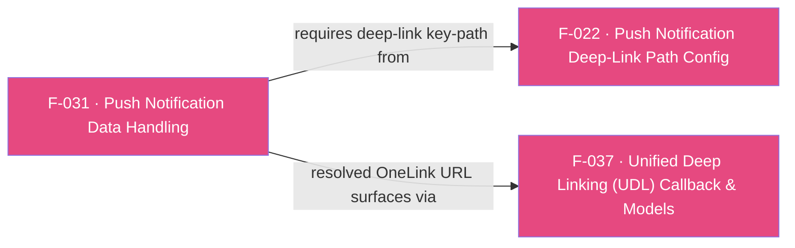

## Business Purpose
Push-notification re-engagement campaigns need to be measured (so their ROI shows up in AppsFlyer reporting) and, when the payload carries a OneLink URL, routed as a deep link into the right in-app screen. `sendPushNotificationData` hands the raw push payload to the native SDK so it can attribute the re-engagement and, if a deep-link path was configured (F-022), extract and resolve the embedded OneLink URL. Without this, push campaigns cannot be measured for re-engagement and push-embedded deep links never reach the SDK for resolution. The older `setPushNotification(bool)` toggle is deprecated in favor of this data-carrying API.

> TODO: enrich from product specs — provide a Notion database URL and re-run Phase 4 to fill this automatically.

---

## Trigger
Called by the host app whenever a push notification is received or tapped (foreground, background, or — via a persisted "pending push" pattern documented in `doc/API.md` — after a cold launch from a terminated state), passing the notification's data payload.

---

## Call Chain
```
AppsflyerSdk.sendPushNotificationData(Map? userInfo)                                 [lib/src/appsflyer_sdk.dart]
  → _methodChannel.invokeMethod("sendPushNotificationData", userInfo)
    → Android: AppsflyerSdkPlugin.onMethodCall("sendPushNotificationData") → sendPushNotificationData(call, result)   [android/.../AppsflyerSdkPlugin.java]
      → jsonToBundle(pushPayload) → Bundle
      → activity.getIntent().putExtras(bundle); activity.setIntent(intent)
      → AppsFlyerLib.getInstance().sendPushNotificationData(activity)
    → iOS: AppsflyerSdkPlugin.handleMethodCall("sendPushNotificationData") → sendPushNotificationData:result:   [ios/appsflyer_sdk/Sources/appsflyer_sdk/AppsflyerSdkPlugin.m]
      → [[AppsFlyerLib shared] handlePushNotification:userInfo]

AppsflyerSdk.setPushNotification(bool isEnabled)   [DEPRECATED, use sendPushNotificationData instead]
  → _methodChannel.invokeMethod("setPushNotification", isEnabled)
    → Android: setPushNotification(call, result) → AppsFlyerLib.getInstance().sendPushNotificationData(activity)   [the isEnabled arg itself is never read]
    → iOS: setPushNotification:result: → stores `_isPushNotificationEnabled` static BOOL   [never read anywhere else in the file]
```

---

## Files
| File | Role |
|------|------|
| `lib/src/appsflyer_sdk.dart` | `sendPushNotificationData(Map?)` (active) and `setPushNotification(bool)` (`@Deprecated`) |
| `android/src/main/java/com/appsflyer/appsflyersdk/AppsflyerSdkPlugin.java` | `sendPushNotificationData` — converts the JSON payload to a `Bundle` via `jsonToBundle`, stuffs it into the current activity's intent extras, then calls `AppsFlyerLib.getInstance().sendPushNotificationData(activity)`; `setPushNotification` — ignores its boolean argument and just re-invokes `sendPushNotificationData(activity)` with whatever extras are already on the intent |
| `ios/appsflyer_sdk/Sources/appsflyer_sdk/AppsflyerSdkPlugin.m` | `sendPushNotificationData:result:` — passes `userInfo` straight to `[AppsFlyerLib shared] handlePushNotification:]`; `setPushNotification:result:` — stores an unused static flag |

---

## Input / Output
| | |
|--|--|
| **Input** | `userInfo` / `pushPayload` (`Map?`) — the push notification's data payload (e.g. FCM/APNs message data) |
| **Output** | `void`. Android: if `pushPayload` is null, the handler logs and returns **without ever calling `result.success`/`result.error`**; if `activity`/`activity.getIntent()` is null, it logs an error message but, again, never calls `result(...)`. iOS: always calls `result(nil)`. Neither platform returns parsed deep-link data directly — any resolved OneLink URL is delivered asynchronously via the UDL `onDeepLinking` callback (F-037), gated by the path configured in F-022. |

---

## Tests
`test/appsflyer_sdk_test.dart` — `check sendPushNotificationData call` (around line 335) asserts the mocked channel receives `sendPushNotificationData` with the payload map; this exercises only the Dart-to-channel dispatch, not native bundle conversion, intent mutation, or deep-link extraction. No test covers the deprecated `setPushNotification`.

---

## Known Limitations
- **Significant Android/iOS asymmetry**: Android re-derives the push payload by mutating the *current activity's intent* (`putExtras` + `setIntent`) and re-running `sendPushNotificationData(activity)`, which only works if an `activity` and its `intent` are currently available; iOS passes the raw `NSDictionary` payload directly to `handlePushNotification:`, with no intent/activity dependency. The two platforms' failure modes for a "no activity" state are therefore completely different.
- **Silent failure path on Android**: when `pushPayload` is null, or when `activity`/`intent` is null, the native handler returns without ever calling `result.success(null)` or `result.error(...)`. Since the Dart `sendPushNotificationData` is `void` and not awaited, this is invisible to the caller — pending method-channel replies are simply never sent, though because Dart doesn't await them this manifests only as silently dropped data rather than a hang.
- **Deprecated `setPushNotification` behaves differently per platform**: on Android it *actively* re-sends whatever is already in the intent extras to the native SDK regardless of the `isEnabled` value passed in (the argument is read from the channel but never inspected); on iOS it only stores an internal flag (`_isPushNotificationEnabled`) that is never read anywhere else in `AppsflyerSdkPlugin.m` — so on iOS, calling the deprecated API has no observable effect on the native SDK at all.
- The iOS "MUST also call `sendPushNotificationData`" requirement for OneLink-URL-in-push deep linking (per `doc/API.md`) is not enforced anywhere in code — an integrator who configures `addPushNotificationDeepLinkPath` (F-022) but skips this call on iOS gets no deep-link resolution and no error signal.

---

## Dependencies

