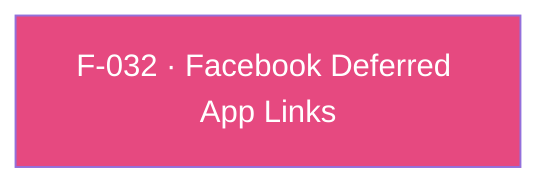

## Business Purpose
Apps that run Facebook Ads alongside AppsFlyer OneLink need deferred deep links to resolve correctly even when Facebook's own SDK has already claimed the deferred-app-link resolution flow. `enableFacebookDeferredApplinks` tells the native AppsFlyer SDK to interoperate with the Facebook SDK's `FBSDKAppLinkUtility` class so both attribution sources can coexist instead of one silently overriding or racing the other. Without enabling this, apps combining Facebook Ads and AppsFlyer OneLink risk deferred deep links resolving incorrectly (or not at all) for users who install after clicking a Facebook ad.

> TODO: enrich from product specs — provide a Notion database URL and re-run Phase 4 to fill this automatically.

---

## Trigger
Called once by the host app during startup configuration (before/around SDK init), for apps that have integrated the Facebook SDK and want AppsFlyer to interoperate with its deferred app-link resolution.

---

## Call Chain
```
AppsflyerSdk.enableFacebookDeferredApplinks(bool isEnabled)                           [lib/src/appsflyer_sdk.dart]
  → _methodChannel.invokeMethod("enableFacebookDeferredApplinks", {'isFacebookDeferredApplinksEnabled': isEnabled})
    → Android: AppsflyerSdkPlugin.onMethodCall("enableFacebookDeferredApplinks") → enableFacebookDeferredApplinks(call, result)   [android/.../AppsflyerSdkPlugin.java]
      → AppsFlyerLib.getInstance().enableFacebookDeferredApplinks(true|false)
    → iOS: AppsflyerSdkPlugin.handleMethodCall("enableFacebookDeferredApplinks") → enableFacebookDeferredApplinks:result:   [ios/appsflyer_sdk/Sources/appsflyer_sdk/AppsflyerSdkPlugin.m]
      → only if isEnabled == true: [[AppsFlyerLib shared] enableFacebookDeferredApplinksWithClass:NSClassFromString(@"FBSDKAppLinkUtility")]
```

---

## Files
| File | Role |
|------|------|
| `lib/src/appsflyer_sdk.dart` | `enableFacebookDeferredApplinks(bool)` — wraps the flag in `{'isFacebookDeferredApplinksEnabled': isEnabled}` |
| `android/src/main/java/com/appsflyer/appsflyersdk/AppsflyerSdkPlugin.java` | `enableFacebookDeferredApplinks(call, result)` — explicitly calls the native API with either `true` or `false` |
| `ios/appsflyer_sdk/Sources/appsflyer_sdk/AppsflyerSdkPlugin.m` | `enableFacebookDeferredApplinks:result:` — only calls the native enabling API when `isEnabled == true`; a `false` value is a no-op |

---

## Input / Output
| | |
|--|--|
| **Input** | `isEnabled` (bool) |
| **Output** | `void` — fire-and-forget; both handlers always call `result.success(null)`/`result(nil)`. Resolved deferred-link data (if any) is not returned here — it surfaces through whichever conversion/attribution channel the app has registered (legacy `onInstallConversionData`/`onAppOpenAttribution`, or UDL `onDeepLinking`), which are native-SDK internal behaviors this plugin does not directly wire to this flag. |

---

## Tests
`test/appsflyer_sdk_test.dart` — `check enableFacebookDeferredApplinks call` (around line 342) asserts the mocked channel receives `enableFacebookDeferredApplinks` with `isFacebookDeferredApplinksEnabled: true`. This exercises only the Dart-to-channel dispatch; it does not verify native behavior or the `false` no-op path on iOS.

---

## Known Limitations
- **Android/iOS asymmetry on disabling**: Android's handler calls the native API with the literal `isEnabled` value either way, so passing `false` actively disables the feature; iOS's handler only acts on `true` — passing `false` is silently ignored, so once enabled on iOS it cannot be turned back off via this API.
- Depends on the Facebook SDK (`FBSDKAppLinkUtility`) being present in the host app; the iOS handler resolves the class dynamically via `NSClassFromString`, so if the Facebook SDK isn't linked, the native AppsFlyer SDK receives a nil class with behavior determined entirely outside this plugin's code (not verified here).
- No signal is returned to Dart indicating whether Facebook deferred-app-link interop actually engaged (e.g. class not found, Facebook SDK version mismatch) — this call is purely fire-and-forget configuration.

---

## Dependencies

