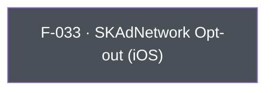

## Business Purpose
Apple's SKAdNetwork is the privacy-preserving attribution framework AppsFlyer's iOS SDK uses automatically post-iOS 14. Some advertisers run their own SKAdNetwork conversion-value scheme, use a different measurement partner for it, or need to suppress AppsFlyer's SKAdNetwork registration/postback handling entirely for compliance or contractual reasons. `disableSKAdNetwork` lets the host app flip that behavior off (the SDK still sends the SKAdNetwork registration request, but AppsFlyer stops returning/acting on conversion-value rules) without disabling the rest of AppsFlyer attribution. Without it, an app that needs to hand SKAdNetwork off to another party would have no supported way to do so short of not integrating the AppsFlyer SDK's SKAdNetwork handling path at all.

> TODO: enrich from product specs — provide a Notion database URL and re-run Phase 4 to fill this automatically.

---

## Trigger
Called by the host app during startup configuration, before `AppsFlyerLib` starts, whenever the app wants to opt out of AppsFlyer's automatic SKAdNetwork conversion-value handling on iOS.

---

## Call Chain
```
AppsflyerSdk.disableSKAdNetwork(isEnabled)                               [lib/src/appsflyer_sdk.dart:566]
  → _methodChannel.invokeMethod("disableSKAdNetwork", isEnabled)
    → iOS: AppsflyerSdkPlugin handleMethodCall: case "disableSKAdNetwork" → disableSKAdNetwork:result:   [ios/appsflyer_sdk/Sources/appsflyer_sdk/AppsflyerSdkPlugin.m:153]
      → [AppsFlyerLib shared].disableSKAdNetwork = _isSKADEnabled                                        [ios/appsflyer_sdk/Sources/appsflyer_sdk/AppsflyerSdkPlugin.m:401]
```
No `case "disableSKAdNetwork"` exists in `android/src/main/java/com/appsflyer/appsflyersdk/AppsflyerSdkPlugin.java`'s method-call switch — on Android the call falls through to the default branch and returns `MethodNotImplemented`.

---

## Files
| File | Role |
|------|------|
| `lib/src/appsflyer_sdk.dart` | `disableSKAdNetwork(bool)` — platform-agnostic Dart API surface (no `Platform.isIOS` guard) |
| `ios/appsflyer_sdk/Sources/appsflyer_sdk/AppsflyerSdkPlugin.m` | `disableSKAdNetwork:result:` native handler, sets `[AppsFlyerLib shared].disableSKAdNetwork` |

---

## Input / Output
| | |
|--|--|
| **Input** | `isEnabled` (bool) — `true` disables AppsFlyer's SKAdNetwork handling; native only applies the change if the argument is an `NSNumber` (boolean), otherwise silently no-ops. |
| **Output** | `void` — fire-and-forget; native always calls `result(nil)` regardless of whether the value was applied. |

---

## Tests
`test/appsflyer_sdk_test.dart` — `check disableSKAdNetwork call` (around line 349) asserts the mocked channel receives the method name `disableSKAdNetwork` with the boolean argument. The Dart test harness cannot verify the native iOS assignment to `AppsFlyerLib.shared.disableSKAdNetwork` actually takes effect.

---

## Known Limitations
- **iOS-only**: no Android implementation exists (concept doesn't apply — SKAdNetwork is an Apple/iOS-specific framework). The Dart API has no `Platform.isIOS` guard, so calling it on Android silently fails with `MissingPluginException`/`FlutterMethodNotImplemented` at the native layer rather than a documented no-op.
- Native code silently ignores non-boolean arguments (`isKindOfClass:[NSNumber class]` check) instead of surfacing an error to the caller, which can mask integration mistakes.
- Disabling SKAdNetwork handling here does not stop iOS from sending the registration call itself (`registerAppForAdNetworkAttribution`/`updateConversionValue` are OS-level, not AppsFlyer-level) — it only stops AppsFlyer's SDK-side processing of it.

---

## Dependencies

