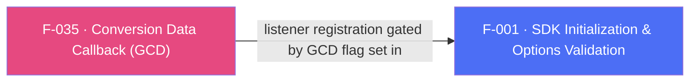

## Business Purpose
When a user installs the app after clicking an attributed link (or organically), the app often needs to know immediately — before the user even signs in — which campaign drove the install and whether it carries a deferred deep link, so it can personalize the very first session (e.g. show a specific onboarding screen or promo). `onInstallConversionData` ("Get Conversion Data", GCD) is the legacy API that delivers this attribution/conversion payload to Dart right after install. Without it, apps lose the ability to react to install-time attribution data and legacy deferred-deep-link payloads inside the app itself.

> TODO: enrich from product specs — provide a Notion database URL and re-run Phase 4 to fill this automatically.

---

## Trigger
Native SDK fires this once conversion data has been fetched from AppsFlyer's servers following an app install/launch — gated end-to-end by the `registerConversionDataCallback` flag passed to `initSdk()` (F-001) and by the Dart app having called `onInstallConversionData(callback)` to subscribe before that init.

---

## Call Chain
```
AppsflyerSdk.initSdk(registerConversionDataCallback: true, ...)                                    [lib/src/appsflyer_sdk.dart]
  → validatedOptions[AF_GCD] = registerConversionDataCallback || registerOnAppOpenAttributionCallback
  → _methodChannel.invokeMethod("initSdk", validatedOptions)
    → Android: initSdk(call, result) → if (getGCD) gcdListener = afConversionListener; instance.init(afDevKey, gcdListener, mContext)        [android/.../AppsflyerSdkPlugin.java]
    → iOS: initSdkWithCall:result: → if (isConversionData) [[AppsFlyerLib shared] setDelegate:_streamHandler]                                 [ios/Classes/AppsflyerSdkPlugin.m]

AppsflyerSdk.onInstallConversionData(Function callback)                                            [lib/src/appsflyer_sdk.dart]
  → startListening(callback, "onInstallConversionData")                                            [lib/src/callbacks.dart]
    → _channel(AF_CALLBACK_CHANNEL).invokeMethod("startListening", "onInstallConversionData")
      → Android: startListening(...) → gcdCallback = true (when callbackName == AF_GCD_CALLBACK == "onInstallConversionData")               [android/.../AppsflyerSdkPlugin.java]
      → iOS: startListening:result: → _gcdCallback = true (when callbackId == afGCDCallback == "onInstallConversionData")                    [ios/Classes/AppsflyerSdkPlugin.m]

Native SDK conversion data arrives:
  Android: afConversionListener.onConversionDataSuccess(map) / onConversionDataFail(s)
    → if (gcdCallback) runOnUIThread(data, AF_GCD_CALLBACK, status) → mCallbackChannel.invokeMethod("callListener", jsonArgs)
  iOS: AppsFlyerStreamHandler.onConversionDataSuccess:/onConversionDataFail: → sends JSON via AppsflyerSdkPlugin.callbackChannel "callListener"
    → Dart: _methodCallHandler(call) [lib/src/callbacks.dart] → callMap["id"] == "onInstallConversionData"
      → _callbacksById["onInstallConversionData"]({"status": ..., "payload": decodedData})
```

---

## Files
| File | Role |
|------|------|
| `lib/src/appsflyer_sdk.dart` | `onInstallConversionData(Function)` — registers the Dart callback via `startListening` |
| `lib/src/callbacks.dart` | `_methodCallHandler` — decodes the `callListener` JSON envelope and dispatches `{"status", "payload"}` to the registered `"onInstallConversionData"` callback |
| `android/src/main/java/com/appsflyer/appsflyersdk/AppsflyerSdkPlugin.java` | `afConversionListener.onConversionDataSuccess/onConversionDataFail` — native `AppsFlyerConversionListener` implementation; `initSdk` registers it with `AppsFlyerLib.getInstance().init(...)` only when `AF_GCD` is true; also caches results (`cachedOnConversionDataSuccess`/`cachedOnConversionDataFail`) across activity detach/reattach (`RD-65582`) |
| `ios/Classes/AppsFlyerStreamHandler.m` | `onConversionDataSuccess:`/`onConversionDataFail:` — `AppsFlyerLibDelegate` implementation, gated by `[AppsflyerSdkPlugin gcdCallback]` |
| `ios/Classes/AppsflyerSdkPlugin.m` | `initSdkWithCall:result:` — sets `_streamHandler` as the `AppsFlyerLib` delegate only if the `GCD` flag is true |

---

## Input / Output
| | |
|--|--|
| **Input** | None from Dart beyond registering the callback; the payload itself originates from AppsFlyer's attribution servers via the native SDK. |
| **Output** | `{"status": "success"｜"failure", "payload": Map?}` delivered to the Dart callback passed to `onInstallConversionData`. On failure, native code wraps the error string into the same envelope shape (`buildJsonResponse`) rather than a distinct failure structure. |

---

## Tests
No dedicated test found. `test/appsflyer_sdk_test.dart` does not exercise `onInstallConversionData` or the `callListener`/`onInstallConversionData` dispatch path in `lib/src/callbacks.dart`.

---

## Known Limitations
- **Shared registration flag, independent dispatch flags**: `initSdk`'s `AF_GCD`/`GCD` flag is `registerConversionDataCallback || registerOnAppOpenAttributionCallback` — enabling *either* flag registers the native conversion listener/delegate for *both* channels (F-035 and F-036 share one native registration). But each channel only actually forwards data to Dart if its own `gcdCallback`/`oaoaCallback` (Android) or `_gcdCallback`/`_oaoaCallback` (iOS) flag was separately flipped by calling `onInstallConversionData`/`onAppOpenAttribution` from Dart. An app that sets only `registerOnAppOpenAttributionCallback: true` but never calls `onInstallConversionData()` will still have the native listener registered but conversion-data events for that channel are simply dropped (Android) or dropped (iOS) rather than queued.
- Documentation (`doc/API.md`) explicitly requires the Dart-side `onInstallConversionData` implementation to be registered **before** SDK initialization; nothing in code enforces or warns about this ordering.
- Android caches at most one conversion-data outcome (success or fail) across an activity-detach window (`RD-65582` static fields); if multiple attach/detach cycles occur before Dart reattaches its listener, only the most recent cached result survives — no queueing of multiple missed callbacks.
- Error payloads use the same JSON envelope as success payloads (`buildJsonResponse` wraps the error string as `"data"`), so Dart-side consumers must inspect `status` rather than relying on a distinct shape to detect failure.

---

## Dependencies

