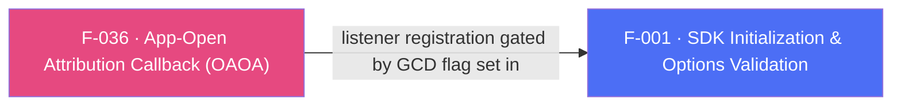

## Business Purpose
When an already-installed app is (re)opened via an attributed link — e.g. a user taps a OneLink pointing to specific content while the app is already on their device — the app needs to know what that link resolved to in order to route the user to the right place. `onAppOpenAttribution` ("On App Open Attribution", OAOA) is the legacy direct-deep-linking API that delivers this attribution payload to Dart. Without it, apps relying on the legacy (pre-UDL) deep-linking model cannot react to attributed app-open events for existing users.

> TODO: enrich from product specs — provide a Notion database URL and re-run Phase 4 to fill this automatically.

---

## Trigger
Native SDK fires this when a deep link is clicked by a user who already has the app installed — gated end-to-end by the `AF_GCD`/`GCD` flag passed to `initSdk()` (F-001, set true when `registerOnAppOpenAttributionCallback` is requested) and by the Dart app having called `onAppOpenAttribution(callback)` to subscribe before init. Per `doc/API.md`, this callback does **not** fire when the app has migrated to Unified Deep Linking (F-037) — the two are mutually exclusive delivery paths for direct deep linking.

---

## Call Chain
```
AppsflyerSdk.initSdk(registerOnAppOpenAttributionCallback: true, ...)                               [lib/src/appsflyer_sdk.dart]
  → validatedOptions[AF_GCD] = registerConversionDataCallback || registerOnAppOpenAttributionCallback
  → _methodChannel.invokeMethod("initSdk", validatedOptions)
    → Android: initSdk(call, result) → if (getGCD) gcdListener = afConversionListener; instance.init(afDevKey, gcdListener, mContext)         [android/.../AppsflyerSdkPlugin.java]
    → iOS: initSdkWithCall:result: → if (isConversionData) [[AppsFlyerLib shared] setDelegate:_streamHandler]                                 [ios/Classes/AppsflyerSdkPlugin.m]

AppsflyerSdk.onAppOpenAttribution(Function callback)                                                [lib/src/appsflyer_sdk.dart]
  → startListening(callback, "onAppOpenAttribution")                                                [lib/src/callbacks.dart]
    → _channel(AF_CALLBACK_CHANNEL).invokeMethod("startListening", "onAppOpenAttribution")
      → Android: startListening(...) → oaoaCallback = true (when callbackName == AF_OAOA_CALLBACK == "onAppOpenAttribution")                [android/.../AppsflyerSdkPlugin.java]
      → iOS: startListening:result: → _oaoaCallback = true (when callbackId == afOAOACallback == "onAppOpenAttribution")                     [ios/Classes/AppsflyerSdkPlugin.m]

Native SDK app-open attribution arrives:
  Android: afConversionListener.onAppOpenAttribution(map) / onAttributionFailure(errorMessage)
    → if (oaoaCallback) runOnUIThread(data, AF_OAOA_CALLBACK, status) → mCallbackChannel.invokeMethod("callListener", jsonArgs)
  iOS: AppsFlyerStreamHandler.onAppOpenAttribution:/onAppOpenAttributionFailure: → sends JSON via AppsflyerSdkPlugin.callbackChannel "callListener"
    → Dart: _methodCallHandler(call) [lib/src/callbacks.dart] → callMap["id"] == "onAppOpenAttribution"
      → _callbacksById["onAppOpenAttribution"]({"status": ..., "payload": decodedData})
```

---

## Files
| File | Role |
|------|------|
| `lib/src/appsflyer_sdk.dart` | `onAppOpenAttribution(Function)` — registers the Dart callback via `startListening` |
| `lib/src/callbacks.dart` | `_methodCallHandler` — decodes the `callListener` JSON envelope and dispatches `{"status", "payload"}` to the registered `"onAppOpenAttribution"` callback |
| `android/src/main/java/com/appsflyer/appsflyersdk/AppsflyerSdkPlugin.java` | `afConversionListener.onAppOpenAttribution/onAttributionFailure` — native `AppsFlyerConversionListener` methods, gated by `oaoaCallback`; also cached across activity detach/reattach (`cachedOnAppOpenAttribution`/`cachedOnAttributionFailure`, `RD-65582`) |
| `ios/Classes/AppsFlyerStreamHandler.m` | `onAppOpenAttribution:`/`onAppOpenAttributionFailure:` — `AppsFlyerLibDelegate` methods, gated by `[AppsflyerSdkPlugin oaoaCallback]` |
| `ios/Classes/AppsflyerSdkPlugin.m` | `initSdkWithCall:result:` — sets `_streamHandler` as the `AppsFlyerLib` delegate only if the `GCD` flag is true (shared with F-035) |

---

## Input / Output
| | |
|--|--|
| **Input** | None from Dart beyond registering the callback; the payload originates from the native SDK's link-resolution logic. |
| **Output** | `{"status": "success"｜"failure", "payload": Map?}` delivered to the Dart callback passed to `onAppOpenAttribution`. |

---

## Tests
No dedicated test found. `test/appsflyer_sdk_test.dart` does not exercise `onAppOpenAttribution` or its dispatch path in `lib/src/callbacks.dart`.

---

## Known Limitations
- **Mutually exclusive with UDL**: per `doc/DeepLink.md`, once an app migrates to Unified Deep Linking, `onAppOpenAttribution` "will not be called" — nothing in code enforces this exclusivity or warns an integrator who registers both `registerOnAppOpenAttributionCallback` and `registerOnDeepLinkingCallback` (F-037) simultaneously.
- Shares its native listener/delegate registration with F-035 (both gated by the same combined `AF_GCD`/`GCD` flag) — see F-035's Known Limitations for the registration-vs-dispatch flag mismatch this creates.
- Documentation requires the Dart-side `onAppOpenAttribution` implementation to be registered **before** SDK initialization; this ordering is not enforced in code.
- Android caches only the single most recent success or failure outcome across an activity-detach window (`RD-65582`); rapid multiple attribution events during a detach period are not individually queued.

---

## Dependencies

