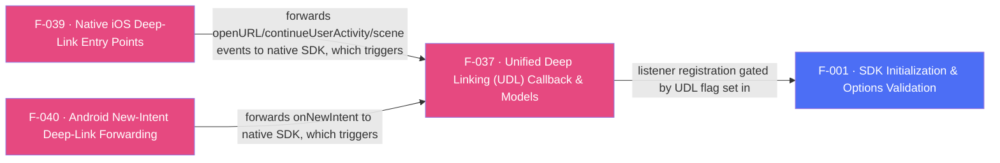

## Business Purpose
Unified Deep Linking is AppsFlyer's current recommended API for both direct and deferred deep linking: a single Dart callback (`onDeepLinking`) delivers one strongly-shaped result (`DeepLinkResult` — a `Status`, an optional `Error`, and an optional `DeepLink` payload) regardless of whether the link was clicked while the app was already installed or triggered a deferred install. Without it, integrators would have to juggle the two legacy, loosely-typed callbacks (`onAppOpenAttribution` / `onInstallConversionData`, F-035/F-036) and hand-parse raw maps to build a single personalized-routing experience (e.g. OneLink-driven deep content).

> TODO: enrich from product specs — provide a Notion database URL and re-run Phase 4 to fill this automatically.

---

## Trigger
Native SDK resolves a deep link (direct click while installed, or deferred deep link surfaced after a fresh install) and invokes its UDL delegate/listener — gated end-to-end by the `UDL` flag passed to `initSdk(registerOnDeepLinkingCallback: true)` (F-001) and by the Dart app having called `onDeepLinking(callback)` to subscribe before init. The underlying native trigger differs per platform: on Android it is `AppsFlyerLib.getInstance().performOnDeepLinking(...)`, invoked from the plugin's `onNewIntent` forwarding (F-040) as well as the SDK's own `onResume` intent inspection; on iOS it is `[AppsFlyerLib shared] handleOpenUrl:`/`continueUserActivity:`, invoked from the app-delegate/scene entry points buffered by `AppsFlyerAttribution` (F-039).

---

## Call Chain
```
AppsflyerSdk.initSdk(registerOnDeepLinkingCallback: true, ...)                                     [lib/src/appsflyer_sdk.dart]
  → validatedOptions[AF_UDL] = registerOnDeepLinkingCallback
  → _methodChannel.invokeMethod("initSdk", validatedOptions)
    → Android: initSdk(call, result) → if (getUdl) instance.subscribeForDeepLink(afDeepLinkListener)                [android/.../AppsflyerSdkPlugin.java]
    → iOS: initSdkWithCall:result: → if (isUDP) [AppsFlyerLib shared].deepLinkDelegate = _streamHandler              [ios/Classes/AppsflyerSdkPlugin.m]

AppsflyerSdk.onDeepLinking(Function(DeepLinkResult) callback)                                       [lib/src/appsflyer_sdk.dart]
  → startListeningToUDL(callback, "onDeepLinking")                                                  [lib/src/callbacks.dart]
    → _channel(AF_CALLBACK_CHANNEL).invokeMethod("startListening", "onDeepLinking")
      → Android: startListening(...) → udlCallback = true (when callbackName == AF_UDL_CALLBACK == "onDeepLinking")  [android/.../AppsflyerSdkPlugin.java]
      → iOS: startListening:result: → _udpCallback = true (when callbackId == afUDPCallback == "onDeepLinking")      [ios/Classes/AppsflyerSdkPlugin.m]

Native deep link resolved (via F-039 iOS entry points / F-040 Android onNewIntent, or SDK-internal resume/link-resolution):
  Android: afDeepLinkListener.onDeepLinking(DeepLinkResult) [com.appsflyer.deeplink.DeepLinkResult, native SDK type]
    → if (udlCallback) runOnUIThread(deepLinkResult, AF_UDL_CALLBACK, AF_SUCCESS)
      → args {"id", "deepLinkStatus", "deepLinkError"?, "deepLinkObj"? } → mCallbackChannel.invokeMethod("callListener", jsonArgs)
  iOS: AppsFlyerStreamHandler.didResolveDeepLink: (AppsFlyerDeepLinkDelegate)                        [ios/Classes/AppsFlyerStreamHandler.m]
    → if ([AppsflyerSdkPlugin udpCallback]) build {"id", "deepLinkStatus", "deepLinkError"?, "deepLinkObj"?} → AppsflyerSdkPlugin.callbackChannel invokeMethod:"callListener"
  Dart: _methodCallHandler(call) [lib/src/callbacks.dart] → callMap["id"] == "onDeepLinking"
    → error = callMap["deepLinkError"]?.errorFromString()
    → status = callMap["deepLinkStatus"]?.statusFromString() ?? Status.PARSE_ERROR
    → deepLink = callMap["deepLinkObj"] != null ? DeepLink(map) : null
    → _udlCallback!(DeepLinkResult(error, deepLink, status))                                          [lib/src/udl/deep_link_result.dart, lib/src/udl/deeplink.dart]
```

---

## Files
| File | Role |
|------|------|
| `lib/src/appsflyer_sdk.dart` | `onDeepLinking(Function(DeepLinkResult))` — registers the Dart UDL callback; `initSdk(registerOnDeepLinkingCallback: ...)` sets the `AF_UDL` init flag |
| `lib/src/callbacks.dart` | `startListeningToUDL` — stores a single `_udlCallback` (unlike the multi-key `_callbacksById` map used for other callbacks); `_methodCallHandler`'s `"onDeepLinking"` branch parses `deepLinkStatus`/`deepLinkError`/`deepLinkObj` into a `DeepLinkResult` |
| `lib/src/udl/deeplink.dart` | `DeepLink` — typed accessors (`deepLinkValue`, `matchType`, `mediaSource`, `campaign`, `afSub1..5`, `isDeferred`, etc.) over the raw click-event map |
| `lib/src/udl/deep_link_result.dart` | `DeepLinkResult`, `Status` (`FOUND`/`NOT_FOUND`/`ERROR`/`PARSE_ERROR`), `Error` (`TIMEOUT`/`NETWORK`/`HTTP_STATUS_CODE`/`UNEXPECTED`/`DEVELOPER_ERROR`) enums and string-conversion extensions used to decode the wire payload |
| `android/src/main/java/com/appsflyer/appsflyersdk/AppsflyerSdkPlugin.java` | `afDeepLinkListener` (`com.appsflyer.deeplink.DeepLinkListener`) — registered via `AppsFlyerLib.getInstance().subscribeForDeepLink(...)` only when `AF_UDL` is true; `runOnUIThread` serializes `DeepLinkResult` into the `deepLinkStatus`/`deepLinkError`/`deepLinkObj` JSON shape; caches `cachedDeepLinkResult` across activity detach/reattach (`RD-65582`) |
| `ios/Classes/AppsFlyerStreamHandler.m` | `didResolveDeepLink:` (`AppsFlyerDeepLinkDelegate`) — gated by `[AppsflyerSdkPlugin udpCallback]`; builds the same JSON shape as Android |
| `ios/Classes/AppsflyerSdkPlugin.m` | `initSdkWithCall:result:` sets `[AppsFlyerLib shared].deepLinkDelegate = _streamHandler` only if the `UDL` flag is true; `startListening:` flips the internal `_udpCallback` flag when `callbackId == afUDPCallback` |
| `ios/Classes/AppsflyerSdkPlugin.h` | Defines `afUDL` (`"UDL"`), `afUDPCallback` (`"onDeepLinking"`) — note the `udpCallback`/`_udpCallback` naming (likely a "UDL"→"UDP" typo) used throughout the iOS plugin for this feature |

---

## Input / Output
| | |
|--|--|
| **Input** | None from Dart beyond registering the callback; the deep-link click event itself originates from AppsFlyer's OneLink resolution, delivered into the native SDK via F-039 (iOS) / F-040 (Android) entry points or the SDK's own intent/URL inspection. |
| **Output** | `DeepLinkResult { Status status, Error? error, DeepLink? deepLink }` delivered to the Dart callback passed to `onDeepLinking`. `DeepLink` exposes the raw click-event map plus typed getters (`deepLinkValue`, `matchType`, `clickHttpReferrer`, `mediaSource`, `campaign`, `campaignId`, `afSub1..5`, `isDeferred`). Per `doc/DeepLink.md`, UDL privacy protection means new users' payloads are limited to `deep_link_value`/`deep_link_sub1-10`; other fields (`media_source`, `campaign`, `af_sub1-5`) return `null`. |

---

## Tests
No dedicated test found. `test/appsflyer_sdk_test.dart` does not exercise `onDeepLinking`, `startListeningToUDL`, or the `"onDeepLinking"` branch of `_methodCallHandler` in `lib/src/callbacks.dart`.

---

## Known Limitations
- **Single global callback, no queueing/multi-subscriber support**: `startListeningToUDL` stores the callback in a single module-level `_udlCallback` variable (not the keyed `_callbacksById` map other callbacks use), so registering `onDeepLinking` more than once silently replaces the previous subscriber rather than supporting multiple listeners.
- **iOS naming inconsistency**: the iOS native layer names its UDL-gating flag/method `udpCallback`/`_udpCallback` (`AppsflyerSdkPlugin.h`/`.m`), apparently a typo for "UDL" — functionally correct (still keyed off the `"onDeepLinking"` string) but a maintenance trap for anyone searching for `udl` in the iOS code.
- **Mutually exclusive with legacy direct deep linking**: per `doc/DeepLink.md`, migrating to UDL means `onAppOpenAttribution` (F-036) "will not be called" — nothing in code enforces or warns if an app registers both `registerOnDeepLinkingCallback` and `registerOnAppOpenAttributionCallback` simultaneously.
- Documentation requires the Dart-side `onDeepLinking` implementation to be registered **before** SDK initialization; nothing in code enforces or warns about this ordering.
- Android caches only the single most recent `DeepLinkResult` across an activity-detach window (`RD-65582` `cachedDeepLinkResult`); rapid multiple deep-link resolutions during a detach period are not individually queued — only the latest survives.
- `deepLinkStatus`/`deepLinkError` string parsing (`statusFromString`/`errorFromString`) uses `firstWhere(..., orElse: null)`, which throws if the native string doesn't match a known enum value rather than falling back cleanly (a `Status.PARSE_ERROR` default is only applied when the field itself is null/missing, not when it's an unrecognized string).

---

## Dependencies

