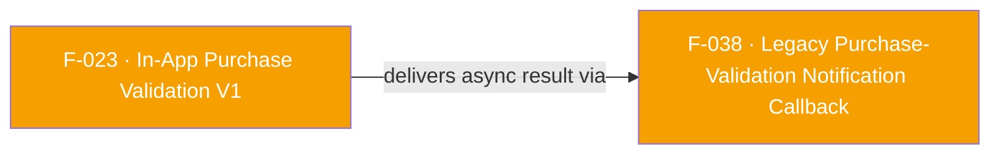

## Business Purpose
The legacy V1 purchase-validation APIs (F-023, `validateAndLogInAppAndroidPurchase` / `validateAndLogInAppIosPurchase`) are fire-and-forget: their Dart `Future` resolves as soon as the native call is dispatched, before AppsFlyer's servers have actually validated the receipt against the store. `onPurchaseValidation` is the only way a host app can find out whether that validation ultimately succeeded or failed — it registers a Dart callback that native code invokes asynchronously, once, whenever a `"validatePurchase"` event arrives from the native `AppsFlyerInAppPurchaseValidatorListener` (Android) or the `validateAndLogInAppPurchase` success/failure blocks (iOS). Without this callback, apps using the deprecated V1 validation APIs would have no way to observe the validation outcome at all, since V1 does not return it on the call's own `Future` (unlike V2 / F-024).

> TODO: enrich from product specs — provide a Notion database URL and re-run Phase 4 to fill this automatically.

---

## Trigger
Called by the host app once, typically during setup (before or shortly after calling the V1 validation APIs), to register a listener for the `"validatePurchase"` event. The registered callback then fires asynchronously whenever the native SDK later completes (or fails) a legacy in-app-purchase validation triggered by F-023.

---

## Call Chain
```
Registration:
AppsflyerSdk.onPurchaseValidation(Function callback)                      [lib/src/appsflyer_sdk.dart]
  → startListening(callback, "validatePurchase")                          [lib/src/callbacks.dart]
    → _callbacksById["validatePurchase"] = callback
    → _channel(AF_CALLBACK_CHANNEL /* "callbacks" */).invokeMethod("startListening", "validatePurchase")
      → Android: AppsflyerSdkPlugin.callbacksHandler → startListening(arguments, result)   [android/.../AppsflyerSdkPlugin.java]
          → validatePurchaseCallback = true   // gates delivery, see registerValidatorListener()
      → iOS: no native handler observed for "startListening" on the callbacks channel (see Known Limitations)

Delivery (Android):
AppsFlyerInAppPurchaseValidatorListener (registered by registerValidatorListener(), called from
  validateAndLogInAppPurchase() in F-023's V1 flow)                        [android/.../AppsflyerSdkPlugin.java]
  → onValidateInApp() / onValidateInAppFailure(String)
    → if (validatePurchaseCallback) runOnUIThread(data, AF_VALIDATE_PURCHASE /* "validatePurchase" */, AF_SUCCESS|AF_FAILURE)
      → mCallbackChannel.invokeMethod("callListener", jsonArgs)             // args = {id, status, data}
        → Dart: _methodCallHandler case 'callListener' → case "validatePurchase"   [lib/src/callbacks.dart]
            → decodes data, builds {"status", "payload"}, invokes _callbacksById["validatePurchase"](fullResponse)
              → the app's registered callback runs

Delivery (iOS):
[AppsFlyerLib shared] validateAndLogInAppPurchase:...success:/failure: (F-023's V1 flow)  [ios/Classes/AppsflyerSdkPlugin.m]
  → onValidateSuccess:/onValidateFail:
    → [_streamHandler sendResponseToFlutter:afValidatePurchase(@"validatePurchase") status:... data:...]  [AppsFlyerStreamHandler.m]
      → Dart: same _methodCallHandler case 'callListener' → case "validatePurchase" path as Android
```

---

## Files
| File | Role |
|------|------|
| `lib/src/appsflyer_sdk.dart` | `onPurchaseValidation(Function callback)` — thin wrapper calling `startListening(callback, "validatePurchase")` |
| `lib/src/callbacks.dart` | `startListening()` registers the callback in `_callbacksById` and tells native to start listening; `_methodCallHandler` routes incoming `"callListener"` calls whose `id == "validatePurchase"` to the registered callback, wrapping the payload as `{"status", "payload"}` |
| `lib/src/appsflyer_constants.dart` | `AF_VALIDATE_PURCHASE = "validatePurchase"` — the shared event id constant |
| `android/src/main/java/com/appsflyer/appsflyersdk/AppsflyerSdkPlugin.java` | `startListening(Object, Result)` sets `validatePurchaseCallback = true`; `registerValidatorListener()` builds the `AppsFlyerInAppPurchaseValidatorListener` whose `onValidateInApp()`/`onValidateInAppFailure(String)` gate on that flag and call `runOnUIThread(...)` to push the event to Dart over the `"callbacks"` (`mCallbackChannel`) `MethodChannel` |
| `android/src/main/java/com/appsflyer/appsflyersdk/AppsFlyerConstants.java` | `AF_VALIDATE_PURCHASE = "validatePurchase"` — native-side mirror of the Dart constant |
| `ios/Classes/AppsflyerSdkPlugin.m` | `onValidateSuccess:`/`onValidateFail:` (fed by F-023's `validateAndLogInAppPurchase:result:`) call `[_streamHandler sendResponseToFlutter:afValidatePurchase ...]` to forward the result |
| `ios/Classes/AppsflyerSdkPlugin.h` | `#define afValidatePurchase @"validatePurchase"` — iOS-side mirror of the same event id |
| `ios/Classes/AppsFlyerStreamHandler.m` | `sendResponseToFlutter:status:data:` — forwards the result to Dart via `invokeMethod("callListener", ...)` on the callback channel (same channel/protocol Android uses) |

---

## Input / Output
| | |
|--|--|
| **Input** | `callback` (`Function`) — a Dart function accepting one `dynamic` argument, registered once via `onPurchaseValidation`. |
| **Output** | The registered callback is invoked with `{"status": "success"\|"failure", "payload": <decoded JSON Map>}` whenever native code reports a `"validatePurchase"` event triggered by a prior F-023 V1 validation call. On Android, `payload` is empty `{}` on success and `{"error": "<message>"}` on failure; on iOS it is the raw validation response dictionary on success and `{"error": "<NSError description>"}` on failure. `onPurchaseValidation` itself returns nothing (`void`, `async` with no awaited work). |

---

## Tests
No dedicated test found. `grep` of `test/` for `onPurchaseValidation`/`validatePurchase` (as a callback registration, not the V1 validate-and-log call already covered by F-023's test) returns no matches — the callback-delivery path is untested by the Dart unit suite. The `example/` app also does not appear to call `onPurchaseValidation`.

---

## Known Limitations
- Deprecated-adjacent: this callback only exists to serve the deprecated V1 validation APIs (F-023). V2 (F-024) delivers its result directly on the call's own `Future` and does not need this listener. Apps that have fully migrated to V2 have no reason to register `onPurchaseValidation`.
- On Android, delivery is gated by the `validatePurchaseCallback` boolean, which is only set `true` once `onPurchaseValidation` → `startListening("validatePurchase")` has round-tripped to native; if a V1 validation call resolves before that registration completes, the resulting event is dropped (no buffering/replay), and the app never learns the outcome.
- `_callbacksById` in `callbacks.dart` is a single global map keyed by event id string — calling `onPurchaseValidation` more than once silently replaces the previously registered callback rather than fanning out to multiple listeners, and there is no corresponding `cancelListening` call exposed for this specific API (though the underlying `startListening` helper does return a `CancelListening` closure that `onPurchaseValidation` discards).
- iOS delivery is not gated by any equivalent boolean flag: `AppsFlyerStreamHandler.sendResponseToFlutter` always attempts to forward a `"validatePurchase"` event whenever `onValidateSuccess:`/`onValidateFail:` fire, regardless of whether the Dart side ever called `onPurchaseValidation` — an asymmetry with Android noted already in F-023's Known Limitations.
- No automated test coverage of the callback-delivery path on either platform.

---

## Dependencies

