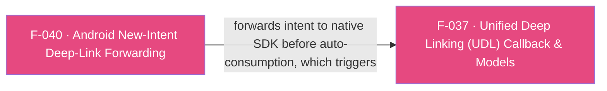

## Business Purpose
The native AppsFlyer Android SDK normally inspects the hosting `Activity`'s intent for deep-link data during `onResume()`. For a warm-started app (already running, brought back to the foreground by a new `VIEW` intent — e.g. tapping a OneLink while the app sits in the background), Android delivers that new intent via `onNewIntent`, and the SDK's own `onResume` handling stamps the intent URI with `af_consumed=true` once it has processed it. If the Flutter plugin didn't forward the intent to the SDK itself before that auto-consumption happens, warm-start deep links would either be missed entirely or race against the SDK's own resume-time handling. This feature exists purely to guarantee that warm-start deep links reliably reach AppsFlyer's resolution logic (and, from there, the UDL callback layer, F-037) as reliably as cold-start links do.

> TODO: enrich from product specs — provide a Notion database URL and re-run Phase 4 to fill this automatically.

---

## Trigger
Fires whenever Android calls `onNewIntent` on the host `Activity` while the Flutter engine's activity is attached — i.e. the app is warm (already running, not being freshly launched) and receives a new `Intent` (typically a `VIEW` intent from a deep link click).

---

## Call Chain
```
Android delivers a new Intent to the running Activity (app already warm)
  → PluginRegistry.NewIntentListener.onNewIntent(Intent intent)                    [android/.../AppsflyerSdkPlugin.java]
    → activity.setIntent(intent)   // keep Activity's intent in sync
    → if (mApplication != null): AppsFlyerLib.getInstance().performOnDeepLinking(intent, mApplication)
      // forwarded BEFORE the SDK's own onResume auto-handler stamps the URI with af_consumed=true
      → native SDK resolves the deep link from the intent
        → afDeepLinkListener.onDeepLinking(DeepLinkResult) (if subscribeForDeepLink was called, F-037/UDL path)
          → ... delivered to Dart via the callListener/onDeepLinking channel (see F-037)
    → onNewIntent returns false (does not claim exclusive handling of the intent)
```

---

## Files
| File | Role |
|------|------|
| `android/src/main/java/com/appsflyer/appsflyersdk/AppsflyerSdkPlugin.java` | `onNewIntentListener` (`PluginRegistry.NewIntentListener`) — calls `activity.setIntent(intent)` then `AppsFlyerLib.getInstance().performOnDeepLinking(intent, mApplication)`; registered via `binding.addOnNewIntentListener(onNewIntentListener)` in both `onAttachedToActivity` and `onReattachedToActivityForConfigChanges` |

---

## Input / Output
| | |
|--|--|
| **Input** | The Android `Intent` delivered to `onNewIntent` (typically a `VIEW` intent carrying a deep-link/OneLink URI), plus the plugin's cached `Activity`/`Application` references. |
| **Output** | No direct Dart-facing output — this feature only forwards the intent into `AppsFlyerLib.getInstance().performOnDeepLinking(...)`, which performs deep-link resolution and (if subscribed) delivers a `DeepLinkResult` through the existing UDL callback path (F-037). `onNewIntent` itself returns `false`, signaling it does not consume the intent for any other listener. |

---

## Tests
No dedicated test found — no native (JUnit/Robolectric) test target under `android/` covers `onNewIntentListener`, and `test/appsflyer_sdk_test.dart` (Dart-only) does not exercise this native-only code path.

---

## Known Limitations
- **Guarded by `mApplication` nullability, not by activity-attach state generally**: `performOnDeepLinking` is only called `if (mApplication != null)`; `mApplication` is set in `onAttachedToActivity` and never explicitly nulled elsewhere in the visible code except implicitly via activity detach handling, so a new intent arriving in a narrow window before `onAttachedToActivity` runs (or after certain teardown paths) would silently skip forwarding.
- **Race with the native SDK's own `onResume` consumption**: the inline comment in code explicitly documents the reason this forwarding exists — "Forward the intent to the SDK before its own onResume auto-handler runs and stamps the URI with `af_consumed=true`. Without this, warm-app VIEW intents get silently consumed and the registered DeepLinkListener never fires for the Dart side." This means the correctness of this feature depends on `onNewIntent` always running before the Activity's `onResume` in the observed lifecycle ordering — an assumption inherent to the Android lifecycle but not enforced/asserted in code.
- **No iOS equivalent by nature**: iOS has no concept of `onNewIntent`; the warm-start-equivalent cases on iOS are handled by the always-active `application:openURL:...`/`continueUserActivity:...`/`scene:...` delegate methods (F-039), which do not need a separate "already consumed" race to guard against.
- `onNewIntent` always returns `false`, so it never signals to the Flutter engine's intent-handling chain that it fully handled the intent — other registered `NewIntentListener`s (e.g. app-level routing) still run.
- No automated test coverage exists for this listener or its interaction with SDK-internal `onResume` consumption timing.

---

## Dependencies

