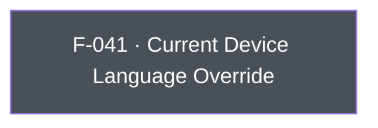

## Business Purpose
AppsFlyer's attribution and in-app-event reporting includes the device's language/locale as a dimension used for reporting and, for some integrated partners, for postback enrichment. Apps that manage their own in-app localization independently of the OS locale (e.g. a language switcher that doesn't change `NSLocale`) need a way to tell AppsFlyer which language the user is actually seeing, rather than relying on the OS-reported value. `setCurrentDeviceLanguage` provides that override. Without it, AppsFlyer would only ever see the OS-level device language, which can diverge from the language actually presented to the user and skew language-based reporting/segmentation for partners that consume it.

> TODO: enrich from product specs — provide a Notion database URL and re-run Phase 4 to fill this automatically.

---

## Trigger
Called by the host app whenever it needs to explicitly declare (or correct) the language reported to AppsFlyer — typically during startup configuration or right after an in-app language change.

---

## Call Chain
```
AppsflyerSdk.setCurrentDeviceLanguage(language)                          [lib/src/appsflyer_sdk.dart:597]
  → _methodChannel.invokeMethod("setCurrentDeviceLanguage", language)
    → iOS: AppsflyerSdkPlugin handleMethodCall: case "setCurrentDeviceLanguage" → setCurrentDeviceLanguage:result:   [ios/appsflyer_sdk/Sources/appsflyer_sdk/AppsflyerSdkPlugin.m:155]
      → [AppsFlyerLib shared] setCurrentDeviceLanguage: language                                                     [ios/appsflyer_sdk/Sources/appsflyer_sdk/AppsflyerSdkPlugin.m:395]
```
No `case "setCurrentDeviceLanguage"` exists in `android/src/main/java/com/appsflyer/appsflyersdk/AppsflyerSdkPlugin.java`'s method-call switch — on Android the call falls through to the default branch and returns `MethodNotImplemented`.

---

## Files
| File | Role |
|------|------|
| `lib/src/appsflyer_sdk.dart` | `setCurrentDeviceLanguage(String)` — platform-agnostic Dart API surface (no `Platform.isIOS` guard) |
| `ios/appsflyer_sdk/Sources/appsflyer_sdk/AppsflyerSdkPlugin.m` | `setCurrentDeviceLanguage:result:` native handler, forwards to `AppsFlyerLib.shared` |

---

## Input / Output
| | |
|--|--|
| **Input** | `language` (String) — an IETF/ISO language code (e.g. `"en"`) forwarded as-is; native performs no validation of the string's format. |
| **Output** | `void` — fire-and-forget; native always calls `result(nil)`. |

---

## Tests
No dedicated test found. `test/appsflyer_sdk_test.dart`'s mock method-call handler does not include a `case 'setCurrentDeviceLanguage'`, and no `test(...)` block exercises `instance.setCurrentDeviceLanguage(...)`.

---

## Known Limitations
- **iOS-only**: no Android implementation exists. The Dart API has no `Platform.isIOS` guard, so calling it on Android fails with `MissingPluginException`/`FlutterMethodNotImplemented` at the native layer rather than a documented no-op — Android integrators must consult documentation to learn this method has no effect there.
- No dedicated automated test coverage for this method, unlike most other Dart API surface methods in this plugin.
- Native code does not validate the `language` string (e.g. against a locale code list), so malformed input is passed straight through to the underlying SDK.

---

## Dependencies

