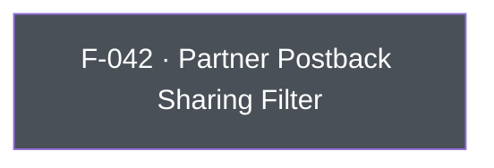

## Business Purpose
AppsFlyer forwards install/event data to integrated partner networks (ad networks, MMPs, analytics vendors) via server-to-server postbacks and API. Advertisers sometimes need to block that forwarding for specific partners or for all of them — to comply with GDPR/CCPA data-sharing restrictions, honor a user's opt-out choice, or enforce a business rule about which vendors may receive attribution data. `setSharingFilterForPartners` (and its deprecated predecessors `setSharingFilter`/`setSharingFilterForAllPartners`) is the only API surface for this; without it, the app would have no way to suppress third-party data sharing short of disabling the AppsFlyer SDK entirely via `stop()`, which would also break the advertiser's own attribution.

> TODO: enrich from product specs — provide a Notion database URL and re-run Phase 4 to fill this automatically.

---

## Trigger
Called by the host app during startup configuration or in direct response to a user consent/opt-out event, whenever the set of partners allowed to receive S2S postback data needs to change.

---

## Call Chain
```
AppsflyerSdk.setSharingFilterForPartners(partners)                       [lib/src/appsflyer_sdk.dart:615]
  → _methodChannel.invokeMethod("setSharingFilterForPartners", partners)
    → Android: AppsflyerSdkPlugin.onMethodCall("setSharingFilterForPartners") → setSharingFilterForPartners(call, result)   [android/.../AppsflyerSdkPlugin.java:349,555]
      → AppsFlyerLib.getInstance().setSharingFilterForPartners(partners)   (only if call.arguments != null)
    → iOS: AppsflyerSdkPlugin handleMethodCall: case "setSharingFilterForPartners" → setSharingFilterForPartners:result:   [ios/appsflyer_sdk/Sources/appsflyer_sdk/AppsflyerSdkPlugin.m:157,389]
      → [AppsFlyerLib shared] setSharingFilterForPartners: partners

AppsflyerSdk.setSharingFilter(partners)  [DEPRECATED]                     [lib/src/appsflyer_sdk.dart:603]
  → setSharingFilterForPartners(partners)   (re-routed in Dart to the method above; native "setSharingFilter" channel handlers still exist but are unreachable from this Dart entry point)

AppsflyerSdk.setSharingFilterForAllPartners()  [DEPRECATED]               [lib/src/appsflyer_sdk.dart:609]
  → setSharingFilterForPartners(["all"])   (re-routed in Dart to the method above)
```

---

## Files
| File | Role |
|------|------|
| `lib/src/appsflyer_sdk.dart` | `setSharingFilterForPartners(List<String>)` (active); `setSharingFilter(List<String>)` and `setSharingFilterForAllPartners()` (`@Deprecated`, both re-route to `setSharingFilterForPartners`) |
| `android/src/main/java/com/appsflyer/appsflyersdk/AppsflyerSdkPlugin.java` | `setSharingFilterForPartners` (active, dispatched via channel), plus dead `setSharingFilter`/`setSharingFilterForAllPartners` channel handlers no longer reachable from the current Dart API |
| `ios/appsflyer_sdk/Sources/appsflyer_sdk/AppsflyerSdkPlugin.m` | `setSharingFilterForPartners:result:` (active, dispatched via channel), plus dead `setSharingFilter:result:`/`setSharingFilterForAllPartners:` channel handlers no longer reachable from the current Dart API |

---

## Input / Output
| | |
|--|--|
| **Input** | `partners` (`List<String>`) — partner ID strings (e.g. `'facebook_int'`, `'googleadwords_int'`), or the literal `'all'` to block every partner. Empty list or `null` resets to the default (no filtering). |
| **Output** | `void` — fire-and-forget; both native handlers always return success/`nil`. |

---

## Tests
No dedicated test found. `test/appsflyer_sdk_test.dart`'s mock method-call handler includes `case 'setSharingFilterForAllPartners'` and `case 'setSharingFilter'` (but not `'setSharingFilterForPartners'`, the actual active channel method), and no `test(...)` block exercises any of `instance.setSharingFilter(...)`, `instance.setSharingFilterForAllPartners()`, or `instance.setSharingFilterForPartners(...)`.

---

## Known Limitations
- The Android native handler for the legacy `setSharingFilter` channel method (`android/.../AppsflyerSdkPlugin.java:792`) calls `AppsFlyerLib.getInstance().setSharingFilter()` with **no arguments**, discarding whatever filter list was passed — this handler is dead code from the current Dart API (which no longer sends a `"setSharingFilter"` channel call), but it would silently misbehave if ever invoked directly via the channel.
- The Dart mock test harness registers channel-method cases for the deprecated `setSharingFilter`/`setSharingFilterForAllPartners` names rather than the actual active `setSharingFilterForPartners` channel call, so the test scaffolding does not match current production wiring and provides no real coverage for this feature.
- No validation in Dart or native code that partner ID strings are well-formed or recognized; typos silently fail to filter the intended partner.

---

## Dependencies

