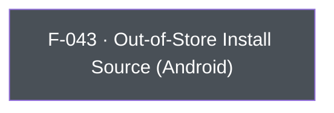

## Business Purpose
Android apps aren't limited to Google Play distribution — they can be side-loaded or distributed via third-party app stores (Facebook, Samsung Galaxy Store, Amazon Appstore, direct APK, etc.). Play Install Referrer, which AppsFlyer normally uses to attribute installs, isn't available for these channels. `setOutOfStore`/`getOutOfStore` let the app declare (and later read back) a custom install-source label so AppsFlyer can still attribute and report on installs that didn't come through Google Play. Without it, installs from alternative distribution channels would show up unattributed or misattributed in AppsFlyer reporting.

> TODO: enrich from product specs — provide a Notion database URL and re-run Phase 4 to fill this automatically.

---

## Trigger
`setOutOfStore` is called by the host app during startup configuration, before or around SDK init, when the app is distributed through a channel other than Google Play. `getOutOfStore` is called on demand whenever the app (or its analytics layer) needs to read back the currently recorded out-of-store source label.

---

## Call Chain
```
AppsflyerSdk.setOutOfStore(sourceName)                                   [lib/src/appsflyer_sdk.dart:620]
  → _methodChannel.invokeMethod("setOutOfStore", sourceName)
    → Android: AppsflyerSdkPlugin.onMethodCall("setOutOfStore") → setOutOfStore(call, result)   [android/.../AppsflyerSdkPlugin.java:355,530]
      → AppsFlyerLib.getInstance().setOutOfStore(sourceName)   (only if sourceName != null)

AppsflyerSdk.getOutOfStore()                                             [lib/src/appsflyer_sdk.dart:625]
  → _methodChannel.invokeMethod("getOutOfStore")
    → Android: AppsflyerSdkPlugin.onMethodCall("getOutOfStore") → getOutOfStore(result)   [android/.../AppsflyerSdkPlugin.java:352,526]
      → result.success(AppsFlyerLib.getInstance().getOutOfStore(this.mContext))
```
Neither `"setOutOfStore"` nor `"getOutOfStore"` has a case in `ios/Classes/AppsflyerSdkPlugin.m`'s `handleMethodCall:` — on iOS both calls fall through to `result(FlutterMethodNotImplemented)`.

---

## Files
| File | Role |
|------|------|
| `lib/src/appsflyer_sdk.dart` | `setOutOfStore(String)`, `getOutOfStore()` — platform-agnostic Dart API surface (no `Platform.isAndroid` guard) |
| `android/src/main/java/com/appsflyer/appsflyersdk/AppsflyerSdkPlugin.java` | `setOutOfStore`, `getOutOfStore` native handlers |
| `doc/API.md` | Documents both methods as **"Android Only!"** with an explicit `if(Platform.isAndroid)` usage guard recommended in examples |

---

## Input / Output
| | |
|--|--|
| **Input** | `setOutOfStore`: `sourceName` (String) — a custom install-source label (e.g. `"facebook_int"`); native no-ops if `null`. `getOutOfStore`: no input. |
| **Output** | `setOutOfStore`: `void`, fire-and-forget. `getOutOfStore`: `Future<String?>` resolving to the previously-set source label (or the native default if never set). |

---

## Tests
`test/appsflyer_sdk_test.dart` — `check setOutOfStore call` (around line 290) asserts the mocked channel receives `'setOutOfStore'` with the string argument; `check getOutOfStore call` (around line 284) asserts the mocked channel receives `'getOutOfStore'`. Tests run in the Dart test harness only and cannot verify the native Android SDK read/write behavior.

---

## Known Limitations
- **Android-only**: no iOS implementation exists (out-of-store distribution/attribution is an Android-specific concern — iOS apps are Apple App Store only). The Dart API has no `Platform.isAndroid` guard, so calling either method from iOS results in `MissingPluginException`/`FlutterMethodNotImplemented`; `doc/API.md` documents the "Android Only!" restriction and recommends wrapping calls in `if(Platform.isAndroid)`, but this is not enforced in code.
- `setOutOfStore` silently no-ops if `sourceName` is `null` rather than surfacing an error, which can mask integration mistakes.

---

## Dependencies

