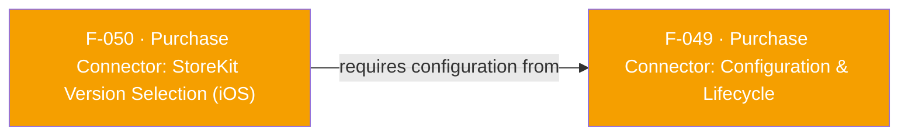

## Business Purpose
StoreKit 2 (iOS 15+) gives Apple's transaction-observation APIs better reliability and richer transaction data than the legacy StoreKit 1 API, but StoreKit 1 remains the only option on pre-iOS-15 devices. `storeKitVersion` on `PurchaseConnectorConfiguration` lets the app pick which StoreKit generation the native `PurchaseConnector` iOS SDK uses to auto-detect and validate purchases (feeding F-049's `startObservingTransactions`). Without this switch, the app would be stuck on whatever single default the native SDK picks, unable to opt into StoreKit 2's improvements on supported OS versions or to deliberately stay on StoreKit 1 for compatibility/testing reasons.

> TODO: enrich from product specs — provide a Notion database URL and re-run Phase 4 to fill this automatically.

---

## Trigger
Applied exactly once, at the same moment F-049's `configure` runs — the first time the app constructs `PurchaseConnector(config: PurchaseConnectorConfiguration(storeKitVersion: ...))`. There is no independent runtime trigger and no way to change it later: because `_PurchaseConnectorImpl` is a Dart-side singleton that ignores config on subsequent constructions, and the native iOS `configure` handler refuses to run twice (`"401" "Connector already configured"`), the StoreKit version is fixed for the lifetime of the app process.

---

## Call Chain
```
PurchaseConnectorConfiguration(storeKitVersion: StoreKitVersion.SK2)        [lib/src/purchase_connector/purchase_connector_configuration.dart]
  → StoreKitVersion.value  (SK1 → 0, SK2 → 1)                               [lib/src/purchase_connector/store_kit_version.dart]
    → _PurchaseConnectorImpl._internal() builds configMap[STORE_KIT_VERSION_KEY] = value   [lib/src/purchase_connector/purchase_connector.dart]
      → _methodChannel.invokeMethod("configure", configMap)   (channel "af-purchase-connector", shared with F-049)
        → iOS: PurchaseConnectorPlugin.methodCallHandler("configure") → configure(call:result:)   [ios/PurchaseConnector/PurchaseConnectorPlugin.swift]
          → reads Int arg "storeKitVersion" (default 0)
            → if 1 and #available(iOS 15.0, *): connector!.setStoreKitVersion(.SK2)
              else: connector!.setStoreKitVersion(.SK1)   (native PurchaseConnector iOS SDK API)
```
Android's native `configure` handler (`ConnectorWrapper`/`AppsFlyerPurchaseConnector.kt`) never reads the `storeKitVersion` key at all — the field travels through Android's channel call but has no effect there.

---

## Files
| File | Role |
|------|------|
| `lib/src/purchase_connector/store_kit_version.dart` | `StoreKitVersion` enum (`SK1`, `SK2`) with `value`/`fromValue` int mapping |
| `lib/src/purchase_connector/purchase_connector_configuration.dart` | `storeKitVersion` field, defaults to `StoreKitVersion.SK1` |
| `lib/src/purchase_connector/purchase_connector.dart` | Packs `config.storeKitVersion.value` into the shared `configure` map |
| `lib/src/appsflyer_constants.dart` | `STORE_KIT_VERSION_KEY = "storeKitVersion"` |
| `ios/PurchaseConnector/PurchaseConnectorPlugin.swift` | `configure(call:result:)` — reads the int, iOS-15 availability check, calls native `connector.setStoreKitVersion(.SK1/.SK2)` |

---

## Input / Output
| | |
|--|--|
| **Input** | `storeKitVersion` (int, 0 = SK1, 1 = SK2) — part of the same `configure` payload documented in F-049; not a standalone method call. |
| **Output** | `void` — no confirmation is returned to Dart of which StoreKit version was actually applied. If SK2 is requested on iOS < 15.0, the plugin silently falls back to SK1 and only logs a `print` statement natively; Dart has no way to detect this fallback happened. |

---

## Tests
No dedicated test found. Grepping `test/` for `StoreKitVersion`/`storeKitVersion` returns no matches.

---

## Known Limitations
- Not a separate API — it is a field folded into F-049's single `configure` call, so it inherits all of F-049's configure-time constraints (cannot be changed after first instantiation; a second `PurchaseConnector(config:...)` call silently drops the new config on Dart side, or gets a native `"401"` error if called again directly).
- No feedback path to Dart about which version was actually applied — the iOS-15 fallback from SK2 to SK1 is invisible to the app.
- The Dart-level enum/field is shared cross-platform code but is entirely inert on Android — `ConnectorWrapper.kt`'s `configure()` never reads `STORE_KIT_VERSION_KEY`.
- The whole feature is a no-op unless the app opted into the Purchase Connector at build time (`$AppsFlyerPurchaseConnector = true` in the Podfile, which conditionally pulls in the `PurchaseConnector` podspec subspec with `ENABLE_PURCHASE_CONNECTOR=1`) — otherwise `ios/PurchaseConnector/PurchaseConnectorPlugin.swift` isn't even compiled into the app (see F-054).

---

## Dependencies

