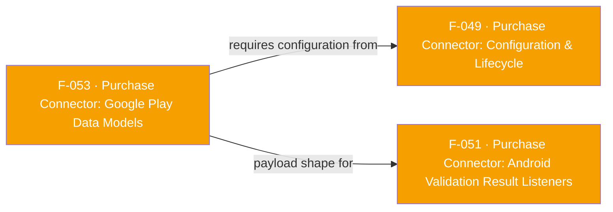

## Business Purpose
Google's Play Developer API represents subscriptions and one-time in-app purchases as deep, nested JSON objects (cancellation reasons, price-change details, prepaid-plan windows, Subscribe-with-Google identity info, etc.). `SubscriptionPurchase`/`ProductPurchase` and their nested classes are the typed Dart mirror of that shape, generated with `json_annotation`/`json_serializable`, so app code consuming F-051's validation-result listeners gets strongly-typed fields instead of having to parse raw maps by hand. Without these models, `SubscriptionValidationResult`/`InAppPurchaseValidationResult` (F-051) would have to expose validation payloads as untyped `Map<String, dynamic>`, pushing all of Google's nested-schema knowledge onto every app developer.

> TODO: enrich from product specs — provide a Notion database URL and re-run Phase 4 to fill this automatically.

---

## Trigger
Not a standalone entry point. These models are populated only as part of F-051's Android validation-result listener flow: whenever the native `purchase-connector` library's `SubscriptionPurchaseValidationResultListener`/`InAppPurchaseValidationResultListener` fires with a validation result, `SubscriptionPurchase`/`ProductPurchase` instances are constructed from the JSON that arrives over the method channel and attached to `SubscriptionValidationResult.subscriptionPurchase`/`InAppPurchaseValidationResult.productPurchase`.

---

## Call Chain
Population happens inside F-051's response path — Kotlin native object → JSON map → Dart typed model:
```
Google Play Billing subscription/purchase event → PurchaseClient validates with AppsFlyer server
  → PurchaseClient.SubscriptionPurchaseValidationResultListener.onResponse(result: Map<String, SubscriptionPurchase>)   [native purchase-connector lib]
    → ConnectorWrapper.SubscriptionPurchase.toJsonMap()  /  ConnectorWrapper.ProductPurchase.toJsonMap()   [android/.../include-connector/ConnectorWrapper.kt]
      (recursively maps every nested type: CanceledStateContext, ExternalAccountIdentifiers, SubscriptionPurchaseLineItem, OfferDetails, AutoRenewingPlan, Money, PausedStateContext, SubscribeWithGoogleInfo, TestPurchase, ...)
        → arsListener/viapListener → methodChannel.invokeMethodOnUI(...)   [AppsFlyerPurchaseConnector.kt]  →  JSON string over "af-purchase-connector" channel
          → Dart _handleSubscriptionPurchaseValidationResultListenerOnResponse / _handleInAppValidationResultListenerOnResponse   [lib/src/purchase_connector/purchase_connector.dart]
            → SubscriptionValidationResultMap.fromJson(...) / InAppPurchaseValidationResultMap.fromJson(...)
              → SubscriptionPurchase.fromJson(...) / ProductPurchase.fromJson(...)   [lib/src/purchase_connector/models/subscription_purchase.dart, product_purchase.dart]
                (generated `_$SubscriptionPurchaseFromJson`/`_$ProductPurchaseFromJson` in lib/appsflyer_sdk.g.dart)
```

---

## Files
| File | Role |
|------|------|
| `lib/src/purchase_connector/models/subscription_purchase.dart` | `SubscriptionPurchase` + nested `@JsonSerializable()` classes: `CanceledStateContext`, `DeveloperInitiatedCancellation`, `ReplacementCancellation`, `SystemInitiatedCancellation`, `UserInitiatedCancellation`, `CancelSurveyResult`, `ExternalAccountIdentifiers`, `SubscriptionPurchaseLineItem`, `OfferDetails`, `AutoRenewingPlan`, `SubscriptionItemPriceChangeDetails`, `Money`, `DeferredItemReplacement`, `PrepaidPlan`, `PausedStateContext`, `SubscribeWithGoogleInfo`, `TestPurchase` |
| `lib/src/purchase_connector/models/product_purchase.dart` | `ProductPurchase` — flat model (kind, purchaseTimeMillis, purchaseState, consumptionState, developerPayload, orderId, purchaseType, acknowledgementState, purchaseToken, productId, quantity, obfuscatedExternalAccountId, obfuscatedExternalProfileId, regionCode) |
| `lib/appsflyer_sdk.g.dart` | Generated `fromJson`/`toJson` bodies for every class above (all model files are `part of appsflyer_sdk`, so `build_runner` emits one combined `.g.dart` at the library root rather than per-file) |
| `android/src/main/include-connector/com/appsflyer/appsflyersdk/ConnectorWrapper.kt` | `SubscriptionPurchase.toJsonMap()`, `ProductPurchase.toJsonMap()`, and one `toJsonMap()` extension per nested Kotlin type — the native side of the field-name contract |
| `lib/src/purchase_connector/models/subscription_validation_result.dart`, `models/in_app_purchase_validation_result.dart` | F-051's result wrappers that hold a `SubscriptionPurchase?`/`ProductPurchase?` — the only place these models are referenced |

---

## Input / Output
| | |
|--|--|
| **Input** | JSON produced by `ConnectorWrapper.kt`'s `toJsonMap()` family, delivered as a JSON string over the `af-purchase-connector` method channel as part of F-051's `onResponse` payloads. |
| **Output** | Strongly-typed `SubscriptionPurchase`/`ProductPurchase` Dart object graphs, exposed to the app only via `SubscriptionValidationResult.subscriptionPurchase` / `InAppPurchaseValidationResult.productPurchase` (F-051). |

Field-name parity was verified directly against the Kotlin source: every key emitted by `ConnectorWrapper.kt`'s `toJsonMap()` functions (e.g. `"acknowledgementState"`, `"canceledStateContext"`, `"lineItems"`, `"subscribeWithGoogleInfo"`, `"purchaseTimeMillis"`, `"obfuscatedExternalAccountId"`, etc.) matches the corresponding Dart field name and the generated `_$...FromJson`/`_$...ToJson` keys in `lib/appsflyer_sdk.g.dart` exactly — no renaming or `@JsonKey` annotations are used anywhere in this model set.

---

## Tests
No dedicated test found. Grepping `test/` for `SubscriptionPurchase`, `ProductPurchase`, or any of the nested type names (`OfferDetails`, `AutoRenewingPlan`, `Money`, `SubscribeWithGoogleInfo`, etc.) returns no matches.

---

## Known Limitations
- These models only exist to be functional because of F-051's listener plumbing — and F-051's Android delivery path currently doesn't work (see F-051's documented method-name mismatch between the `#`-separated Dart constants and the `:`-separated strings Kotlin actually sends). Until that is fixed, these models are effectively dead code at runtime even though they compile and are fully wired.
- No custom `@JsonKey` mapping or manual value coercion exists anywhere in this model set — every field relies on an exact, case-sensitive key match between Kotlin's `toJsonMap()` and the Dart class; a rename on either side without updating the other would fail silently (`json['x'] as String` throws only if the key is present with the wrong type, but a missing/renamed key with a non-nullable field throws a `TypeError` deep inside `fromJson` with no context tying it back to Play Billing).
- Several fields (`purchaseTimeMillis`, `startTime`, `expiryTime`, `cancelTime`, etc.) are modeled as `String` even though they represent epoch milliseconds — no `DateTime` parsing is applied on either side, so callers must convert these themselves.
- `SubscriptionPurchase`/`ProductPurchase` mirror the Google Play Developer API schema at a point in time; if the native `purchase-connector:2.2.0` dependency (see `doc/PurchaseConnector.md`'s Billing Library 8.x note) adds or changes fields, these Dart models must be manually kept in sync — there is no schema-validation step in the build.
- This is Android/Google-Play-specific; there is no iOS equivalent typed model (F-052's `validationInfo` stays an untyped map).

---

## Dependencies

