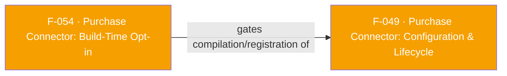

## Business Purpose
The Purchase Connector depends on the Google Play Billing Library (Android) and StoreKit (iOS) — libraries the plugin does not bundle, because most apps that don't sell in-app purchases/subscriptions shouldn't have to pull in billing dependencies just to use core attribution. This feature is the build-time switch that lets an app pull the real native Purchase Connector implementation into its build only if it explicitly opts in; apps that don't opt in get an inert stub instead. Without this switch, every consumer of the Flutter plugin would be forced to carry Play Billing Library / StoreKit purchase-connector native code (and satisfy their ProGuard/versioning constraints) even if they never call any Purchase Connector Dart API, which is unacceptable to plugins that just want attribution and deep linking.

> TODO: enrich from product specs — provide a Notion database URL and re-run Phase 4 to fill this automatically.

---

## Trigger
Not a runtime trigger — this is a build-time decision made once per app project when it configures its Gradle/CocoaPods build:
- **Android**: `android/build.gradle` reads `project.findProperty('appsflyer.enable_purchase_connector')?.toBoolean() ?: false`. The app sets `appsflyer.enable_purchase_connector=true` in its own `gradle.properties`.
- **iOS**: `ios/appsflyer_sdk.podspec` checks `if defined?($AppsFlyerPurchaseConnector)`. The app sets `$AppsFlyerPurchaseConnector = true` in its own `Podfile` before running `pod install`.

---

## Call Chain
This feature has no runtime call chain — it is compile/build-time source-set and preprocessor branching:

```
Android (Gradle, evaluated at build configuration time):
  android/build.gradle
    def includeConnector = project.findProperty('appsflyer.enable_purchase_connector')?.toBoolean() ?: false
    sourceSets.main.java.srcDirs += includeConnector
        ? ['src/main/include-connector']   → real AppsFlyerPurchaseConnector.kt + ConnectorWrapper.kt (Play Billing Library, PurchaseClient)
        : ['src/main/exlude-connector']    → stub AppsFlyerPurchaseConnector.kt (no MethodChannel registered)

iOS (CocoaPods, evaluated at `pod install` time):
  ios/appsflyer_sdk.podspec
    if defined?($AppsFlyerPurchaseConnector)   ("$AppsFlyerPurchaseConnector = true" set in app's Podfile)
      s.default_subspecs = 'Core', 'PurchaseConnector'
        subspec 'PurchaseConnector' → depends on CocoaPods 'PurchaseConnector' pod
                                     → pod_target_xcconfig sets GCC_PREPROCESSOR_DEFINITIONS 'ENABLE_PURCHASE_CONNECTOR=1'
    else
      s.default_subspecs = 'Core'   (PurchaseConnector subspec/pod not included at all)

  ios/Classes/AppsflyerSdkPlugin.m (compiled per the xcconfig macro above):
    #ifdef ENABLE_PURCHASE_CONNECTOR
      #import "appsflyer_sdk/appsflyer_sdk-Swift.h"
    #endif
    ...
    + (void)registerWithRegistrar:...
    #ifdef ENABLE_PURCHASE_CONNECTOR
      [PurchaseConnectorPlugin registerWithRegistrar:registrar];
    #endif
```

---

## Files
| File | Role |
|------|------|
| `android/build.gradle` | Reads `appsflyer.enable_purchase_connector` Gradle property, switches `sourceSets.main.java.srcDirs` between the two variants |
| `android/src/main/include-connector/com/appsflyer/appsflyersdk/AppsFlyerPurchaseConnector.kt` | Real Android implementation: registers the `af-purchase-connector` MethodChannel and handles `configure`/`startObservingTransactions`/`stopObservingTransactions` |
| `android/src/main/include-connector/com/appsflyer/appsflyersdk/ConnectorWrapper.kt` | Wraps `PurchaseClient` (Play Billing Library) — only compiled in the include-connector variant |
| `android/src/main/exlude-connector/com/appsflyer/appsflyersdk/AppsFlyerPurchaseConnector.kt` | No-op stub: implements `FlutterPlugin` but registers no `MethodChannel` at all |
| `ios/appsflyer_sdk.podspec` | Defines the `PurchaseConnector` CocoaPods subspec conditionally on `$AppsFlyerPurchaseConnector`, and sets the `ENABLE_PURCHASE_CONNECTOR=1` preprocessor macro for that subspec only |
| `ios/Classes/AppsflyerSdkPlugin.m` | `#ifdef ENABLE_PURCHASE_CONNECTOR` guards both the Swift-bridging header import and the `[PurchaseConnectorPlugin registerWithRegistrar:registrar]` call |
| `doc/PurchaseConnector.md` | App-facing opt-in instructions (`$AppsFlyerPurchaseConnector = true` in Podfile; `appsflyer.enable_purchase_connector=true` in gradle.properties) and an explicit "What Happens if You Use Dart Files Without Opting In?" section |

---

## Input / Output
| | |
|--|--|
| **Input** | Android: Gradle property `appsflyer.enable_purchase_connector` (string `"true"`/`"false"`, default `false`) set in the consuming app's `gradle.properties`. iOS: Ruby global `$AppsFlyerPurchaseConnector` set in the consuming app's `Podfile` before `pod install`; presence (not value) is what's checked (`defined?($AppsFlyerPurchaseConnector)`). |
| **Output** | Android: which `AppsFlyerPurchaseConnector.kt`/`ConnectorWrapper.kt` source set is compiled into the app's APK, and whether the `af-purchase-connector` MethodChannel gets a real handler. iOS: whether the `PurchaseConnector` pod/subspec and `ENABLE_PURCHASE_CONNECTOR` macro are present, which determines whether `PurchaseConnectorPlugin` is compiled and registered at all. |

---

## Tests
No dedicated test found — this is a Gradle/CocoaPods build-configuration concern with no Dart or native unit test coverage; verifying it requires two full builds (opted-in vs. opted-out) rather than a unit test, which the repo's `test/appsflyer_sdk_test.dart` does not attempt.

---

## Known Limitations
- The exclude-connector stub (`android/src/main/exlude-connector/.../AppsFlyerPurchaseConnector.kt`) is genuinely inert: it implements `FlutterPlugin.onAttachedToEngine`/`onDetachedFromEngine` as empty (`= Unit`) and never constructs a `MethodChannel` or sets a call handler. It does not throw and does not log a warning — it simply never responds. Any Dart call on the `af-purchase-connector` channel (`configure`, `startObservingTransactions`, etc.) in an app built without opting in will fail with Flutter's own `MissingPluginException`, not an AppsFlyer-authored error, making the failure mode confusing to diagnose (confirmed by reading the stub source directly).
- iOS has the same silent-gap behavior by omission rather than an explicit stub: if `$AppsFlyerPurchaseConnector` is undefined, the `PurchaseConnector` subspec/macro/registration are all compiled out, so `PurchaseConnectorPlugin` never registers a handler for `af-purchase-connector` either — same `MissingPluginException` outcome as Android, but reached via a completely different mechanism (absent Ruby global vs. an explicit empty Kotlin object), which is easy for engineers modifying one platform to forget applies to the other.
- **F-049 (Purchase Connector: Configuration & Lifecycle) and every other Purchase Connector Dart API are entirely meaningless without this feature being correctly opted into on both platforms** — the Dart-side classes (`PurchaseConnector`, `PurchaseConnectorConfiguration`, etc.) are always compiled into the plugin regardless of opt-in status, so an app can write code against them, pass static analysis, and still get runtime `MissingPluginException`s in production if it forgot the Podfile/gradle.properties step on either platform (`doc/PurchaseConnector.md` calls this out explicitly).
- The two opt-in mechanisms are asymmetric in strictness: Android checks a boolean value (`.toBoolean() ?: false`), so `appsflyer.enable_purchase_connector=false` or an unset/malformed property both cleanly resolve to "excluded." iOS checks mere *definedness* of `$AppsFlyerPurchaseConnector` (`defined?(...)`), so setting it to `false` in a Podfile still counts as "opted in" (`if defined?($AppsFlyerPurchaseConnector)` is true regardless of the assigned value) — a plausible copy-paste mistake (`$AppsFlyerPurchaseConnector = false` intending to disable it) silently enables the feature.

---

## Dependencies

