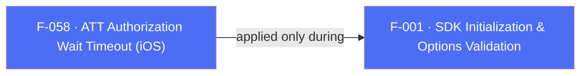

## Business Purpose
Since iOS 14.5, apps must show Apple's App Tracking Transparency (ATT) prompt before collecting the IDFA. If the AppsFlyer SDK starts (and fires its first session/attribution request) before the user responds to that prompt, it may miss the IDFA and under-report attribution. `timeToWaitForATTUserAuthorization` lets the host app delay the SDK's `start()` call for up to N seconds so it can wait for the user to accept, decline, or time out on the consent dialog before the first session is sent — improving IDFA-based attribution accuracy without requiring the app to manually gate SDK start behind a callback.

> TODO: enrich from product specs — provide a Notion database URL and re-run Phase 4 to fill this automatically.

---

## Trigger
Set once by the host app as part of `AppsFlyerOptions` (or the raw options `Map`), read only on iOS (`Platform.isIOS`), and applied inside `initSdkWithCall:` before the SDK's `start` call.

---

## Call Chain
```
AppsFlyerOptions(timeToWaitForATTUserAuthorization: 50.0)               [lib/src/appsflyer_options.dart]
  → AppsflyerSdk.initSdk(...)                                          [lib/src/appsflyer_sdk.dart]
    → _validateAFOptions(options) / _validateMapOptions(options)
      → if (Platform.isIOS) { assert(value is double);
          validatedOptions[AF_TIME_TO_WAIT_FOR_ATT_USER_AUTHORIZATION] = value }   (lines 76-85 / 137-148)
      → _methodChannel.invokeMethod("initSdk", validatedOptions)
        → iOS: AppsflyerSdkPlugin.handleMethodCall("initSdk") → initSdkWithCall:result:   [ios/Classes/AppsflyerSdkPlugin.m]
          → timeToWaitForATTUserAuthorization = call.arguments[afTimeToWaitForATTUserAuthorization] doubleValue   (line 796)
          → if (timeToWaitForATTUserAuthorization != 0) {
              [[AppsFlyerLib shared] waitForATTUserAuthorizationWithTimeoutInterval:timeToWaitForATTUserAuthorization]
            }                                                                     (lines 867-869)
          → [[AppsFlyerLib shared] start] (unless manualStart)                    (line 873)
        → Android: value is never read — no Android equivalent exists (ATT is an iOS-only framework)
```

---

## Files
| File | Role |
|------|------|
| `lib/src/appsflyer_options.dart` | `AppsFlyerOptions.timeToWaitForATTUserAuthorization` (`double?`, optional named constructor param) |
| `lib/src/appsflyer_sdk.dart` | `_validateAFOptions` / `_validateMapOptions` — reads the value **only** when `Platform.isIOS`, asserts it is a `double`, copies into the validated options map |
| `lib/src/appsflyer_constants.dart` | `AF_TIME_TO_WAIT_FOR_ATT_USER_AUTHORIZATION = "timeToWaitForATTUserAuthorization"` — shared Dart↔native key |
| `ios/Classes/AppsflyerSdkPlugin.h` | `#define afTimeToWaitForATTUserAuthorization @"timeToWaitForATTUserAuthorization"` |
| `ios/Classes/AppsflyerSdkPlugin.m` | `initSdkWithCall:result:` — parses the interval and calls `waitForATTUserAuthorizationWithTimeoutInterval:` before `start` (lines 796, 860-869) |
| `doc/BasicIntegration.md`, `doc/AdvancedAPI.md`, `doc/Guides.md`, `doc/API.md` | Document the option as delaying SDK start "for x seconds until the user either accepts the consent dialog, declines it, or the timer runs out" |

---

## Input / Output
| | |
|--|--|
| **Input** | `timeToWaitForATTUserAuthorization` (`double?`, seconds) via `AppsFlyerOptions` or the equivalent Map key; only read/applied when `Platform.isIOS` |
| **Output** | `void` — delays the native SDK's internal `start()`/first session dispatch by up to the given interval (or until ATT authorization resolves, whichever comes first); no value or confirmation returned to Dart. |

---

## Tests
No dedicated test found. `test/appsflyer_sdk_test.dart`'s `check initSdk call` test does not set `timeToWaitForATTUserAuthorization` in its options and, because Dart tests do not run with `Platform.isIOS == true`, the entire `if (Platform.isIOS) { ... }` validation branch (including the `assert(timeToWaitForATTUserAuthorization is double)` check and the iOS App ID regex validation alongside it) is untested.

---

## Known Limitations
- Android has no equivalent: the option is silently ignored on Android (no `Platform.isIOS` guard exists on the *native* Android side because the key is simply never sent — the guard lives entirely in Dart's `_validateAFOptions`/`_validateMapOptions`). A host app relying on `Platform.isIOS` checks elsewhere but forgetting one here would have no functional impact, since Android's `initSdk` never looks for this key at all.
- iOS's `AppsflyerSdkPlugin.m` contains a large commented-out block (lines ~860-865) that shows an earlier `respondsToSelector:`/`objc_msgSend` based implementation of this same call, superseded by the direct `waitForATTUserAuthorizationWithTimeoutInterval:` call — dead code left in place, mildly confusing when reading the file.
- A value of exactly `0` is treated as "not set" (`if (timeToWaitForATTUserAuthorization != 0)`), so a host app cannot explicitly pass `0.0` to mean "no wait" versus simply omitting the option — both behave identically.
- The Dart-side `assert(timeToWaitForATTUserAuthorization is double)` is stripped in release builds, so passing a non-double dynamic value (e.g. via the raw `Map` options path) would silently misbehave in production rather than failing fast.

---

## Dependencies

