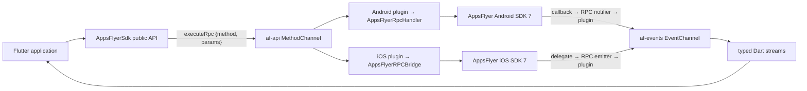

# AppsFlyer Flutter Plugin — Architecture (Flutter ↔ RPC ↔ Native SDK)

**Status:** Current implementation  
**Last verified:** 2026-08-10  
**Flutter plugin:** 7.0.1  
**Android SDK / RPC:** 7.0.1  
**iOS SDK:** 7.0.1  
**iOS RPC:** 7.0.12

This document describes the current implementation of the `appsflyer_sdk` Flutter plugin. Its scope is the cross-platform wrapper, its Flutter channels, the Android and iOS RPC integrations, and the optional Purchase Connector. The native SDKs remain separately versioned systems; this repository adapts their supported RPC capabilities rather than reimplementing attribution, persistence, or networking.

Historical SDK 6 behavior and upgrade instructions belong in [`doc/migration-guide.md`](../doc/migration-guide.md), not in the current architecture contract. Method signatures and platform availability belong in [`doc/api-reference.md`](../doc/api-reference.md); this document explains boundaries and flows rather than duplicating that reference.

## 1. Architectural principles

The Flutter plugin is a thin, typed bridge over the native Android and iOS RPC modules.

- `AppsFlyerSdk.instance` is the public singleton entry point.
- Dart owns public naming, type safety, platform gates, event models, and error normalization.
- Native SDK validation, persistence, lifecycle state, threading, and network behavior remain native responsibilities.
- Every core Dart-to-native call uses one RPC transport method: `executeRpc` on `af-api`.
- Native asynchronous SDK events use `af-events` and are exposed as broadcast Dart streams.
- Per-call results remain correlated to the originating `MethodChannel` reply; they are not delivered through global callback slots.
- Intentional Android/iOS RPC differences are adapted explicitly instead of being hidden by duplicated business logic.

Dependencies point inward toward the native capability:

```text
host Flutter app
  → public Dart API and Dart models
    → Flutter channel transport
      → platform plugin adapter
        → native RPC parser/router
          → native AppsFlyer SDK
```

The callback direction is reversed, but ownership is not: the native SDK emits a callback, the RPC layer creates an event envelope, the platform plugin transports it, and Dart exposes a typed stream. Neither native platform imports Dart business logic. The optional Purchase Connector follows a separate channel and does not pass through the core RPC router.



## 2. Public Dart layer

`lib/src/appsflyer_sdk.dart` contains the public SDK surface.

### 2.1 Singleton and platform selection

`AppsFlyerSdk.instance` owns the production `MethodChannel` and `EventChannel`. The `@visibleForTesting` named constructor accepts injected channels and an optional `TargetPlatform`, allowing platform-specific behavior to be tested without changing global Flutter platform state.

The stored platform is used only for bridge concerns:

- selecting Android or iOS RPC method names;
- selecting platform-specific parameter shapes;
- short-circuiting APIs unsupported by the current native RPC layer;
- serializing platform-specific models such as purchase details and mediation values.

An explicitly platform-gated API is a deliberate no-op off-platform. Its guard logs through `_logUnsupportedPlatform`, returns a safe default (`null`, `false`, or nothing), and dispatches no RPC. Shared APIs are not guarded this way. The package registers native implementations only for Android and iOS, so invoking a shared API on another Flutter target can still produce `MissingPluginException`.

### 2.2 RPC helpers

All public RPC-backed methods delegate to two helpers:

```dart
Future<T?> _invokeRpc<T>(String method, [Map<String, dynamic>? params]);
Future<void> _invokeVoidRpc(String method, [Map<String, dynamic>? params]);
```

`_invokeRpc` sends this channel payload:

```json
{
  "method": "<rpc method>",
  "params": {}
}
```

The Flutter channel method is always `executeRpc`. A native `PlatformException` is converted into public `AppsFlyerException` before reaching plugin consumers. `AppsFlyerException.code` is populated only when `PlatformException.code` is numeric. Android RPC failures normally use HTTP-style numeric codes (`400`, `404`, `422`, `500`, `503`). iOS protocol errors also preserve numeric RPC codes, but an iOS handler failure without an `errorCode` is exposed with the non-numeric fallback `SDK_ERROR`. Plugin transport failures such as `UNEXPECTED_ERROR`, `SERIALIZATION_ERROR`, and `RPC_PARSE_ERROR` are also non-numeric. All of those cases therefore produce `AppsFlyerException(code: null, ...)` while retaining the message.

`MissingPluginException` — when no native handler answers the channel — is **not** part of the RPC error contract and is **not** converted to `AppsFlyerException`. It indicates a Flutter integration gap (unsupported platform, or plugin registration failure) and should not occur on a properly integrated Android or iOS build.

`_invokeVoidRpc` discards successful native response data and exposes `Future<void>`. For native fire-and-forget setters, completion means that the RPC layer accepted the call; it does not invent a native network-completion callback. Dart does not add its own timeout or cancellation layer.

### 2.3 Public result delivery

Public APIs use the delivery style supported by the underlying capability:

| Public behavior | Examples | Transport behavior |
| --- | --- | --- |
| Awaitable request result | `start`, `logEvent`, `validateAndLogInAppPurchase`, `generateInviteLink` | Completes or fails through the originating `MethodChannel` reply |
| Awaitable RPC acceptance | setters, `logAdRevenue`, `logInvite` | Completes after the native RPC accepts the operation |
| Immediate Dart getter | `pluginVersion` | Reads local package metadata; no RPC |
| Broadcast stream | conversion data, UDL, session readiness | Delivered through `af-events` and exposed through typed public getters |

`start`, `logEvent`, `generateInviteLink`, and `validateAndLogInAppPurchase` expose a public `awaitResponse` parameter. It defaults to `false` for `start` and `logEvent`, and to `true` for the two result-producing APIs. The flag is forwarded to both platforms for `start` and `logEvent`, but only Android exposes it for invite generation and purchase validation.

## 3. Flutter platform channels

The channel names are identical across Dart, Android, and iOS:

| Purpose | Channel | Dart | Android | iOS |
| --- | --- | --- | --- | --- |
| Requests and per-call replies | `af-api` | `MethodChannel` | `MethodChannel` | `FlutterMethodChannel` |
| Native SDK events | `af-events` | `EventChannel` | `EventChannel` | `FlutterEventChannel` |
| Optional Purchase Connector | `af-purchase-connector` | `MethodChannel` | included build variant | CocoaPods subspec |

The core `MethodChannel` remains necessary: an `EventChannel` can deliver native events but cannot provide correlated request/reply calls for initialization, setters, getters, `start`, event logging, purchase validation, or invite-link generation.

The channel names, `executeRpc` entry point, RPC method strings, parameter keys, JSON envelopes, and native event names are **internal transport contracts**. They are not a second public Flutter API and applications must not call them directly. `AppsFlyerSdk`, its exported models, and its documented streams are the public compatibility boundary. A transport contract can differ by platform while the public Dart method remains stable; the Dart layer owns that mapping.

## 4. Forward path: Dart → RPC → native SDK

### 4.1 Generic request

```text
Flutter public method
  → _invokeRpc / _invokeVoidRpc
  → af-api: executeRpc {method, params}
  → platform plugin dispatch
  → native RPC parser and handler
  → native SDK 7 API
  → native RPC response
  → MethodChannel result
  → Dart value or AppsFlyerException
```

### 4.2 Android transport

`AppsflyerSdkPlugin.java` forwards every method except plugin-orchestrated `init` to `AppsFlyerRpcHandler`.

- Requests run on a single-thread `rpcExecutor`, preserving FIFO ordering.
- The handler uses `JsonRpcRequestParser` and the typed Android RPC request catalog.
- SDK callbacks required for awaitable RPC operations are converted into the corresponding RPC response.
- Flutter results are delivered on the main thread.
- The RPC handler is engine-scoped; an attached `Activity` is preferred as its context so cold-start deep-link lifecycle replay works correctly.
- Awaited native callbacks block the single RPC executor until completion or timeout. Later requests remain queued, so callers should avoid unnecessary `awaitResponse: true` operations on startup-critical paths.

### 4.3 iOS transport

`AppsflyerSdkPlugin.m` serializes `{method, params}` and calls `AppsFlyerRPCBridge.executeJson`.

- `AppsFlyerRPCBridge` is `@MainActor`-isolated. It starts an async task per request; unlike Android, the plugin has no single FIFO executor for unrelated calls. Callers must `await` operations whose ordering matters.
- Native completion-handler APIs are invoked on the main queue and bridged into Swift concurrency. RPC state used to gate listeners is held in an actor.
- JSON protocol errors and SDK failures become `FlutterError` values.
- iOS-specific nested result envelopes are unwrapped into the primitive or map shape expected by Dart.
- `logAndOpenStore` is the only non-init public call requiring plugin orchestration because the plugin opens the returned store URL.

## 5. Reverse path: native SDK → RPC → Dart streams

The native RPC event notifier emits JSON event envelopes. Both platform plugins forward those envelopes through `af-events` without maintaining Dart callback slots.

Events emitted before Dart attaches an `EventChannel` listener are buffered by the platform plugin and replayed when `onListen` runs.

The Dart constructor creates one broadcast stream. It catches malformed transport values, logs them with `debugPrint`, and drops them instead of terminating the public streams:

```dart
_events = _eventChannel
    .receiveBroadcastStream()
    .transform(/* validate String and decode _AppsFlyerEvent; drop failures */)
    .asBroadcastStream();
```

`_AppsFlyerEvent.fromNative` accepts the RPC JSON string and normalizes:

- `event` → `_AppsFlyerEvent.name`;
- `data` → `Map<String, dynamic>` when `data` is a JSON object, otherwise `{}` (covers Android `onSessionReady` with `data: null`).

Transport-only envelope fields (`timestamp`, `origin`) are ignored on the Dart side.

The Android and iOS plugins each keep an engine-scoped in-memory FIFO of event JSON strings while no Dart event sink is attached, then flush it from `onListen`. There is no persisted or size-bounded queue. Events that occur before plugin registration, after engine teardown, or before the native RPC event handler exists are not recoverable.

Typed public streams filter and map the shared event stream:

| Dart stream | Native event names |
| --- | --- |
| `onConversionDataSuccess` | `onConversionDataSuccess` |
| `onConversionDataFailure` | `onConversionDataFail` |
| `onDeepLinkReceived` | `onDeepLinking` or `onDeepLinkReceived` |
| `onSessionReady` | `onSessionReady` |

The application must subscribe to a typed stream before registering the corresponding native listener so the first event is not missed.

## 6. Initialization and session lifecycle

### 6.1 Initialization

The public API is:

```dart
Future<void> init({required String devKey, String? appId});
```

- Android receives only `devKey`; `appId` is not sent.
- iOS requires a non-empty `appId` and receives both fields.
- Initialization does not register optional conversion, UDL, or session-ready listeners.
- Initialization does not send a Launch.

Android initialization sequence:

```text
setPluginInfo(plugin: flutter, pluginVersion)
  → init(devKey)
  → complete the originating Flutter result on the main thread
```

Plugin metadata is attempted before initialization on both platforms so it can label the first session. Its result is intentionally non-fatal and does not abort `init`.

iOS initialization sequence:

```text
register RPC event handler
  → setPluginInfo(plugin: flutter, pluginVersion)
  → initialize(devKey, appId)
  → handle pending launch options when present
  → mark AppsFlyerAttribution bridge ready
  → replay queued iOS URL / Universal Link requests
```

### 6.2 Listener registration

Native listeners are registered explicitly after `init()`:

| Flutter API | Android RPC | iOS RPC |
| --- | --- | --- |
| `registerConversionListener()` | `registerConversionListener` | `registerConversionListener` |
| `registerDeepLinkListener()` | `subscribeForDeepLink` | `registerDeeplinkListener` |
| `registerSessionReadyListener()` | `registerSessionReadyListener` | `registerSessionReadyListener` |

Android additionally exposes `unregisterConversionListener` and the RPC soft-unsubscribe mapped by `unregisterDeeplinkListener`. Session-ready unregister is supported on both platforms.

### 6.3 Session start

The app subscribes to `onSessionReady`, registers the native listener after initialization, and calls `start()` for every emitted foreground-cycle signal.

```dart
final appsFlyer = AppsFlyerSdk.instance;

appsFlyer.onSessionReady.listen((_) async {
  await appsFlyer.start();
});

await appsFlyer.init(devKey: devKey, appId: appId);
await appsFlyer.registerSessionReadyListener();
```

`start({awaitResponse})` and `logEvent(..., {awaitResponse})` forward the public flag (default `false`) to both native RPC layers. `true` completes the `Future<void>` on native request success and `false` completes after RPC acceptance. `generateInviteLink(..., awaitResponse: ...)` and `validateAndLogInAppPurchase(..., awaitResponse: ...)` default to `true` and forward the flag to Android RPC. Android returns a synchronous long link for `generateInviteLink(awaitResponse: false)` and an empty validation-result map for `validateAndLogInAppPurchase(awaitResponse: false)`. The current iOS RPC 7.0.12 does not expose the flag for those two APIs and always awaits their callbacks.

Listener registration can cause readiness or attribution work promptly, so application code must subscribe to the Dart stream first and apply consent/identity settings that must affect the first Launch before registering `onSessionReady`. The wrapper does not maintain an initialized/started state machine or reject out-of-order calls; it relies on the application to await required sequencing and on native RPC/SDK validation for unsupported states. Most configuration is native runtime state and must be re-applied after a cold process start.

### 6.4 Callback timeouts

Timeouts belong to the native RPC layers, not Dart. They bound how long a Flutter request waits; they do not cancel native work, so a late native operation may still complete after Dart has received an error.

| Awaited operation | Android RPC 7.0.1 | iOS RPC 7.0.12 |
| --- | ---: | ---: |
| `start` | 5 s | 10 s |
| `logEvent` | 5 s | 10 s |
| `validateAndLogInAppPurchase` | 5 s | 30 s |
| `generateInviteLink` | 10 s | 10 s |
| `logAndOpenStore` | no awaited SDK callback in Android RPC | 10 s before the plugin opens the URL |

These are distinct from `setDeepLinkTimeout`, which configures native deep-link resolution (default 3,000 ms on Android and 60,000 ms on iOS). Android requires a positive value; iOS accepts zero.

## 7. Deep-link lifecycle forwarding

### 7.1 Android

The plugin is `ActivityAware` and registers a `NewIntentListener`.

- On a warm-start intent, it calls `activity.setIntent(intent)` and returns `false`; it does not invoke `performDeepLinking` itself or claim exclusive handling.
- The SDK 7 lifecycle integration inspects the activity's current intent on resume after `subscribeForDeepLink`, so keeping that intent current enables native UDL resolution.
- There is no plugin-owned Android URL queue. If no activity is attached when the new intent arrives, the plugin does not retain it.
- The active `Activity` is preferred when the RPC handler is first created so the Android SDK can inspect cold-start lifecycle state; application context is the fallback.

### 7.2 iOS

The plugin registers AppDelegate and, when available, UIScene lifecycle delegates.

- URL-scheme links map to `handleOpenUrl` or `handleOpenURL` according to the native callback shape.
- Universal Links map to `continueUserActivity`.
- launch options are retained until the RPC bridge is initialized;
- `AppsFlyerAttribution` queues early URL/Universal Link requests and replays them after `markBridgeReady`.

These lifecycle RPC calls are implementation details and are not public Dart methods.

## 8. Platform-specific API adaptation

The public layer normalizes only where a reliable mapping exists.

Examples:

- `registerDeepLinkListener` selects the different Android and iOS RPC method names.
- `init` omits `appId` on Android but enforces it on iOS.
- `AFMediationNetwork` maps to the native platform's accepted identifier.
- `AppsFlyerInviteLinkParams.referrerCustomerId` maps to Android `customerId` and iOS `referrerCustomerId`.
- `AFPurchaseDetails` has dedicated Android and iOS implementations because the native RPC request shapes differ.
- `sendPushNotificationData` is Android-only, while `handlePushNotification` is iOS-only.

Where the native RPC layer has no equivalent, the Flutter API either logs and ignores the call or does not expose the capability at all. Dart does not simulate missing native behavior.

Important differences that affect design and testing:

| Concern | Android | iOS |
| --- | --- | --- |
| Core request scheduling | One FIFO executor | Independent async tasks through a `@MainActor` bridge |
| Native request catalog | Kotlin sealed requests parsed by `JsonRpcRequestParser` | Swift typed requests parsed by `AFRPCParser` and routed by domain |
| Result shape | Bare `RpcResponse.Success` value or void | JSON response envelope with plugin-side unwrapping |
| UDL subscribe/unsubscribe | `subscribeForDeepLink`; soft unsubscribe drops future callbacks because the SDK has no native unsubscribe | `registerDeeplinkListener`; no public unregister mapping |
| Warm link entry | Current `Activity` intent consumed by SDK lifecycle | AppDelegate/UIScene callbacks explicitly forwarded through RPC |
| iOS app ID | Not used | Required by Dart `init` |
| Purchase Connector opt-in | Gradle source-set flag | CocoaPods subspec; unavailable through SPM |

## 9. Purchase validation and Purchase Connector

### 9.1 RPC purchase validation

`validateAndLogInAppPurchase` is part of the core RPC bridge and accepts the `AFPurchaseDetails` interface.

- `AFAndroidPurchaseDetails` sends `purchaseType`, `productId`, `purchaseToken`, and `additionalParameters`.
- `AFIOSPurchaseDetails` sends the nested `product` and `transaction` objects expected by the iOS RPC.
- `AppsFlyerSdk.validateAndLogInAppPurchase` appends the public `awaitResponse` value only to the Android payload; the iOS RPC does not expose that field.
- Supplying a model for the wrong current platform throws `ArgumentError` before crossing the channel.

### 9.2 Purchase Connector

Purchase Connector is a separate optional native subsystem using `af-purchase-connector` rather than the core RPC channel.

- Android is enabled through `appsflyer.enable_purchase_connector=true`.
- iOS is enabled through the CocoaPods Purchase Connector subspec.
- iOS Purchase Connector is not available through the plugin's Swift Package Manager integration.
- Dart keeps a separate process singleton. The first factory call requires configuration and sends an unawaited `configure` channel call; later configuration objects are ignored with a log.
- `startObservingTransactions()` and `stopObservingTransactions()` send unawaited calls because their public signatures return `void`. Consequently, native `PlatformException` failures from these calls are not normalized by the core `AppsFlyerException` path.
- Native validation callbacks travel back over the same Purchase Connector `MethodChannel`, not `af-events`. Dart stores callback functions: separate Android subscription/in-app success/failure listeners and one combined iOS validation callback.
- Android marshals connector callbacks to the main looper and serializes maps as JSON strings. iOS dispatches its delegate callback to the main queue and also sends JSON text; Dart accepts either a JSON string or a decoded map.

## 10. Error handling and state boundaries

- Core RPC `PlatformException` values are converted to `AppsFlyerException`. `MissingPluginException` is left unwrapped — it is outside the RPC contract.
- Explicitly platform-gated calls are short-circuited with a logged warning before a channel request is sent; shared calls are not guaranteed to work outside Android/iOS.
- Dart throws `ArgumentError` before transport for an empty `devKey`, a missing/empty iOS `appId`, incomplete GDPR consent, or purchase details for the wrong platform. Most business validation remains in the typed native RPC request and SDK.
- Android converts parser/validation failures to numeric `RpcResponse.Error` values. Unexpected plugin orchestration failures use plugin error strings such as `UNEXPECTED_ERROR` or `INIT_ERROR`.
- iOS distinguishes protocol errors in the response `error` envelope from handler failures represented by `result.success == false`; the Objective-C adapter converts both to `FlutterError` and unwraps successful values.
- A malformed native event is logged and dropped by Dart. It does not become a stream error. Conversion-data failure and UDL failure are normal event payloads, not failed MethodChannel requests.
- Android detaches channels, clears pending events, shuts down its executor, and releases its RPC handler/context when the Flutter engine detaches.
- iOS registers its RPC event handler during plugin construction and tears it down in `detachFromEngineForRegistrar:` (after `publish:` in `registerWithRegistrar:`), clearing `eventSink`, `pendingEvents`, and the bridge event handler when the `FlutterEngine` is deallocated.
- Event-stream subscriptions belong to the Flutter application; the SDK exposes broadcast streams and does not install per-callback global state.

## 11. Serialization and parameter contracts

Core calls cross two serialization boundaries:

```text
Dart values
  → Flutter StandardMessageCodec
    → Java Map / Objective-C NSDictionary
      → native JSON request string
        → typed RPC request
```

- Public parameter maps should contain JSON-compatible values only: string-keyed maps, lists, strings, booleans, finite numbers, and `null`. Platform channels can carry some additional Flutter codec types, but the following native JSON boundary cannot.
- Dart generally includes explicit `null` values in the `params` map. Android's plugin JSON conversion omits null-valued map entries, while iOS serializes them as JSON null; the typed request on each platform then decides whether the resulting value means “absent,” nullable, or invalid. Do not assume identical wire JSON even when the public Dart semantics are aligned. Clearing the iOS sharing filter is one case where an explicit Dart null is intentionally consumed on iOS.
- Android converts the Flutter map to `JSONObject` and its parser uses typed `opt*` helpers. Missing, omitted-null, or wrong-typed optional values can therefore collapse to parser defaults.
- iOS validates the Objective-C object with `NSJSONSerialization`, then `AFRPCParser` decodes `AnyCodable` into JSON scalar/list/map types and typed request initializers validate required values. The iOS parser rejects request JSON at or above 1 MiB.
- Enums are never sent by ordinal. Dart maps them to stable native strings, including platform-specific `AFMediationNetwork` values and different purchase-type spellings.
- Returned platform maps use dynamic Flutter codec key/value types. Dart converts result and event maps to `Map<String, dynamic>` at the public boundary. Core result type mismatches can surface as Dart cast/type errors; malformed event values are caught and dropped.
- Native callback events are JSON strings even though core MethodChannel requests begin as maps. Purchase Connector callbacks also currently send JSON strings, while its Dart handler tolerates an already-decoded map.

Treat `lib/src/appsflyer_sdk.dart` and the platform model serializers as the source of truth for public-to-RPC mapping. Treat Android `RpcRequest`/`JsonRpcRequestParser` and iOS `AFRPCTypedRequests`/`AFRPCParser` as the source of truth for accepted native transport shapes.

## 12. Privacy and security boundaries

The plugin exposes controls; the host application remains responsible for collecting consent lawfully and ordering calls so the first session reflects the user's choice.

- Apply consent, anonymization, identifier-collection, and stop/resume decisions before registering the session-ready listener when they must affect the first Launch. `setConsentData` is native runtime state: reapply it on each cold/process start, while background-to-foreground cycles in the same process retain it. TCF collection reads the platform consent stores through the native SDK when enabled.
- Advertising and device identifier collection is implemented by native SDK controls. The Dart bridge maps the setting but does not read, store, or redact identifiers itself. Platform-specific controls include Android ID/App Set ID/network data and iOS IDFV, ASA/Apple Ads, SKAdNetwork, and device name.
- Email, phone, first name, and last name cross the in-process Flutter channel and RPC boundary as raw strings. SHA-256 normalization/hashing happens inside the native SDK before those values are sent to AppsFlyer. The Facebook App-Scoped ID is explicitly not hashed. `clearUserPii` clears values set through all public `setUser*` PII methods, including that Facebook ID; it does not clear customer ID, consent, anonymization, or stopped state.
- Event values, additional data, partner data, push payloads, purchase details, deep links, and identifiers supplied by the app are passed to native code. The plugin is not a general-purpose sanitizer or secret store. iOS rejects dangerous schemes for `setFacebookDeferredAppLink`; that narrow validation does not apply to every URL-taking API.
- Platform channels and native RPC calls are in-process boundaries, not encrypted inter-process/network protocols. Network transport, native storage, identifier persistence, and server delivery belong to the native AppsFlyer SDKs.
- Debug logging is off unless enabled. Native debug logs can include request/event data useful for integration testing, so applications should not enable them in production or log channel payloads containing sensitive values. The wrapper's normal RPC diagnostics log method/failure information rather than intentionally logging PII values.

See [`doc/consent-dma.md`](../doc/consent-dma.md) for integration ordering and the public privacy controls.

## 13. Testing strategy

Different test levels protect different boundaries:

| Level | Location | Responsibility |
| --- | --- | --- |
| Dart channel/unit tests | `test/appsflyer_sdk_test.dart` | Public method-to-RPC names, parameter maps, platform gates/defaults, exception normalization, typed event routing, malformed-event behavior |
| Generated-model checks | `lib/appsflyer_sdk.g.dart` plus generator workflow | Purchase Connector JSON model conversion; regenerate after annotated model changes |
| Android RPC tests | native Android SDK/RPC repository | Typed request parsing/validation, handler-to-SDK mapping, callbacks, response/error behavior, timeouts |
| iOS RPC tests | native iOS SDK/RPC repository | Parser/router/domain handlers, state actor, event encoding, SDK timeout races, negative paths |
| Platform adapter tests | no comprehensive suite in this repository | Channel registration, engine detach, Android activity/new-intent behavior, iOS AppDelegate/UIScene forwarding, buffering, result unwrapping; these currently require focused native tests or example-app verification |
| Device/integration tests | `example/`, RC scenario scripts, real AppsFlyer dashboard/logs | Plugin registration, native dependency packaging, lifecycle sessions, deep links, attribution callbacks, push/uninstall paths, and network-visible behavior |

The repository CI in `.travis.yml` runs `flutter test test` on Linux. That suite cannot load the native SDK binaries or prove Android/iOS lifecycle and packaging behavior. Run the example on a device or emulator for platform changes and follow [`doc/testing-and-troubleshooting.md`](../doc/testing-and-troubleshooting.md). Purchase Connector changes need opt-in builds; iOS Core should be checked through both CocoaPods and SPM where applicable.

## 14. Adding or changing capabilities

### 14.1 Public method or core RPC method

1. Confirm the capability exists in the pinned Android and/or iOS RPC catalog. If it does not, add and release the native RPC capability first; do not reproduce native SDK business logic in Dart.
2. Define the public Dart signature and platform availability in `lib/src/appsflyer_sdk.dart`. Add a small model only when it gives callers type safety or isolates a real platform-shape difference.
3. Map the public call to the exact native method name and parameter keys. Add an explicit platform gate or adapter when only one side supports it; do not silently send an iOS contract to Android or vice versa.
4. Decide the completion contract: RPC acceptance, awaited native callback, returned value, or asynchronous event. Keep a request result on its originating MethodChannel reply; reserve `af-events` for unsolicited/repeating SDK events.
5. Update iOS result unwrapping when the public API expects data from an iOS nested response. Add plugin orchestration only for cross-layer duties such as initialization ordering or opening a returned URL.
6. Test Dart mappings for both platforms, including nulls/defaults, exceptions, and off-platform behavior. Add or update native RPC parser/handler tests in the owning native repository and run device coverage for lifecycle or packaging changes.
7. Update API, feature, migration, and architecture documentation affected by the change. Do not hand-edit generated `.g.dart` files.

### 14.2 Callback or event

1. Register the native SDK delegate/listener in the native RPC layer and define a stable event name plus JSON-compatible data shape.
2. Emit through the RPC notifier/event emitter and keep Flutter-channel access on the platform main thread.
3. Ensure the platform plugin registers the event handler early enough and decide whether its existing engine-scoped buffer is sufficient.
4. Decode and normalize the event in Dart, then expose a typed broadcast stream. Document subscription-before-registration ordering and platform payload differences.
5. Test listener gating, event name/payload mapping, malformed input, cancellation/re-listening, and early-event replay. Add device coverage when the callback depends on application lifecycle.

### 14.3 Platform-only or Purchase Connector feature

Keep platform-only behavior visibly gated in Dart and documented as such. Purchase Connector features belong to its separate channel, models, native opt-in sources, and callback mechanism; they should not be added to `af-api` merely to make the channels look uniform.

## 15. Known constraints and trade-offs

- Android and iOS are the only registered Flutter targets. Explicit platform gates return safe defaults, but shared calls on other targets can throw `MissingPluginException`.
- Public/native compatibility is checked by tests and review, not generated from a shared cross-platform schema. Android and iOS RPC method names and parameter shapes can drift independently.
- Android serializes core RPC calls through one executor. An awaited callback stalls later RPC work until it completes or times out. iOS permits unrelated requests to overlap, so ordering must be expressed by awaiting calls.
- Native timeout errors do not cancel SDK work. Fire-and-forget completion is acceptance, not network delivery.
- Event buffering is in memory, engine-scoped, and unbounded. Malformed events are dropped. The application must subscribe before listener registration to minimize gaps.
- Android deep-link correctness relies on an attached activity and SDK lifecycle inspection of its current intent; there is no plugin URL queue. iOS owns explicit AppDelegate/UIScene forwarding and queues early URL requests in `AppsFlyerAttribution` until initialization.
- Android deep-link unsubscribe is soft: it clears the RPC listener reference, but the native SDK has no unsubscribe API. iOS exposes no conversion/UDL unregister mapping in the current RPC.
- The plugin does not enforce a full lifecycle state machine. Call ordering, cold-start configuration replay, ATT prompting, and consent UI remain application responsibilities.
- iOS Purchase Connector requires CocoaPods and is absent from the SPM product. Its Dart `void` operations do not expose native completion errors through the core exception contract.
- The public dynamic map surfaces cannot provide compile-time guarantees for arbitrary event/additional-data keys or values. Keep payloads JSON-compatible and verify platform-specific mappings.

## 16. Key files

| Layer | File | Responsibility |
| --- | --- | --- |
| Public library | `lib/appsflyer_sdk.dart` | Library exports |
| Dart SDK | `lib/src/appsflyer_sdk.dart` | Public API, platform gates, RPC invocation, typed streams |
| Event model | `lib/src/appsflyer_event.dart` | Native event decoding and normalization |
| Errors | `lib/src/appsflyer_exception.dart` | Public SDK exceptions |
| Purchase models | `lib/src/af_purchase_details.dart` | Android/iOS purchase request implementations |
| Invite model | `lib/src/appsflyer_invite_link_params.dart` | Platform-aware invite parameter mapping |
| Android plugin | `android/src/main/java/com/appsflyer/appsflyersdk/AppsflyerSdkPlugin.java` | Channels, RPC dispatch, lifecycle forwarding, event buffering |
| Android dependencies | `android/build.gradle` | SDK/RPC BOM, optional connector source set, Android compatibility |
| iOS plugin | `ios/appsflyer_sdk/Sources/appsflyer_sdk/AppsflyerSdkPlugin.m` | Channels, RPC dispatch, lifecycle forwarding, result unwrapping |
| iOS attribution adapter | `ios/appsflyer_sdk/Sources/appsflyer_sdk/AppsFlyerAttribution.m` | Queues and forwards early URL/Universal Link RPC calls |
| iOS dependencies | `ios/appsflyer_sdk.podspec`, `ios/appsflyer_sdk/Package.swift` | CocoaPods subspecs and Core-only SPM product/version pins |
| Purchase Connector | `lib/src/purchase_connector/`, `android/src/main/include-connector/`, `ios/PurchaseConnector/` | Optional non-core channel, state, models, and native callbacks |
| Dart contract tests | `test/appsflyer_sdk_test.dart` | Public mapping, platform behavior, errors, and event decoding |

## 17. Sources of truth and related documentation

Source-of-truth ownership is split by boundary:

| Contract | Source of truth |
| --- | --- |
| Public Flutter API and public models | Current `lib/appsflyer_sdk.dart` library and `lib/src/` implementation |
| Dart-to-native mapping and public error/event normalization | `lib/src/appsflyer_sdk.dart`, platform serializers, and `lib/src/appsflyer_event.dart` |
| Channel registration, buffering, lifecycle forwarding, orchestration, and iOS result unwrapping | Android/iOS platform plugin source in this repository |
| Android RPC method names, accepted parameters, validation, callbacks, and timeouts | Pinned native Android `RpcRequest`, `JsonRpcRequestParser`, and `AppsFlyerRpcHandler` |
| iOS RPC method names, accepted parameters, validation, callbacks, and timeouts | Pinned native iOS `AFRPCParser`, typed requests, router, and domain handlers |
| Integration guidance | Public guides; secondary to code when they disagree |

Repository references:

- [`doc/README.md`](../doc/README.md) — integration-guide index
- [`doc/api-reference.md`](../doc/api-reference.md) — public API and platform availability
- [`doc/getting-started.md`](../doc/getting-started.md) — initialization and session-start integration
- [`doc/deep-linking.md`](../doc/deep-linking.md) — UDL and lifecycle setup
- [`doc/consent-dma.md`](../doc/consent-dma.md) — consent, identifiers, anonymization, and PII
- [`doc/purchase-connector.md`](../doc/purchase-connector.md) — optional connector setup and behavior
- [`doc/testing-and-troubleshooting.md`](../doc/testing-and-troubleshooting.md) — device verification and operational failures
- [`doc/migration-guide.md`](../doc/migration-guide.md) — SDK 6 to SDK 7 changes
- [`internal-docs/features/INDEX.md`](features/INDEX.md) and [`internal-docs/features/DIAGRAM.md`](features/DIAGRAM.md) — feature-level implementation records and dependency diagrams; observe their per-entry verification dates
- [`internal-docs/tech-designs/spm-support.md`](tech-designs/spm-support.md) — historical ADR-like design record; its superseded sections are explicitly marked, so use the current manifest and feature F-060 for current behavior

No dedicated ADR directory or checked-in machine-readable cross-platform RPC schema exists in this repository. Any external alignment matrix or schema can assist review, but it is not sufficient evidence unless it matches the pinned source revisions above.

Before declaring a release ready, verify the Dart API, both native RPC catalogs, platform mappings, event shapes, docs, and tests against the same revision.

## 18. Document maintenance

Review this document whenever the public Dart surface, channel names, RPC versions/catalogs, native dependency versions, result/event envelopes, initialization or lifecycle behavior, threading/timeouts, platform support, privacy controls, Purchase Connector packaging, or test strategy changes. Also review it during every release-version alignment. Update the `Last verified` date only after checking the Dart wrapper and both pinned native RPC implementations, not for prose-only edits.
