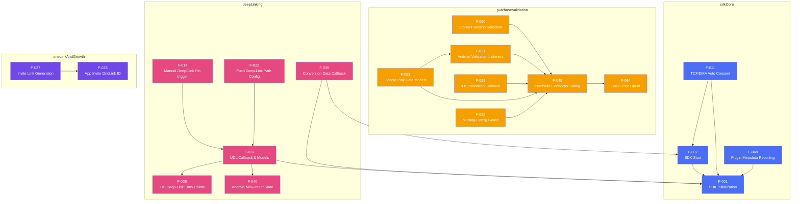

# AppsFlyer Flutter Plugin — Feature Diagrams

> **Verification status:** All dependency metadata and workflow edges were checked on **2026-08-10** against the current Dart, platform-plugin, native RPC, and relevant native SDK sources. Removed feature tombstones are intentionally absent from runtime diagrams.

## Section 1 — Declared Feature Dependencies

For this section and the table below, `A --> B` means **feature A declares B in `depends_on`**. These are implementation/workflow prerequisites, not merely related topics. F-037's iOS and Android entry-point dependencies are platform-conditional; a single runtime uses the applicable branch.

---

## Section 2 — First-Launch Workflow

This diagram is chronological, not a `depends_on` graph. It distinguishes calls that must precede `init()` from runtime configuration and explicit listener registration. Each listener takes its callback as an argument, so the callback is always in place before the native listener is installed and an immediate event cannot be lost.

```mermaid
flowchart LR
    PRE["Pre-init configuration<br/>F-067 timeout, F-022 push path,<br/>iOS side of F-063"]:::config
    F001["F-001 · init()"]:::sdkCore
    CONFIG["Apply launch configuration<br/>consent, identity, privacy;<br/>Android side of F-063"]:::config
    LISTENERS["Register conversion and/or UDL listeners"]:::listeners
    SESSION["Register session-ready listener"]:::listeners
    READY["session-ready callback runs<br/>once per foreground cycle"]:::event
    F002["F-002 · start()"]:::sdkCore

    PRE --> F001 --> CONFIG --> LISTENERS --> SESSION --> READY --> F002

    classDef sdkCore fill:#4C6EF5,color:#fff
    classDef config fill:#495057,color:#fff
    classDef dart fill:#12B886,color:#fff
    classDef listeners fill:#7048E8,color:#fff
    classDef event fill:#E64980,color:#fff
```

Configuration that is native runtime state remains available across background-to-foreground cycles in the same process, but must be reapplied after a cold start. `start()` is still called for every session-ready event. Conversion-data registration alone does not issue a request; the Launch from `start()` triggers that work.

---

## Section 3 — Dependency Table

| Feature | Depends On | Verified reason |
|---------|------------|-----------------|
| F-002 | F-001 | Native session start requires initialization |
| F-011 | F-001 | Documented automatic-consent setup runs after initialization |
| F-011 | F-002 | The consent workflow gates the first Launch until CMP state is ready |
| F-014 | F-037 | Resolution result is delivered through the UDL callback |
| F-022 | F-037 | Configured push URL is useful to the Flutter app through UDL delivery |
| F-027 | F-028 | Invite generation requires a base OneLink ID |
| F-035 | F-001 | Conversion listener is explicitly registered after initialization |
| F-035 | F-002 | The Launch sent by `start()` triggers conversion-data retrieval |
| F-037 | F-001 | UDL listener is explicitly registered before initialization |
| F-037 | F-039 | iOS URL/Universal Link/UIScene entry points feed native resolution |
| F-037 | F-040 | Android warm-intent state must be current for lifecycle resolution |
| F-048 | F-001 | Plugin metadata is reported inside native init orchestration |
| F-049 | F-054 | Native Purchase Connector exists only in opted-in builds |
| F-050 | F-049 | StoreKit selection is part of the connector configure payload |
| F-051 | F-049 | Android callbacks require the configured connector and observation lifecycle |
| F-052 | F-049 | iOS callback relies on the delegate wired by connector configuration |
| F-053 | F-049 | Models are populated only by configured connector callbacks |
| F-053 | F-051 | The models are the Android listener payload shapes |
| F-055 | F-049 | Guard protects first construction of the connector singleton |

Optional relationships are intentionally excluded. In particular, F-025 is an optional sandbox switch for F-024; F-031 can attribute a push without F-022; and F-060's exclusion of Purchase Connector is a packaging constraint rather than a runtime dependency.
