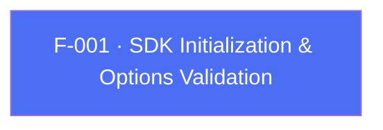

## Business Purpose
This is the entry point that wires the Flutter app's dev key, app ID and startup flags into the native AppsFlyer SDK 7. Without it, no other AppsFlyer API works: no attribution, no events, no deep linking. The Dart-side validation (`_validateAFOptions` / `_validateMapOptions`) catches misconfiguration early (missing dev key, malformed iOS numeric App Store ID) via `assert`s. It also stamps the plugin's identity (`setPluginInfo`, `plugin=flutter`) onto the native SDK so AppsFlyer's backend can attribute traffic to the Flutter wrapper. In SDK 7, `initSdk()` **only initializes** the SDK — it does not send a session. The app must call `startSDK()` (F-002) separately, once per foreground cycle.

---

## Trigger
Called once by the host app after constructing `AppsflyerSdk(options)`, typically in `main()` before `runApp()`. Register `registerSessionReadyListener` (and any conversion/deep-link listeners) **before** calling `initSdk()` so the first signals are not missed. Runs whether `AppsFlyerOptions` (typed) or a raw `Map` was passed to the factory constructor.

---

## Call Chain
All Dart→native traffic goes through the single `af-api` MethodChannel, method `executeRpc`, carrying `{method, params}`. `init` is a plugin-orchestrated RPC method (not generic dispatch): the native side runs an ordered sequence of bridge RPCs.

```
AppsflyerSdk(options) factory                                         [lib/src/appsflyer_sdk.dart]
  → AppsflyerSdk.private(...)
AppsflyerSdk.initSdk({registerConversionDataCallback, registerOnDeepLinkingCallback})
  → _validateAFOptions(AppsFlyerOptions) | _validateMapOptions(Map)
  → sets GCD/UDL flags from the two parameters
  → _executeRpc('init', validatedOptions)
    → af-api MethodChannel "executeRpc" {method:'init', params}
      → Android: AppsflyerSdkPlugin.executeRpc → initFromRpc(params, result)   [android/.../AppsflyerSdkPlugin.java]
        → AppsFlyerRpcHandler ordered RPCs: setPluginInfo → (setDisableAdvertisingIdentifiers) →
          (setLogLevel DEBUG) → setDebugLog → initialize(devKey) →
          (registerConversionListener) → (subscribeForDeepLink) → registerSessionReadyListener →
          (setAppInviteOneLink); init() never sends the first session
      → iOS: AppsflyerSdkPlugin.executeRpc → initFromRpc:result:               [ios/.../AppsflyerSdkPlugin.m]
        → AppsFlyerRPCBridge ordered RPCs: setPluginInfo → initialize(devKey, appId) → isDebug →
          (setDisableCollectASA) → (setDisableAdvertisingIdentifiers) → (setAppInviteOneLink) →
          (registerConversionListener) → (registerDeeplinkListener) → registerSessionReadyListener;
          then waitForATTUserAuthorization (if set) and mark the attribution bridge ready
```

The session-ready listener is registered here only so the app can **observe** readiness (via `registerSessionReadyListener`/`onSessionReady`, delivered over the `af-events` EventChannel); it does not gate `startSDK()`.

---

## Files
| File | Role |
|------|------|
| `lib/src/appsflyer_sdk.dart` | `initSdk`, `_validateAFOptions`, `_validateMapOptions`, `_executeRpc` — validation + RPC dispatch |
| `lib/src/appsflyer_options.dart` | `AppsFlyerOptions` typed config model (devKey, appId, ATT wait time, disableCollectASA, etc.) |
| `lib/src/appsflyer_constants.dart` | String keys shared across Dart/native (`AF_DEV_KEY`, `AF_APP_Id`, `AF_GCD`, `AF_UDL`, `AF_METHOD_CHANNEL`, `AF_EVENTS_CHANNEL`, `PLUGIN_VERSION`) |
| `android/src/main/java/com/appsflyer/appsflyersdk/AppsflyerSdkPlugin.java` | `executeRpc` / `initFromRpc` — plugin-orchestrated init over `AppsFlyerRpcHandler` |
| `ios/appsflyer_sdk/Sources/appsflyer_sdk/AppsflyerSdkPlugin.m` | `executeRpc` / `initFromRpc:result:` — plugin-orchestrated init over `AppsFlyerRPCBridge` |

---

## Input / Output
| | |
|--|--|
| **Input** | `afDevKey` (String, required), `appId` (String, required on iOS — validated against `^\d{8,11}$`), `showDebug` (bool), `timeToWaitForATTUserAuthorization` (double, iOS only), `disableAdvertisingIdentifier` (bool), `disableCollectASA` (bool, iOS only), `appInviteOneLink` (String?), plus `GCD`/`UDL` flags derived from `registerConversionDataCallback` / `registerOnDeepLinkingCallback` |
| **Output** | `Future` that completes when native init finishes (Android resolves with `"success"`; iOS resolves with `null`). No session is sent — call `startSDK()` for that. |

---

## Tests
`test/appsflyer_sdk_test.dart` verifies that `initSdk` dispatches the `init` RPC and that the dev key and the `GCD`/`UDL` flags are forwarded in `params`. The iOS App ID regex / ATT-wait assertions run only under `Platform.isIOS`, which the Dart host test environment does not satisfy.

---

## Known Limitations
- Validation uses Dart `assert()`, which is stripped in release/profile builds — a missing `afDevKey` (Android surfaces an `INIT_ERROR`) or malformed iOS `appId` only fails once it reaches native code.
- `disableCollectASA` and `timeToWaitForATTUserAuthorization` are applied on iOS only; on Android they are silently ignored.

---

## Dependencies

