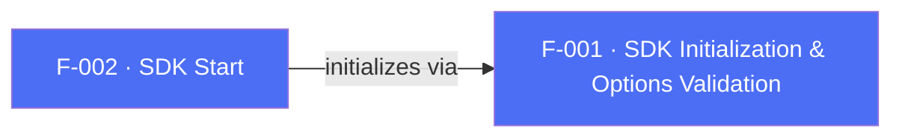

## Business Purpose
In SDK 7 the app controls when a session (Launch) is sent. `initSdk()` (F-001) only initializes the SDK; nothing is reported until `startSDK()` is called. `startSDK()` must be called **once per foreground cycle** — the native SDK resets its "started" flag on every background — so it is typically called from inside the session-ready callback: `registerSessionReadyListener((_) => startSDK())`. Deferring the call gates the first session behind consent, CUID, or ATT. The optional `onSuccess`/`onError` handler lets the app confirm whether the session request succeeded (useful for CMP/consent flows). The `manualStart` option from SDK 6 has been **removed**: start is always app-driven now.

---

## Trigger
Called by the host app once per foreground cycle, normally from the `registerSessionReadyListener` callback. Apply all configuration setters (e.g. `setCustomerUserId`, `setCurrencyCode`, `setConsentDataV2`) before `startSDK()`. Calling it again within the same foreground cycle is a native no-op.

---

## Call Chain
`start` is a plugin-orchestrated RPC method. `startSDK()` returns `void`; when `onSuccess`/`onError` is supplied the Dart layer sets `awaitResponse: true` so the native call blocks until the SDK reports the result, which is returned on the per-call reply (same path as `logEvent`) — not over the event channel.

```
AppsflyerSdk.startSDK({onSuccess, onError})                            [lib/src/appsflyer_sdk.dart]
  → _executeRequest('start', null, onSuccess, onError)
    → _executeRpc('start', {awaitResponse: <onSuccess||onError != null>})
      → af-api MethodChannel "executeRpc" {method:'start', params}
        → Android: AppsflyerSdkPlugin.executeRpc → dispatchRpc('start', ...)  [android/.../AppsflyerSdkPlugin.java]
          → AppsFlyerRpcHandler → AppsFlyerLib.start(...)
        → iOS: AppsflyerSdkPlugin.executeRpc → dispatchRpc('start', ...)      [ios/.../AppsflyerSdkPlugin.m]
          → AppsFlyerRPCBridge → [AppsFlyerLib shared] start...
  → on reply: onSuccess() or onError(errorCode, errorMessage) (parsed from the PlatformException)
```

---

## Files
| File | Role |
|------|------|
| `lib/src/appsflyer_sdk.dart` | `startSDK()`, `_executeRequest` — dispatches the `start` RPC and routes the optional result to `onSuccess`/`onError` |
| `android/src/main/java/com/appsflyer/appsflyersdk/AppsflyerSdkPlugin.java` | `executeRpc` `start` case → `dispatchRpc` over `AppsFlyerRpcHandler` |
| `ios/appsflyer_sdk/Sources/appsflyer_sdk/AppsflyerSdkPlugin.m` | `start` forwarded generically via `dispatchRpc` over `AppsFlyerRPCBridge` |

---

## Input / Output
| | |
|--|--|
| **Input** | Optional `RequestSuccessListener onSuccess` and `RequestErrorListener onError`; no other parameters. |
| **Output** | `void`. With no callback the call is fire-and-forget (`awaitResponse: false`). With a callback, the native side blocks and reports the outcome, invoking `onSuccess()` or `onError(int errorCode, String errorMessage)` once. |

---

## Tests
`test/appsflyer_sdk_test.dart` verifies that `startSDK()` dispatches the `start` RPC with `awaitResponse: false` (fire-and-forget), that passing `onSuccess` sets `awaitResponse: true` and invokes the success callback on reply.

---

## Known Limitations
- `startSDK()` must be re-called on every foreground cycle; forgetting to route it through `registerSessionReadyListener` means later foregrounds send no session.
- The `onError` code is parsed from `PlatformException.code`; a non-numeric code resolves to `0`.

---

## Dependencies

