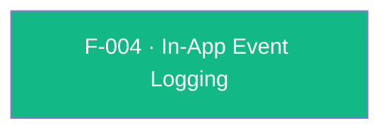

## Business Purpose
AppsFlyer's attribution model can only compute ROI (Return on Investment) and LTV (Lifetime Value) for media sources if the app reports what users actually *do* after install — purchases, tutorial completions, level-ups, subscriptions, etc. `logEvent` is the single funnel through which every custom in-app event (a name plus an arbitrary value map) reaches AppsFlyer's backend and is joined to the installing campaign/media-source. Without it, install attribution would exist in isolation with no downstream engagement or monetization signal, making campaign performance comparison and LTV/ROI reporting impossible.

---

## Trigger
Called by the host app at any point after the SDK is initialized (`initSdk`) and started (`startSDK`), whenever a business-significant in-app action occurs (e.g. purchase, level completion, tutorial finish, subscription).

---

## Call Chain
Since the SDK 7 / RPC migration this is a generic RPC call routed through the per-call reply mechanism (same as `startSDK`). When `onSuccess`/`onError` is passed, `_executeRequest` sets `awaitResponse: true` so the native call blocks and the result is returned on the MethodChannel reply; otherwise it is fire-and-forget.
```
AppsflyerSdk.logEvent(eventName, eventValues, {onSuccess, onError})            [lib/src/appsflyer_sdk.dart]
  → _executeRequest('logEvent', {eventName, eventValues}, ...)                  // sets awaitResponse when a listener is passed
    → _executeRpc('logEvent', {eventName, eventValues, awaitResponse})         // MethodChannel af-api → executeRpc
      → Android: AppsflyerSdkPlugin.executeRpc → dispatchRpc('logEvent', ...)  [android/.../AppsflyerSdkPlugin.java]
        → AppsFlyerRpcHandler.execute(json) → AppsFlyerLib.logEvent(...)       [plugin_bridge module]
      → iOS: AppsflyerSdkPlugin.executeRpc → dispatchRpc:method:@"logEvent"    [ios/.../AppsflyerSdkPlugin.m]
        → [AppsFlyerRPCBridge shared] executeJson:completion: → AFRPCRequestHandler → SDK
```
On success `onSuccess()` is invoked; on failure the reply throws a `PlatformException` whose `code`/`message` are surfaced as `onError(errorCode, errorMessage)` (e.g. codes 41/42 when logged before init/start).

---

## Files
| File | Role |
|------|------|
| `lib/src/appsflyer_sdk.dart` | `logEvent(String eventName, Map? eventValues, {RequestSuccessListener? onSuccess, RequestErrorListener? onError})` — Dart public API, returns `void`; delegates to `_executeRequest` |
| `lib/src/callbacks.dart` | `RequestSuccessListener` / `RequestErrorListener` typedefs |
| `android/.../AppsflyerSdkPlugin.java` | No per-method handler — generic `executeRpc` → `dispatchRpc('logEvent', ...)` forwards the envelope to `AppsFlyerRpcHandler` |
| `ios/.../AppsflyerSdkPlugin.m` | No per-method handler — generic `executeRpc` → `dispatchRpc` forwards the envelope to `AppsFlyerRPCBridge` |
| `doc/in-app-events.md` | Public integration guide with usage example |

---

## Input / Output
| | |
|--|--|
| **Input** | `eventName` (String, required — AppsFlyer docs recommend ≤45 chars or the event is dropped from the dashboard but still visible in raw data); `eventValues` (Map, nullable — arbitrary event parameters, e.g. `af_revenue`, `af_content_id`); optional `onSuccess` / `onError` listeners |
| **Output** | `void`. Without a listener the call is fire-and-forget. With `onSuccess`/`onError`, the native call blocks (up to ~10s) and reports the SDK request result: `onSuccess()` on success, or `onError(errorCode, errorMessage)` on failure |

---

## Tests
`test/appsflyer_sdk_test.dart`:
- `logEvent (fire and forget)` — asserts the `logEvent` RPC is dispatched with the event name/values.
- `logEvent forwards awaitResponse and invokes onSuccess on a 200 OK` — verifies `awaitResponse: true` is sent and `onSuccess` fires on a successful reply.
- `logEvent invokes onError with the SDK code/message on failure` — verifies a `PlatformException` reply is surfaced as `onError(code, message)`.

---

## Known Limitations
- No client-side validation of the 45-character event-name limit; events with longer names are still accepted by the plugin and silently excluded from the AppsFlyer dashboard (visible only via raw data / Pull-Push APIs).
- `eventValues` accepts an untyped `Map`, so type mismatches (e.g. non-JSON-serializable values) are only caught when the native SDK serializes the payload, not at the Dart call site.
- The blocking behavior (native call waits ~10s) only applies when `onSuccess`/`onError` is supplied; fire-and-forget calls return no delivery signal at all.

---

## Dependencies

