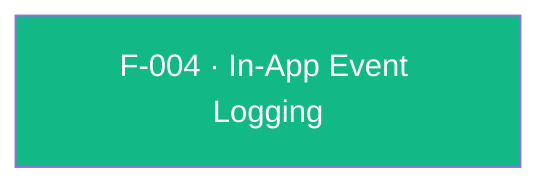

## Business Purpose
AppsFlyer's attribution model can only compute ROI (Return on Investment) and LTV (Lifetime Value) for media sources if the app reports what users actually *do* after install — purchases, tutorial completions, level-ups, subscriptions, etc. `logEvent` is the single funnel through which every custom in-app event (a name plus an arbitrary value map) reaches AppsFlyer's backend and is joined to the installing campaign/media-source. Without it, install attribution would exist in isolation with no downstream engagement or monetization signal, making campaign performance comparison and LTV/ROI reporting impossible.

---

## Trigger
The host app awaits `AppsFlyerSdk.instance.logEvent(...)` whenever a business-significant in-app action occurs (purchase, level completion, tutorial finish, subscription). The supported lifecycle is to call it after `init()` and the first `start()`; neither Dart nor the RPC layers enforce that ordering before forwarding the event.

---

## Call Chain
`logEvent` forwards the public `awaitResponse` flag to the native RPC layer. Default `false` is fire-and-forget; `true` waits for the native request completion callback.

```
AppsFlyerSdk.logEvent(eventName, {eventValues, awaitResponse})        [lib/src/appsflyer_sdk.dart]
  → _invokeVoidRpc('logEvent', {eventName, eventValues, awaitResponse})
    → _invokeRpc → MethodChannel('af-api').invokeMethod('executeRpc', {method, params})
      → Android: AppsflyerSdkPlugin.dispatchRpc → AppsFlyerRpcHandler
        → AppsFlyerLib.logEvent(...)
      → iOS: AppsflyerSdkPlugin.dispatchRpc → AppsFlyerRPCBridge
        → AppsFlyerLib logEvent
  → awaitResponse true: successful per-call reply completes Future<void>; PlatformException → AppsFlyerException
  → awaitResponse false: Future completes after the native fire-and-forget API returns and RPC reports immediate success
```

---

## Files
| File | Role |
|------|------|
| `lib/src/appsflyer_sdk.dart` | `logEvent(String eventName, {Map<String, dynamic>? eventValues, bool awaitResponse = false})` — public API over the shared RPC path |
| `lib/src/appsflyer_exception.dart` | `AppsFlyerException.fromPlatformException` — converts the native error reply into a typed Dart exception |
| `android/.../AppsflyerSdkPlugin.kt` | No per-method handler — generic `executeRpc` → `dispatchRpc('logEvent', ...)` forwards the envelope to `AppsFlyerRpcHandler` |
| `ios/.../AppsflyerSdkPlugin.swift` | No per-method handler — generic `executeRpc` → `dispatchRpc` forwards the envelope to `AppsFlyerRPCBridge` |
| `doc/in-app-events.md` | Public integration guide with usage example |

---

## Input / Output
| | |
|--|--|
| **Input** | `eventName` (`String`, required and non-empty on both RPC layers; Android additionally enforces a maximum of 255 characters, while iOS has no RPC-level maximum); `eventValues` (`Map<String, dynamic>?`, optional named — values must survive the Flutter platform codec and the platform plugin's JSON serialization); `awaitResponse` (`bool`, named, default `false` — when `true`, wait for the native request callback; when `false`, return after the native fire-and-forget API returns and RPC reports immediate success). |
| **Output** | `Future<void>`. With the default `awaitResponse: false`, completion does not confirm delivery. With `awaitResponse: true`, completes when the native request succeeds and throws `AppsFlyerException` for native errors or RPC timeouts. |

---

## Tests
`test/appsflyer_sdk_test.dart`:
- `logEvent is fire-and-forget by default` — asserts the `logEvent` RPC is dispatched with `eventName`, `eventValues`, and `awaitResponse: false`.
- `logEvent can wait for the native request callback` — asserts `awaitResponse: true` is forwarded.
- `PlatformException with a numeric RPC code becomes AppsFlyerException` — drives a failing `logEvent` call with platform code `422` and verifies code `422` and message.

---

## Known Limitations
- Dart performs no event-name validation. Both RPC layers reject an empty name with code `422`; Android also rejects names longer than 255 characters, while iOS applies no bridge-level maximum. Any additional backend or dashboard limit is outside the verified plugin/RPC contract.
- `eventValues` accepts `Map<String, dynamic>`, but not every Dart object is transport-safe. Unsupported values can fail in the Flutter platform-channel codec or the platform plugin's JSON serialization before reaching the native SDK; there is no Dart-side schema validation.
- When `awaitResponse` is `true`, the RPC wait is bounded to 5 seconds on Android and 10 seconds on iOS. A timeout throws `AppsFlyerException` but does not cancel the native request, which may still succeed later without another Dart result.
- When `awaitResponse` is `false`, delivery success or failure is not surfaced to Dart.

---

## Dependencies

