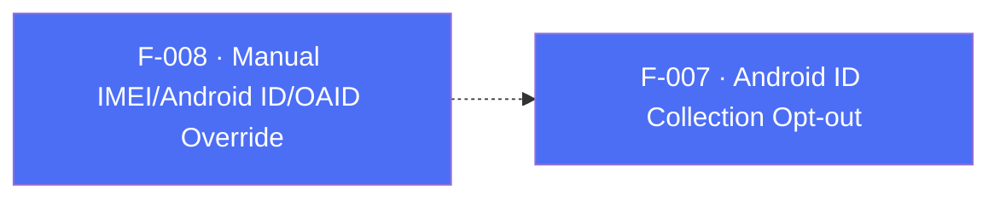

## Business Purpose
Apps that already hold IMEI, Android ID, or OAID values can supply them to the Android SDK instead of relying on automatic collection. This matches the SDK 6 manual-override use case and was restored in plugin 7.0.2+1 when Android RPC 7.0.13 exposed the underlying RPC methods.

Apps must ensure manual identifier submission complies with store policy, consent, and privacy disclosures.

---

## Trigger
Called by the host app during startup configuration, typically before `start()`, when the app has already obtained the identifier through its own compliant collection path. Dart and RPC do not enforce ordering.

---

## Call Chain
All three methods are generic RPC calls with no Dart platform gate (Android-only identifiers; on iOS the native RPC layer reports the method as unavailable and the call throws `AppsFlyerException`).

```
AppsFlyerSdk.setImeiData(imei) / setOaidData(oaid) / setAndroidIdData(androidId)  [lib/src/appsflyer_sdk.dart]
  → off Android: native RPC reports the method as unavailable → AppsFlyerException
  → _invokeVoidRpc('<method>', {<paramKey>: value})
    → af-api "executeRpc" {method, params}
      → Android: dispatchRpc → AppsFlyerRpcHandler → AppsFlyerLib setter  [android/.../AppsflyerSdkPlugin.kt]
```

| Dart method | RPC method | Param key |
|-------------|------------|-----------|
| `setImeiData(String imei)` | `setImeiData` | `imei` |
| `setOaidData(String oaid)` | `setOaidData` | `oaid` |
| `setAndroidIdData(String androidId)` | `setAndroidIdData` | `androidId` |

---

## Files
| File | Role |
|------|------|
| `lib/src/appsflyer_sdk.dart` | `setImeiData`, `setOaidData`, `setAndroidIdData` — dispatched through RPC without a Dart platform check |
| `android/src/main/kotlin/com/appsflyer/appsflyersdk/AppsflyerSdkPlugin.kt` | generic RPC dispatch over `AppsFlyerRpcHandler` |
| `android/build.gradle` | pins `af-android-plugin-bridge` **7.0.13+**, which implements these RPC methods |

---

## Input / Output
| | |
|--|--|
| **Input** | Non-empty string for the identifier value. RPC param keys: `imei`, `oaid`, `androidId`. |
| **Output** | `Future<void>` — on Android, completes after RPC handling and the synchronous native setter invocation. RPC or bridge failures throw `AppsFlyerException`. On iOS the call still reaches the channel and throws `AppsFlyerException` because the iOS RPC layer does not implement these methods. |

---

## Tests
`test/appsflyer_sdk_test.dart` → `'maps cross-platform configuration and identity APIs'` verifies that each method dispatches the expected RPC method name and params on Android.

---

## Known Limitations
- **Android-only** but not Dart-gated: calling on iOS throws `AppsFlyerException` instead of quietly doing nothing.
- Requires **Android RPC 7.0.13+** (`af-android-plugin-bridge`). Plugin 7.0.2 shipped bridge 7.0.12, which did not expose these methods.
- For opting out of automatic Android ID collection (without supplying a manual value), use F-007 `setCollectAndroidID(bool)`.

---

## Dependencies

