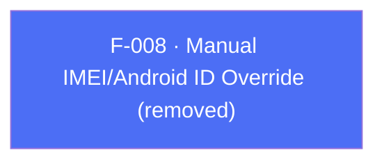

## Business Purpose
In SDK 6 the plugin exposed `setImeiData(String)` and `setAndroidIdData(String)` so apps that already held IMEI/Android ID values could hand them to the SDK instead of relying on its automatic collection.

> **Removed in SDK 7.** Both `setImeiData` and `setAndroidIdData` no longer exist in the Flutter plugin. These APIs are **not exposed by the SDK 7 RPC bridges** (`AppsFlyerRpcHandler` / `AppsFlyerRPCBridge`), so the plugin cannot reach them. Per the API Removal Rule, they were removed rather than shipped as silent no-ops. There is no RPC-reachable replacement. See [`doc/migration-guide.md`](../../doc/migration-guide.md).

---

## Trigger
N/A — the APIs have been removed. There is no Dart method, no RPC method, and no native handler.

---

## Call Chain
N/A — removed. No `setImeiData` / `setAndroidIdData` method exists in `lib/src/appsflyer_sdk.dart`, and neither name is handled by the `executeRpc` dispatch on Android or iOS.

---

## Files
| File | Role |
|------|------|
| — | No implementation remains in `lib/src/appsflyer_sdk.dart`. Removal is documented in [`doc/migration-guide.md`](../../doc/migration-guide.md) and `CHANGELOG.md`. |

---

## Input / Output
| | |
|--|--|
| **Input** | N/A (removed) |
| **Output** | N/A (removed) |

---

## Tests
No tests — the APIs no longer exist. `test/appsflyer_sdk_test.dart` contains no references to `setImeiData` / `setAndroidIdData`.

---

## Known Limitations
- No RPC-reachable replacement exists in SDK 7. Apps that previously fed device identifiers manually must rely on the SDK's own (policy-compliant) collection; the Android-ID opt-out is covered by F-007 through `AppsFlyerSdk.instance.setCollectAndroidID(bool)`.

---

## Dependencies

