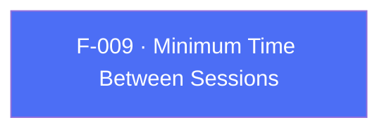

## Business Purpose
By default AppsFlyer starts a new session whenever the app returns to the foreground after being backgrounded, using the SDK's built-in threshold. Apps with unusual foreground/background patterns (quick task-switching, widget-driven relaunches) can get inflated session counts. `setMinTimeBetweenSessions` widens or narrows that threshold so relaunches within the configured window fold into the current session instead of counting as a new one.

---

## Trigger
Called by the host app during startup configuration, before the first `start()`, when the default session-splitting threshold needs to be overridden. The Flutter API does not require a particular order relative to `init()`.

---

## Call Chain
An ordinary fire-and-forget RPC setter available on both platforms, returning `Future<void>`.

```
AppsFlyerSdk.setMinTimeBetweenSessions(seconds)                       [lib/src/appsflyer_sdk.dart]
  → _invokeVoidRpc('setMinTimeBetweenSessions', {'seconds': seconds})
    → _invokeRpc → MethodChannel('af-api').invokeMethod('executeRpc', {method, params})
      → Android: AppsflyerSdkPlugin.executeRpc → dispatchRpc → AppsFlyerRpcHandler
        → AppsFlyerLib.setMinTimeBetweenSessions(seconds)
      → iOS: AppsflyerSdkPlugin.executeRpc → dispatchRpc → AppsFlyerRPCBridge.executeJson
        → native minimum-time-between-sessions setter
  → PlatformException is converted to AppsFlyerException
```

---

## Files
| File | Role |
|------|------|
| `lib/src/appsflyer_sdk.dart` | `setMinTimeBetweenSessions(int seconds)` — dispatches the RPC, returns `Future<void>` |
| `android/src/main/java/com/appsflyer/appsflyersdk/AppsflyerSdkPlugin.java` | Generic `executeRpc` → `dispatchRpc` routing to `AppsFlyerRpcHandler` |
| `ios/appsflyer_sdk/Sources/appsflyer_sdk/AppsflyerSdkPlugin.m` | Generic `executeRpc` → `dispatchRpc` forwarding to `AppsFlyerRPCBridge` |

---

## Input / Output
| | |
|--|--|
| **Input** | `seconds` (`int`) sent under the `seconds` param key. Both native RPC parsers reject negative values. |
| **Output** | `Future<void>` completes after native RPC validation and the synchronous SDK setter invocation. Validation or bridge failures throw `AppsFlyerException`; there is no native completion callback or request timeout. |

---

## Tests
`test/appsflyer_sdk_test.dart` — `maps cross-platform configuration and identity APIs` asserts that `setMinTimeBetweenSessions(15)` dispatches RPC method `setMinTimeBetweenSessions` with `{'seconds': 15}`.

---

## Known Limitations
- Dart performs no range validation, but both native RPC parsers reject negative values before invoking the SDK.
- The native API has no completion callback, so a completed `Future` confirms only that the RPC layer accepted the call.

---

## Dependencies

