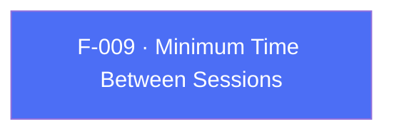

## Business Purpose
By default AppsFlyer starts a new session whenever the app returns to the foreground after being backgrounded, using the SDK's built-in threshold. Apps with unusual foreground/background patterns (quick task-switching, widget-driven relaunches) can get inflated session counts. `setMinTimeBetweenSessions` widens (or narrows) that threshold so relaunches within the configured window fold into the current session instead of counting as a new one.

---

## Trigger
Called by the host app during startup configuration, before `startSDK()`, when the default session-splitting threshold needs to be overridden.

---

## Call Chain
Generic RPC on both platforms.

```
AppsflyerSdk.setMinTimeBetweenSessions(seconds)                       [lib/src/appsflyer_sdk.dart]
  → _executeRpc('setMinTimeBetweenSessions', {seconds})
    → af-api "executeRpc" {method:'setMinTimeBetweenSessions', params}
      → Android: dispatchRpc → AppsFlyerRpcHandler → AppsFlyerLib.setMinTimeBetweenSessions(seconds)  [android/.../AppsflyerSdkPlugin.java]
      → iOS: dispatchRpc → AppsFlyerRPCBridge → [AppsFlyerLib shared] ...                              [ios/.../AppsflyerSdkPlugin.m]
```

---

## Files
| File | Role |
|------|------|
| `lib/src/appsflyer_sdk.dart` | `setMinTimeBetweenSessions(int seconds)` — dispatches the RPC |
| `android/src/main/java/com/appsflyer/appsflyersdk/AppsflyerSdkPlugin.java` | generic `setMinTimeBetweenSessions` dispatch over `AppsFlyerRpcHandler` |
| `ios/appsflyer_sdk/Sources/appsflyer_sdk/AppsflyerSdkPlugin.m` | generic `setMinTimeBetweenSessions` dispatch over `AppsFlyerRPCBridge` |

---

## Input / Output
| | |
|--|--|
| **Input** | `seconds` (int). RPC param key `seconds`. |
| **Output** | `void` — fire-and-forget; no confirmation returned to Dart. |

---

## Tests
`test/appsflyer_sdk_test.dart` verifies that `setMinTimeBetweenSessions` dispatches the `setMinTimeBetweenSessions` RPC with the `seconds` param.

---

## Known Limitations
- No client-side range validation — the value is forwarded to the native SDK as-is.

---

## Dependencies

