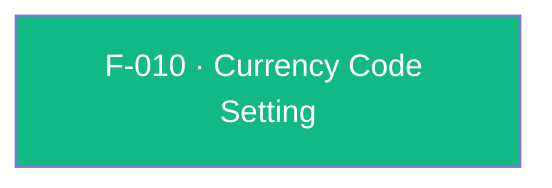

## Business Purpose
AppsFlyer's revenue analytics (ROI/LTV dashboards) need a consistent currency to normalize monetary values reported through in-app purchase and revenue events. Apps that sell in a currency other than the SDK's USD default must declare that currency once through `setCurrencyCode`, so every subsequent in-app event's monetary value is interpreted and converted for reporting correctly. Without it, revenue figures for non-USD apps would be misreported at AppsFlyer's default currency assumption, corrupting revenue-based attribution and LTV comparisons across campaigns.

---

## Trigger
Called by the host app once, typically after `init()` and before `start()`, whenever the app's transactions are denominated in a non-default (non-USD) currency.

---

## Call Chain
An ordinary fire-and-forget RPC setter available on both platforms, returning `Future<void>`.

```
AppsFlyerSdk.setCurrencyCode(currencyCode)                            [lib/src/appsflyer_sdk.dart]
  → _invokeVoidRpc('setCurrencyCode', {'currencyCode': currencyCode})
    → _invokeRpc → MethodChannel('af-api').invokeMethod('executeRpc', {method, params})
      → Android: AppsflyerSdkPlugin.executeRpc → dispatchRpc → AppsFlyerRpcHandler
        → AppsFlyerLib.setCurrencyCode(...)                            [plugin_bridge module]
      → iOS: AppsflyerSdkPlugin.executeRpc → dispatchRpc → AppsFlyerRPCBridge.executeJson
        → AFRPCRequestHandler → SDK
  → PlatformException is converted to AppsFlyerException
```

---

## Files
| File | Role |
|------|------|
| `lib/src/appsflyer_sdk.dart` | `setCurrencyCode(String currencyCode)` — platform-agnostic, returns `Future<void>` |
| `android/src/main/java/com/appsflyer/appsflyersdk/AppsflyerSdkPlugin.java` | No per-method handler — generic `executeRpc` → `dispatchRpc` |
| `ios/appsflyer_sdk/Sources/appsflyer_sdk/AppsflyerSdkPlugin.m` | No per-method handler — generic `executeRpc` → `dispatchRpc` |
| `doc/api-reference.md` | Public documentation for `setCurrencyCode` |

---

## Input / Output
| | |
|--|--|
| **Input** | `currencyCode` (`String`) — expected to be a three-letter ISO 4217 code; the native default is `"USD"`. Sent under the `currencyCode` param key. |
| **Output** | `Future<void>` completes once the RPC layer accepts the fire-and-forget native call; native errors throw `AppsFlyerException`. |

---

## Tests
`test/appsflyer_sdk_test.dart` — `maps cross-platform configuration and identity APIs` asserts that `setCurrencyCode('USD')` dispatches RPC method `setCurrencyCode` with `{'currencyCode': 'USD'}`. Only the Dart-to-RPC dispatch is exercised.

---

## Known Limitations
- **No format validation** in the plugin: any string (empty, wrong length, lowercase, non-existent code) is passed straight to the native SDK. Native-side handling is outside this plugin's code, and an invalid code produces no Dart-side error.
- No API exists to read back the currently configured currency code — the plugin is write-only for this setting.
- No ordering is enforced relative to `init()`, `start()`, or revenue-logging calls; applying it after revenue events have been logged may leave prior events at the previous currency, depending on native SDK behavior.
- The native API has no completion callback, so a completed `Future` confirms only that the RPC layer accepted the call.

---

## Dependencies

