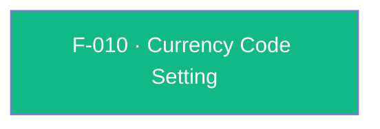

## Business Purpose
AppsFlyer's revenue analytics (ROI/LTV dashboards) need a consistent currency to normalize monetary values reported through in-app purchase/revenue events. Apps that sell in a currency other than the SDK's USD default must declare that currency once via `setCurrencyCode`, so every subsequent in-app event's monetary value is interpreted (and converted for reporting) correctly. Without it, revenue figures for non-USD apps would be misreported at AppsFlyer's default currency assumption, corrupting revenue-based attribution and LTV comparisons across campaigns.

---

## Trigger
Called by the host app once, typically at startup before `startSDK()`, whenever the app's transactions are denominated in a non-default (non-USD) currency.

---

## Call Chain
Since the SDK 7 / RPC migration this is a generic, fire-and-forget RPC call.
```
AppsflyerSdk.setCurrencyCode(currencyCode)                                          [lib/src/appsflyer_sdk.dart]
  → _executeRpc('setCurrencyCode', {'currencyCode': currencyCode})                 // MethodChannel af-api → executeRpc
    → Android: AppsflyerSdkPlugin.executeRpc → dispatchRpc('setCurrencyCode', ...)  [android/.../AppsflyerSdkPlugin.java]
      → AppsFlyerRpcHandler.execute(json) → AppsFlyerLib.setCurrencyCode(...)       [plugin_bridge module]
    → iOS: AppsflyerSdkPlugin.executeRpc → dispatchRpc:method:@"setCurrencyCode"    [ios/.../AppsflyerSdkPlugin.m]
      → [AppsFlyerRPCBridge shared] executeJson:completion: → AFRPCRequestHandler → SDK
```

---

## Files
| File | Role |
|------|------|
| `lib/src/appsflyer_sdk.dart` | `setCurrencyCode(String currencyCode)` — platform-agnostic Dart API, `void` |
| `android/.../AppsflyerSdkPlugin.java` | No per-method handler — generic `executeRpc` → `dispatchRpc('setCurrencyCode', ...)` |
| `ios/.../AppsflyerSdkPlugin.m` | No per-method handler — generic `executeRpc` → `dispatchRpc` |
| `doc/api-reference.md` | Public documentation for `setCurrencyCode` |

---

## Input / Output
| | |
|--|--|
| **Input** | `currencyCode` (String) — expected to be a 3-character ISO 4217 code (default is `"USD"`) |
| **Output** | `void` — fire-and-forget; no validation or error signal if an invalid/malformed currency code is passed |

---

## Tests
`test/appsflyer_sdk_test.dart` — `setCurrencyCode` calls `setCurrencyCode("USD")` and asserts the `setCurrencyCode` RPC is dispatched with `currencyCode: 'USD'`; exercises only the Dart→RPC dispatch.

---

## Known Limitations
- **No format validation** in the plugin: any string (empty, wrong length, lowercase, non-existent code) is passed straight to the native SDK; native-side handling is outside this plugin's code.
- No API to read back the currently configured currency code — the plugin is write-only for this setting.
- No enforced ordering relative to `initSdk()`/`startSDK()` or revenue-logging calls; applying it after revenue events have been logged may leave prior events at the previous currency, depending on native SDK behavior.

---

## Dependencies

