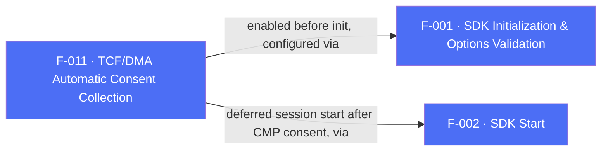

## Business Purpose
The EU Digital Markets Act (DMA) requires gatekeepers like Google to obtain and forward user consent data before certain attribution/advertising interactions can occur. Rather than forcing every integrator to manually read Consent Management Platform (CMP) state and pass it to AppsFlyer via F-012's API, `enableTCFDataCollection` lets the SDK read TCF v2.2-formatted consent strings directly out of `SharedPreferences` (Android) / `NSUserDefaults` (iOS) — wherever a TCF-compliant CMP already stores them — and attach that consent data to every outgoing event automatically. Without this, apps using a CMP would need to duplicate the CMP's consent state into AppsFlyer's manual consent API themselves.

---

## Trigger
Called by the host app once, typically at startup before SDK init. Per `doc/consent-dma.md`, the documented integration pattern is: (1) call `enableTCFDataCollection(true)`, (2) `initSdk()` without sending a session, (3) let the CMP present its consent dialog if needed, (4) once the CMP confirms consent data is stored, call `startSDK()` (F-002) so the first network request already carries the CMP-collected consent.

---

## Call Chain
```
AppsflyerSdk.enableTCFDataCollection(shouldCollect)                      [lib/src/appsflyer_sdk.dart]
  → _executeRpc('enableTCFDataCollection', {'shouldCollect': shouldCollect})
    → MethodChannel "af-api".invokeMethod('executeRpc', {method:'enableTCFDataCollection', params:{shouldCollect}})
      → Android: AppsflyerSdkPlugin.executeRpc → dispatchRpc → AppsFlyerRpcHandler   [android/.../AppsflyerSdkPlugin.java]
        → AppsFlyerLib.getInstance().enableTCFDataCollection(shouldCollect)
      → iOS: AppsflyerSdkPlugin executeRpc → AppsFlyerRPCBridge                       [ios/appsflyer_sdk/Sources/appsflyer_sdk/AppsflyerSdkPlugin.m]
        → [[AppsFlyerLib shared] enableTCFDataCollection:shouldCollect]
```

---

## Files
| File | Role |
|------|------|
| `lib/src/appsflyer_sdk.dart` | `enableTCFDataCollection(bool)` |
| `android/src/main/java/com/appsflyer/appsflyersdk/AppsflyerSdkPlugin.java` | `enableTCFDataCollection` native handler |
| `ios/appsflyer_sdk/Sources/appsflyer_sdk/AppsflyerSdkPlugin.m` | RPC bridge entry (`executeRpc`) forwarding `enableTCFDataCollection` |
| `doc/consent-dma.md` | Integration guide documenting the required init → CMP → `startSDK()` sequencing |

---

## Input / Output
| | |
|--|--|
| **Input** | `shouldCollect` (bool) — `true` enables automatic TCF v2.2 string reads from platform storage. |
| **Output** | `void` — fire-and-forget; no confirmation returned to Dart. Downstream effect is that TCF consent strings are attached to subsequent SDK network requests. |

---

## Tests
`test/appsflyer_sdk_test.dart` — `check enableTCFDataCollection call` asserts the mocked `af-api` channel receives `executeRpc` with method `enableTCFDataCollection`. No test verifies the documented manual-start/CMP sequencing, and no test exists for the interaction between this flag and `startSDK()`/`initSdk()` timing.

---

## Known Limitations
- The feature is purely a "read consent from storage" toggle — it does not validate that a TCF-compliant CMP is actually present or that the stored string is well-formed; if no CMP has written TCF data, the SDK simply finds nothing to read, with no error surfaced to the app.
- Correct behavior depends entirely on the app following the documented ordering (init → CMP consent → `startSDK()`); calling `enableTCFDataCollection` after `startSDK()` has already sent the first session may mean that session went out without consent data attached.

---

## Dependencies

