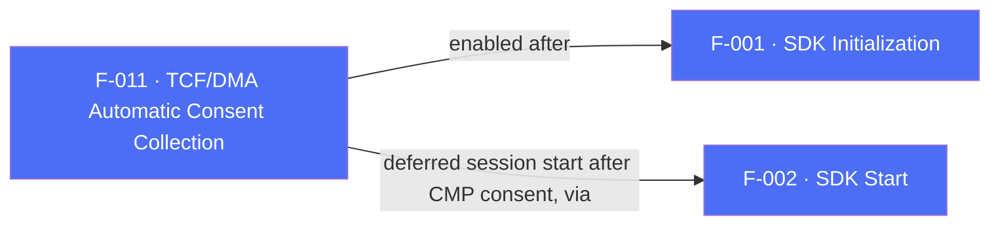

## Business Purpose
The EU Digital Markets Act (DMA) requires gatekeepers like Google to obtain and forward user consent data before certain attribution and advertising interactions can occur. Rather than forcing every integrator to manually read Consent Management Platform (CMP) state and pass it to AppsFlyer through F-012's API, `enableTCFDataCollection` lets the SDK read TCF v2.2-formatted consent strings directly out of `SharedPreferences` (Android) / `NSUserDefaults` (iOS) — wherever a TCF-compliant CMP already stores them — and attach that consent data to every outgoing event automatically. Without this, apps using a CMP would need to duplicate the CMP's consent state into AppsFlyer's manual consent API themselves.

---

## Trigger
The host app calls this once per launch. Per `doc/consent-dma.md`, the documented sequence is: (1) `await appsflyerSdk.init(...)`, (2) `await appsflyerSdk.enableTCFDataCollection(true)`, (3) let the CMP present its consent dialog if needed, (4) register the session-ready listener and call `start()` (F-002) once the CMP has stored its consent data, so the first network request already carries the CMP-collected consent.

---

## Call Chain
`enableTCFDataCollection` is an ordinary fire-and-forget RPC setter available on both platforms and returns `Future<void>`.

```
AppsFlyerSdk.enableTCFDataCollection(shouldCollect)                   [lib/src/appsflyer_sdk.dart]
  → _invokeVoidRpc('enableTCFDataCollection', {'shouldCollect': shouldCollect})
    → _invokeRpc → MethodChannel('af-api').invokeMethod('executeRpc', {method, params})
      → Android: AppsflyerSdkPlugin.executeRpc → dispatchRpc → AppsFlyerRpcHandler
        → AppsFlyerLib.getInstance().enableTCFDataCollection(shouldCollect)
      → iOS: AppsflyerSdkPlugin.executeRpc → dispatchRpc → AppsFlyerRPCBridge.executeJson
        → [[AppsFlyerLib shared] enableTCFDataCollection:shouldCollect]
  → PlatformException is converted to AppsFlyerException
```

---

## Files
| File | Role |
|------|------|
| `lib/src/appsflyer_sdk.dart` | `enableTCFDataCollection(bool shouldCollect)` returning `Future<void>` |
| `android/src/main/kotlin/com/appsflyer/appsflyersdk/AppsflyerSdkPlugin.kt` | Generic `executeRpc` → `dispatchRpc` routing to `AppsFlyerRpcHandler` |
| `ios/appsflyer_sdk/Sources/appsflyer_sdk/AppsflyerSdkPlugin.swift` | Generic `executeRpc` → `dispatchRpc` forwarding to `AppsFlyerRPCBridge` |
| `doc/consent-dma.md` | Integration guide documenting the `init()` → `enableTCFDataCollection` → CMP → `start()` sequencing |

---

## Input / Output
| | |
|--|--|
| **Input** | `shouldCollect` (`bool`) sent under the `shouldCollect` param key. `true` enables automatic TCF v2.2 string reads from platform storage. |
| **Output** | `Future<void>` completes once the RPC layer accepts the fire-and-forget native call; native errors throw `AppsFlyerException`. The downstream effect is that TCF consent strings are attached to subsequent SDK network requests. |

---

## Tests
`test/appsflyer_sdk_test.dart` — `maps cross-platform configuration and identity APIs` asserts that `enableTCFDataCollection(true)` dispatches RPC method `enableTCFDataCollection` with `{'shouldCollect': true}`. No test verifies the documented CMP sequencing or the interaction between this flag and `init()`/`start()` timing.

---

## Known Limitations
- The feature is purely a "read consent from storage" toggle. It does not validate that a TCF-compliant CMP is present or that the stored string is well-formed; if no CMP has written TCF data, the SDK finds nothing to read and no error is surfaced to the app.
- Correct behavior depends on the app following the documented ordering (`init()` → CMP consent → `start()`). Because SDK 7 requires an explicit `start()`, that ordering is now under the app's control, but nothing in the Dart layer enforces it: calling `enableTCFDataCollection` after `start()` may mean the first session went out without consent data attached.
- The native API has no completion callback, so a completed `Future` confirms only that the RPC layer accepted the call.

---

## Dependencies

