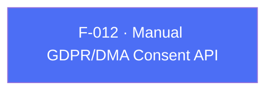

## Business Purpose
Apps that do not rely on a TCF-compatible CMP (F-011) still need a way to legally record and forward the user's GDPR/DMA consent decisions before AppsFlyer collects or uses their data. `setConsentData` is the manual counterpart: the app itself determines whether GDPR applies and what the user consented to, then hands that decision to the SDK explicitly. Getting this right is a legal-compliance requirement, not a UX nicety — incorrect or missing consent forwarding can put the integrating company in violation of GDPR/DMA.

SDK 7 replaces the previous two-variant surface (the deprecated `AppsFlyerConsent` object and `setConsentDataV2`) with a single flat method whose named parameters map one-to-one onto the RPC contract. There is no consent model class to construct and no deprecated alternative to choose between.

---

## Trigger
Called by the host app once consent has been captured from the user's own consent UI. Per `doc/consent-dma.md`, call it after `init()` and before the first `start()`, so the launch request carries the correct state. The native SDK retains the value across foreground cycles in the same process, but not across a cold start; supply it once per process launch.

---

## Call Chain
A single flat method dispatches the `setConsentData` RPC on both platforms. Dart validates the GDPR-required fields before any channel call is made.

```
AppsFlyerSdk.setConsentData({isUserSubjectToGDPR, hasConsentForDataUsage,
                             hasConsentForAdsPersonalization, hasConsentForAdStorage})
                                                                      [lib/src/appsflyer_sdk.dart]
  → when isUserSubjectToGDPR == true, hasConsentForDataUsage and
    hasConsentForAdsPersonalization must be non-null, else ArgumentError.notNull
  → _invokeVoidRpc('setConsentData', {isUserSubjectToGDPR, hasConsentForDataUsage,
                                      hasConsentForAdsPersonalization, hasConsentForAdStorage})
    → _invokeRpc → MethodChannel('af-api').invokeMethod('executeRpc', {method, params})
      → Android: AppsflyerSdkPlugin.executeRpc → dispatchRpc → AppsFlyerRpcHandler
        → AppsFlyerConsent → AppsFlyerLib.getInstance().setConsentData(consent)
      → iOS: AppsflyerSdkPlugin.executeRpc → dispatchRpc → AppsFlyerRPCBridge.executeJson
        → AppsFlyerConsent → [[AppsFlyerLib shared] setConsentData:consentData]
  → PlatformException is converted to AppsFlyerException
```

---

## Files
| File | Role |
|------|------|
| `lib/src/appsflyer_sdk.dart` | `setConsentData({required bool isUserSubjectToGDPR, bool? hasConsentForDataUsage, bool? hasConsentForAdsPersonalization, bool? hasConsentForAdStorage})` and its `ArgumentError` validation |
| `android/src/main/java/com/appsflyer/appsflyersdk/AppsflyerSdkPlugin.java` | Generic `executeRpc` → `dispatchRpc` routing `setConsentData` to `AppsFlyerRpcHandler` |
| `ios/appsflyer_sdk/Sources/appsflyer_sdk/AppsflyerSdkPlugin.m` | Generic `executeRpc` → `dispatchRpc` forwarding `setConsentData` to `AppsFlyerRPCBridge` |
| `doc/consent-dma.md` | Integration guide for both the CMP-automatic (F-011) and manual (this feature) consent paths |
| `doc/migration-guide.md` | Maps the removed `setConsentDataV2(...)` / `setConsentData(AppsFlyerConsent)` variants onto the flat `setConsentData(...)` API |

---

## Input / Output
| | |
|--|--|
| **Input** | `isUserSubjectToGDPR` (required `bool`); `hasConsentForDataUsage`, `hasConsentForAdsPersonalization`, and `hasConsentForAdStorage` (`bool?`, where `null` means "not supplied"). When `isUserSubjectToGDPR` is `true`, `hasConsentForDataUsage` and `hasConsentForAdsPersonalization` are **required** — omitting either throws an `ArgumentError` before any RPC is sent. `hasConsentForAdStorage` is always optional. Dart constructs all four keys; Android's JSON conversion omits null-valued entries, while iOS transports them as JSON null. Both native request models interpret them as absent optional values. |
| **Output** | `Future<void>` completes after native RPC validation and the synchronous SDK setter invocation. Validation or bridge failures throw `AppsFlyerException`; there is no native completion callback or request timeout. |

---

## Tests
`test/appsflyer_sdk_test.dart` covers both the mapping and the validation guard:
- `maps cross-platform configuration and identity APIs` asserts that a fully populated call dispatches RPC method `setConsentData` with `{'isUserSubjectToGDPR': true, 'hasConsentForDataUsage': true, 'hasConsentForAdsPersonalization': false, 'hasConsentForAdStorage': true}`.
- `consent validates GDPR-required fields in release behavior` asserts that `setConsentData(isUserSubjectToGDPR: true)` alone throws an `ArgumentError`.

---

## Known Limitations
- Dart applies the stricter iOS contract on both platforms: when `isUserSubjectToGDPR` is `true`, the two consent flags are required even though the Android native API would accept them as absent. This is intentional — a single cross-platform contract avoids a call that succeeds on one platform and fails on the other.
- The validation is a thrown `ArgumentError` rather than an `assert`, so it holds in release builds as well as debug.
- Consent is order-sensitive relative to `start()` (it must be set before the first session to affect the launch request), but neither the Dart API nor either native handler enforces or warns about this ordering.
- "Every app start" means every cold/process start. The native SDK keeps the value for later background-to-foreground sessions in the same process; the Flutter plugin adds no persistence of its own.
- The native API has no completion callback, so a completed `Future` confirms only that the RPC layer accepted the call — not that the consent state reached AppsFlyer's servers.

---

## Dependencies

