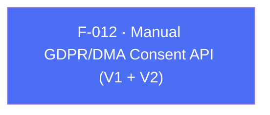

## Business Purpose
Apps that don't rely on a TCF-compatible CMP (F-011) still need a way to legally record and forward the user's GDPR/DMA consent decisions before AppsFlyer collects or uses their data. `setConsentDataV2`/`setConsentData` are the manual counterpart: the app itself determines whether GDPR applies and what the user consented to, then hands that decision to the SDK explicitly. `setConsentDataV2` is the current, primary API (`isUserSubjectToGDPR` plus `consentForDataUsage`, `consentForAdsPersonalization`, and the granular `hasConsentForAdStorage`, all supporting nullable "not yet decided" states); `setConsentData(AppsFlyerConsent)` is the `@Deprecated` V1 shape kept for backward compatibility. Both dispatch the same RPC method `setConsentData`. Getting this right is a legal-compliance requirement, not just a UX nicety — incorrect or missing consent forwarding can put the integrating company in violation of GDPR/DMA.

---

## Trigger
Called by the host app once consent has been captured from the user (via its own consent UI), and per `doc/consent-dma.md`, ideally called *before* `startSDK()` so the very first SDK network request already carries the correct consent state. Consent is not persisted across sessions — supply it on every app start.

---

## Call Chain
Both variants converge on the single RPC method `setConsentData` over the `af-api` MethodChannel.

```
AppsflyerSdk.setConsentDataV2({isUserSubjectToGDPR, consentForDataUsage, consentForAdsPersonalization, hasConsentForAdStorage})   [lib/src/appsflyer_sdk.dart]
  → validates: when isUserSubjectToGDPR == true, the two consent flags are required (else ArgumentError)
  → _executeRpc('setConsentData', {isUserSubjectToGDPR, hasConsentForDataUsage, hasConsentForAdsPersonalization, hasConsentForAdStorage})

AppsflyerSdk.setConsentData(AppsFlyerConsent consentData)   [@Deprecated]              [lib/src/appsflyer_sdk.dart]
  → _executeRpc('setConsentData', consentData.toMap())

  → MethodChannel "af-api".invokeMethod('executeRpc', {method:'setConsentData', params:{...}})
    → Android: AppsflyerSdkPlugin.executeRpc → dispatchRpc → AppsFlyerRpcHandler   [android/.../AppsflyerSdkPlugin.java]
      → new AppsFlyerConsent(...) → AppsFlyerLib.getInstance().setConsentData(consent)
    → iOS: AppsflyerSdkPlugin executeRpc → AppsFlyerRPCBridge                       [ios/appsflyer_sdk/Sources/appsflyer_sdk/AppsflyerSdkPlugin.m]
      → [[AppsFlyerConsent alloc] init...] → [[AppsFlyerLib shared] setConsentData:consentData]
```

---

## Files
| File | Role |
|------|------|
| `lib/src/appsflyer_consent.dart` | `AppsFlyerConsent` model — `forGDPRUser`/`nonGDPRUser` factories, `toMap()` (used by deprecated V1 API only) |
| `lib/src/appsflyer_sdk.dart` | `setConsentData` (`@Deprecated`), `setConsentDataV2` |
| `android/src/main/java/com/appsflyer/appsflyersdk/AppsflyerSdkPlugin.java` | RPC bridge entry (`executeRpc`) routing `setConsentData` to `AppsFlyerRpcHandler` |
| `ios/appsflyer_sdk/Sources/appsflyer_sdk/AppsflyerSdkPlugin.m` | RPC bridge entry (`executeRpc`) forwarding `setConsentData` to `AppsFlyerRPCBridge` |
| `doc/consent-dma.md` | Full integration guide for both the CMP-automatic (F-011) and manual (this feature) consent paths |

---

## Input / Output
| | |
|--|--|
| **Input** | V1 (`setConsentData`): `AppsFlyerConsent` object — `isUserSubjectToGDPR` (bool), `hasConsentForDataUsage` (bool), `hasConsentForAdsPersonalization` (bool). V2 (`setConsentDataV2`): `isUserSubjectToGDPR` (required bool); `consentForDataUsage`, `consentForAdsPersonalization`, `hasConsentForAdStorage` (nullable bools, `null` = "not yet decided"). When `isUserSubjectToGDPR` is `true`, `consentForDataUsage` and `consentForAdsPersonalization` are **required** — omitting either throws an `ArgumentError` in Dart before any RPC is sent; when `false` they are ignored. `hasConsentForAdStorage` is always optional. |
| **Output** | `void` for both — fire-and-forget on the Dart side. Any native failure surfaces as the RPC error envelope but is not observed by these `void` methods. |

---

## Tests
`test/appsflyer_sdk_test.dart` mocks the `af-api` `executeRpc` channel but has **no test** that asserts on the `setConsentData` RPC for either variant, despite `setConsentDataV2` being the currently recommended API per `doc/consent-dma.md`. The `ArgumentError` guard in `setConsentDataV2` (GDPR-true requires both consent flags) is also untested.

---

## Known Limitations
- `setConsentData` (V1) is `@Deprecated('Use setConsentDataV2 instead')` in Dart, and `doc/consent-dma.md` explicitly flags it as deprecated, yet it remains fully wired end-to-end (dispatching the same `setConsentData` RPC as V2) with no runtime warning or removal timeline.
- V1's `AppsFlyerConsent` model (`lib/src/appsflyer_consent.dart`) forces `hasConsentForDataUsage`/`hasConsentForAdsPersonalization` to non-null booleans, which cannot represent an explicit "user has not yet decided" state — this is precisely the gap V2's nullable parameters were introduced to close.
- `setConsentDataV2` has zero test coverage despite being the actively recommended, DMA-critical API — a regression in its argument marshaling (e.g. a renamed key on one platform) would not be caught by the existing test suite.
- Both consent APIs are order-sensitive relative to `initSdk()`/`startSDK()` (must be called first to affect the initial request), but neither the Dart API nor either native handler enforces or warns about this ordering.

---

## Dependencies

