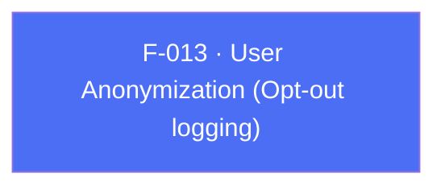

## Business Purpose
When a specific user opts out of tracking (via an in-app privacy setting or a "do not track" requirement), the app needs to tell AppsFlyer to stop logging identifiable data for that user without tearing down the whole SDK. `anonymizeUser` flips this opt-out flag on the native SDK. Without it, the only alternative would be the much blunter `stop()` (F-017), which disables the SDK entirely.

---

## Trigger
Called by the host app whenever the current user's tracking-opt-out preference changes (e.g. a settings toggle, or a privacy-compliance check at login).

---

## Call Chain
Generic RPC on both platforms.

```
AppsflyerSdk.anonymizeUser(shouldAnonymize)                           [lib/src/appsflyer_sdk.dart]
  → _executeRpc('anonymizeUser', {shouldAnonymize})
    → af-api "executeRpc" {method:'anonymizeUser', params}
      → Android: dispatchRpc → AppsFlyerRpcHandler → AppsFlyerLib.anonymizeUser(shouldAnonymize)  [android/.../AppsflyerSdkPlugin.java]
      → iOS: dispatchRpc → AppsFlyerRPCBridge → [AppsFlyerLib shared] ...                          [ios/.../AppsflyerSdkPlugin.m]
```

---

## Files
| File | Role |
|------|------|
| `lib/src/appsflyer_sdk.dart` | `anonymizeUser(bool)` — dispatches the RPC |
| `android/src/main/java/com/appsflyer/appsflyersdk/AppsflyerSdkPlugin.java` | generic `anonymizeUser` dispatch over `AppsFlyerRpcHandler` |
| `ios/appsflyer_sdk/Sources/appsflyer_sdk/AppsflyerSdkPlugin.m` | generic `anonymizeUser` dispatch over `AppsFlyerRPCBridge` |

---

## Input / Output
| | |
|--|--|
| **Input** | `shouldAnonymize` (bool) — `true` anonymizes logging for the current user, `false` restores normal logging. RPC param key `shouldAnonymize`. |
| **Output** | `void` — fire-and-forget; no confirmation returned to Dart. |

---

## Tests
`test/appsflyer_sdk_test.dart` verifies that `anonymizeUser` dispatches the `anonymizeUser` RPC with the `shouldAnonymize` param.

---

## Known Limitations
- The flag is instance-scoped (a property on the shared native SDK), not tied to a specific customer user ID — if the app switches logged-in users without resetting it, the anonymization state can leak across user sessions.
- No way to read back the current anonymization state from Dart.

---

## Dependencies

