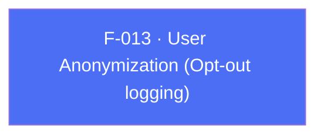

## Business Purpose
When a specific user opts out of tracking (via an in-app privacy setting or a "do not track" requirement), the app needs to tell AppsFlyer to stop logging identifiable data for that user without tearing down the whole SDK. `anonymizeUser` flips this opt-out flag on the native SDK. Without it, the only alternative would be the much blunter `stop()` (F-017), which disables the SDK entirely.

---

## Trigger
The host app awaits `AppsFlyerSdk.instance.anonymizeUser(...)` whenever the current user's tracking-opt-out preference changes — a settings toggle, or a privacy-compliance check at login. Apply the setting before `start()` when the first session must already be anonymized.

---

## Call Chain
`anonymizeUser` is an awaitable RPC setter available on both platforms.

```
AppsFlyerSdk.anonymizeUser(shouldAnonymize)                           [lib/src/appsflyer_sdk.dart]
  → _invokeVoidRpc('anonymizeUser', {'shouldAnonymize': shouldAnonymize})
    → _invokeRpc → MethodChannel('af-api').invokeMethod('executeRpc', {method, params})
      → Android: AppsflyerSdkPlugin.dispatchRpc → AppsFlyerRpcHandler
        → AppsFlyerLib.anonymizeUser(shouldAnonymize)
      → iOS: AppsflyerSdkPlugin.dispatchRpc → AppsFlyerRPCBridge
        → [AppsFlyerLib shared] anonymize flag
  → PlatformException is converted to AppsFlyerException
```

---

## Files
| File | Role |
|------|------|
| `lib/src/appsflyer_sdk.dart` | `anonymizeUser(bool shouldAnonymize)` — awaitable RPC setter |
| `android/src/main/java/com/appsflyer/appsflyersdk/AppsflyerSdkPlugin.java` | Forwards `anonymizeUser` through the Android RPC handler |
| `ios/appsflyer_sdk/Sources/appsflyer_sdk/AppsflyerSdkPlugin.m` | Forwards `anonymizeUser` through the iOS RPC bridge |

---

## Input / Output
| | |
|--|--|
| **Input** | `shouldAnonymize` (`bool`) — `true` anonymizes logging for the current user, `false` restores normal logging. RPC param key `shouldAnonymize`. |
| **Output** | `Future<void>` completes when the native request succeeds and throws `AppsFlyerException` for native errors or RPC timeouts. |

---

## Tests
`test/appsflyer_sdk_test.dart` verifies in the cross-platform RPC mapping test that `anonymizeUser(true)` dispatches RPC method `anonymizeUser` with `{'shouldAnonymize': true}`. Error conversion is covered generically by the test asserting that a `PlatformException` becomes an `AppsFlyerException` on the shared RPC path.

---

## Known Limitations
- The flag is instance-scoped (a property on the shared native SDK), not tied to a specific customer user ID — if the app switches logged-in users without resetting it, the anonymization state can leak across user sessions.
- No way to read back the current anonymization state from Dart.

---

## Dependencies

