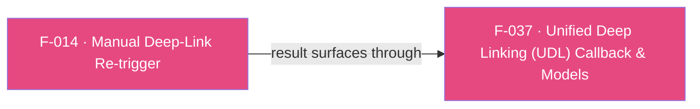

## Business Purpose
Apps that defer `startSDK()` (SDK 7 session model) can miss deep-link resolution for a link that arrived from a non-standard source, or when the launch URL was captured before the SDK was ready. `performDeepLinking(url, ...)` lets the host app hand a specific URL (a full URL, a OneLink, or an intent-data string) to the native SDK on demand and route the resolved result through the `onDeepLinking` (UDL) callback. It works for both intent and non-intent sources (e.g. a URL pulled from Firebase Messaging), so a OneLink that the SDK's own lifecycle hooks did not resolve is still delivered to the app.

---

## Trigger
Called explicitly by the host app whenever it holds a URL it wants the SDK to resolve as a deep link — for example after extracting a link from a push payload handled outside the AppsFlyer flow, or when re-processing a launch URL after gating `startSDK()` on consent/config.

---

## Call Chain
Since the SDK 7 / RPC migration this is a generic RPC call (no per-method channel handler). The Dart method name is `performDeepLinking` and it routes to a **different native RPC per platform**: Android uses `performDeepLinking`; iOS uses `performOnAppAttributionWithURL`. `shouldTriggerSession` is Android-only and ignored on iOS.
```
AppsflyerSdk.performDeepLinking(String url, {bool shouldTriggerSession = false})       [lib/src/appsflyer_sdk.dart]
  → Android: _executeRpc('performDeepLinking', {'url': url, 'shouldTriggerSession': shouldTriggerSession})   // MethodChannel af-api → executeRpc
      → AppsflyerSdkPlugin.executeRpc → dispatchRpc('performDeepLinking', ...)          [android/.../AppsflyerSdkPlugin.java]
        → AppsFlyerRpcHandler.execute(json)                                             [plugin_bridge]
          → AppsFlyerLib.getInstance().performOnDeepLinking(...) → onDeepLinking (F-037)
  → iOS: _executeRpc('performOnAppAttributionWithURL', {'url': url})                    // shouldTriggerSession ignored
      → AppsflyerSdkPlugin executeRpc → dispatchRpc('performOnAppAttributionWithURL')   [ios/.../AppsflyerSdkPlugin.m]
        → AppsFlyerRPCBridge → [AppsFlyerLib shared] performOnAppAttributionWithURL: → onDeepLinking (F-037)
```
The resolved deep link surfaces asynchronously over the `af-events` EventChannel as the `onDeepLinking` envelope (see F-037); this method returns nothing to Dart.

---

## Files
| File | Role |
|------|------|
| `lib/src/appsflyer_sdk.dart` | `performDeepLinking(String url, {bool shouldTriggerSession = false})` — platform-branching wrapper: Android sends the `performDeepLinking` RPC with `{url, shouldTriggerSession}`; iOS sends `performOnAppAttributionWithURL` with `{url}`. Fire-and-forget (`void`). |
| `android/.../AppsflyerSdkPlugin.java` / `ios/.../AppsflyerSdkPlugin.m` | No per-method handler — the generic `executeRpc` dispatch forwards the JSON envelope to the native RPC bridge. |
| `android/.../plugin_bridge` / `AppsFlyerRPC` framework (native SDKs, not the Flutter plugin) | Parse the request and call the SDK (`performOnDeepLinking` on Android, `performOnAppAttributionWithURL:` on iOS). |

---

## Input / Output
| | |
|--|--|
| **Input** | `url` (`String`, required) — full URL, OneLink, or intent-data string. `shouldTriggerSession` (`bool`, default `false`) — when `true`, Android also enqueues a Launch for re-engagement; ignored on iOS. |
| **Output** | `void` — fire-and-forget; the Dart wrapper discards the RPC Future. Any resolved deep link is delivered asynchronously via the `onDeepLinking` (UDL) callback (F-037). |

---

## Tests
No dedicated test found. `test/appsflyer_sdk_test.dart` does not exercise `performDeepLinking`.

---

## Known Limitations
- **`shouldTriggerSession` is Android-only**: the default is `false`, so a bare `performDeepLinking(url)` does not trigger a session. On iOS the parameter is silently ignored (the iOS route, `performOnAppAttributionWithURL`, has no session-trigger option).
- **Different native API per platform**: Android resolves via `performOnDeepLinking`; iOS via `performOnAppAttributionWithURL`. The Dart surface hides this, but the two native paths can differ in edge-case behavior.
- Fire-and-forget: the Dart wrapper discards the `_executeRpc` Future, so a native rejection (e.g. malformed URL) surfaces only as a swallowed unhandled async error, not to the caller.

---

## Dependencies

